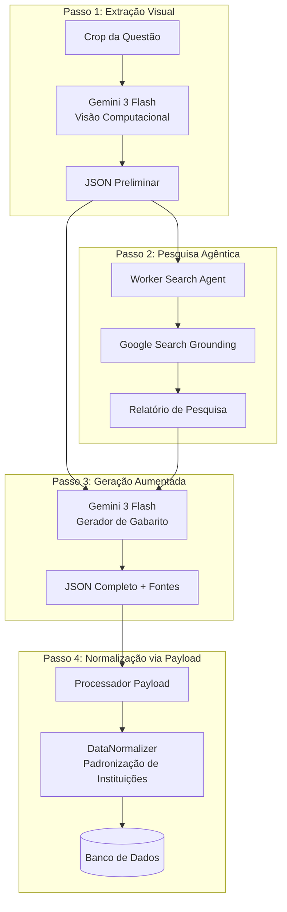
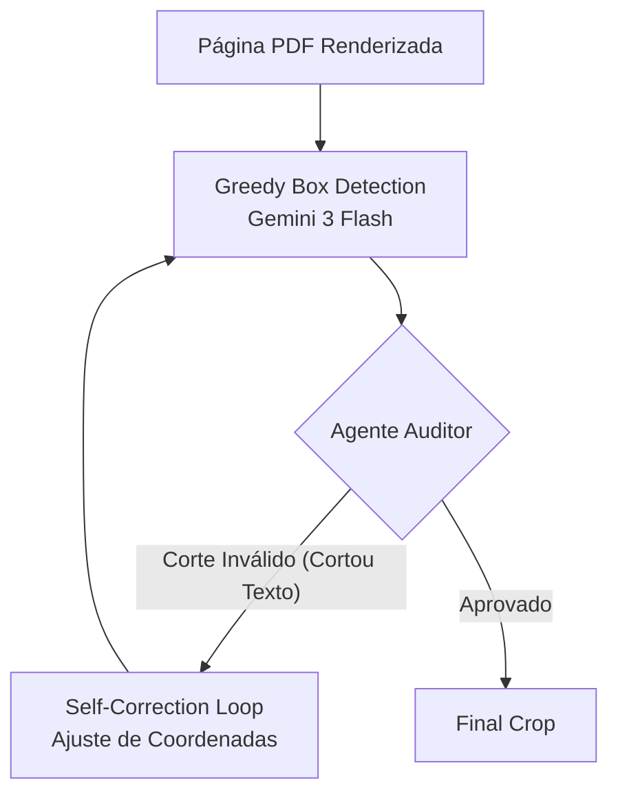

<table border="0">
  <tr>
    <td valign="middle">
      
    </td>
    <td valign="middle">
      <h1 style="margin: 0;">Maia<span style="color: #21808D">.edu</span></h1>
    </td>
  </tr>
</table>

<div align="center">
  
  
  
  
</div>

<div align="center">
  
  
  
</div>

<div align="center">
  
  
  
  
</div>

<br />

**Ecossistema educacional inteligente para a democratização do ensino no Brasil.**

> [!NOTE]
> Este é um **projeto científico** que utiliza tecnologia de ponta para pesquisar e implementar novas formas de aprendizado adaptativo e acessibilidade digital.

O **Maia.edu** é uma plataforma _open-source_ de alto desempenho projetada para criar um ecossistema educacional funcional e autônomo. Mais do que apenas documentar dados, o projeto integra um **sistema automatizado de extração de questões**, um **chatbot pedagógico** avançado e um **banco de dados estruturado** de questões reais de vestibulares brasileiros.

Por meio de uma arquitetura _serverless_ distribuída e uma interface web de alta fidelidade (Vite), a plataforma permite que estudantes treinem para exames e contribuam para o banco de dados em um ciclo colaborativo. O sistema de extração inteligente reduz o tempo de digitalização para menos de **5 minutos por questão**, garantindo que a informação educacional seja preservada, interoperável e acessível a todos.

## 🎯 Nossa Missão

O objetivo do Maia.edu é servir como infraestrutura crítica para a educação aberta brasileira. Buscamos fornecer o primeiro grande **banco de dados, alimentado por IA, público, estruturado e inteligente de questões** para uso pessoal e de pesquisa, curado pela comunidade, removendo barreiras econômicas e tecnológicas através de IA adaptativa.

## 🛠️ Como Funciona (Arquitetura e Processamento)

O projeto opera sobre uma arquitetura moderna e escalável, dividida em microsserviços na borda (_Edge Computing_), garantindo baixa latência e alta disponibilidade.

### 🧠 Pipeline de Inferência Híbrida

O coração do Maia.edu é um sistema roteável que entende a intenção do estudante para fornecer a resposta pedagógica ideal.

graph TD
%% Estilo dos nós
classDef user fill:#21808D,stroke:#fff,stroke-width:2px,color:#fff;
classDef ai fill:#4285F4,stroke:#fff,stroke-width:2px,color:#fff;
classDef worker fill:#F38020,stroke:#fff,stroke-width:2px,color:#fff;
classDef db fill:#000,stroke:#fff,stroke-width:2px,color:#fff;
classDef front fill:#61DAFB,stroke:#333,stroke-width:2px,color:#000;

    UserInput([👤 Mensagem do Estudante]):::user --> Router{🧠 Router Inteligente<br>Gemini 3 Flash}:::ai

    subgraph "Backend (Cloudflare Workers)"
        Router -- "Dúvida Rápida" --> ModeFast[⚡ Modo Rápido]:::ai
        Router -- "Conceito Complexo" --> ModeReasoning[🤔 Modo Raciocínio]:::ai
        Router -- "Passo-a-Passo" --> ModeScaffolding[🎓 Modo Scaffolding<br>Tutor Socrático]:::ai
        Router -- "Intenção de Busca" --> ModeSearch[🔎 Modo Busca<br>RAG / Grounding]:::ai

        ModeSearch --> Pinecone[(Pinecone Vector DB)]:::db
        Pinecone --> ContextInjection[💉 Injeção de Contexto]:::worker
        ContextInjection --> Generator[📝 Geração de Resposta<br>JSON Schema Strict]:::ai
        ModeFast & ModeReasoning & ModeScaffolding --> Generator
    end

    Generator -- "Stream de JSON Tipado" --> Frontend[💻 Frontend React<br>Processamento de Stream]:::front

    subgraph "Frontend (Client-Side Rendering)"
        Frontend --> Parser{⚙️ Parser de Blocos}:::front
        Parser -- "type: 'texto'" --> ComponentText[Renderizador Markdown]:::front
        Parser -- "type: 'questao'" --> ComponentQuestion[Hydrate: <QuestaoCard /><br>Fetch Dados do DB]:::front
        Parser -- "type: 'scaffolding'" --> ComponentScaffolding[Hydrate: <ScaffoldUI /><br>Interativo]:::front
    end

    ComponentText & ComponentQuestion & ComponentScaffolding --> Output([✨ Interface Final]):::user

### 1. Núcleo de Processamento (API & IA)

O backend é sustentado por **Cloudflare Workers**, executando código diretamente na borda da rede. Quando uma questão é enviada:

- **Ingestão Multimodal:** O sistema recebe os dados brutos e utiliza a inteligência do **Gemini 3 Flash Preview** (modelos multimodais) para realizar a inferência semântica da prova.
- **Estruturação de Dados:** Diferente de OCRs tradicionais, nossa API força uma **saída estruturada em JSON**, categorizando rigorosamente:
  - Enunciados e alternativas;
  - Imagens, gráficos e legendas associadas;
  - Fontes, títulos e metadados contextuais;
  - Citações e trechos de código.

#### 🔎 Geração Aumentada por Pesquisa (SAG)

O extrator não apenas "lê" a imagem, mas atua como um agente pesquisador para garantir a precisão do gabarito.



### 2. Renderização de Alta Fidelidade

Para garantir que a experiência digital seja indistinguível da prova física:

- Utilizamos _parsers_ avançados para converter o conteúdo extraído em **Markdown** (para formatação rica) e **LaTeX** (para equações matemáticas complexas e fórmulas químicas).
- O frontend, otimizado via **Vite**, renderiza esses componentes instantaneamente, preservando a diagramação original.

### 3. Redundância e Confiabilidade

A plataforma implementa um sistema de **captura híbrida**:

- **Manual/Verificação:** As **fotos originais** (raw images) da questão e do gabarito são armazenadas permanentemente e vinculadas ao objeto JSON da questão. Isso cria uma camada de segurança ("fallback"), permitindo que o usuário consulte a fonte primária caso haja qualquer alucinação ou erro na extração automática da IA.

---

## 🤖 Maia.ai (Chatbot Educacional)

A Maia.ai é o assistente inteligente que consome o banco de dados para proporcionar uma experiência de aprendizado personalizada e interativa.

### 1. Orquestração de Conversa (Router)

- **Router de Complexidade:** Implementamos um roteador inteligente baseado em **Gemini 3 Flash Preview** que analisa cada mensagem do usuário para decidir o melhor fluxo de execução: _Rápido_ (respostas diretas), _Raciocínio_ (análise profunda via Flash Thinking) ou _Scaffolding_ (estudo guiado).
- **Títulos Dinâmicos:** Utilizamos o modelo **Gemma 3 27b-it** para gerar títulos curtos e precisos que resumem o contexto de cada conversa no histórico.

### 2. Memória Contextual Híbrida

A Maia possui um sistema de memória de longo prazo que evolui conforme o estudante interage:

- **Extração de Fatos:** Fluxo assíncrono que extrai fatos sobre o perfil, conhecimento e preferências do usuário.
- **Busca Vetorial (RAG):** Recuperação semântica de memórias passadas para personalizar a resposta.
- **Storage Híbrido:** **EntityDB** (local via IndexedDB) para velocidade e **Pinecone** (nuvem) para persistência global de usuários logados.

### 3. Scaffolding (Aprendizado Adaptativo)

Em vez de apenas entregar a resposta, a plataforma pode ativar o modo de estudo assistido:

- **Decomposição Lógica:** A IA quebra a questão original em uma sequência de afirmações de **Verdadeiro ou Falso**.
- **Métricas de Proficiência:** O sistema avalia não apenas o acerto, mas a **certeza do usuário** (via slider de 0-100%) e o **tempo de resposta**, ajustando a dificuldade do próximo passo em tempo real.
- **Intervenção Didática:** O fluxo só avança ou termina quando o sistema valida que o usuário compreendeu o conceito fundamental por trás do problema.

## 🔎 Deep Search (Busca Profunda de Provas)

Para escalar a captura de provas, implementamos um agente autônomo de busca profunda.

### Como Funciona

1.  **Solicitação:** O usuário insere uma query simples (ex: "ITA 2022").
2.  **Agente AI (OpenHands):** Um container Docker isolado roda um agente inteligente que navega na web.
3.  **Busca & Decisão:** O agente usa ferramentas de busca (como Tavily ou Google) para encontrar _links oficiais_ de provas e gabaritos, ignorando sites genéricos ou de baixa qualidade.
4.  **Extração & Validação:** O sistema baixa os PDFs, valida se são arquivos legítimos (checa headers, tamanho, conteúdo) e os organiza.
5.  **Manifesto:** Gera um arquivo `manifest.json` padronizado, listando tudo o que foi encontrado (arquivos baixados e links de referência).

#### 📷 Scanner Auditor (Greedy Box)

O sistema de digitalização possui um loop de "auditoria" para garantir cortes perfeitos.



## 🧬 Estrutura do Banco de Dados

Nossos dados seguem uma estrutura JSON padronizada e rica em metadados:

```json
{
  "questoes": {
    "NOME_DO_EXAME_OU_BANCA": {
      "IDENTIFICADOR_UNICO_DA_QUESTAO": {
        "dados_gabarito": {
          "alternativa_correta": "LETRA (EX: A)",
          "alternativas_analisadas": [
            {
              "correta": true,
              "letra": "A",
              "motivo": "Explicação detalhada do motivo desta ser a correta."
            },
            {
              "correta": false,
              "letra": "B",
              "motivo": "Explicação do erro (distrator)."
            }
          ],
          "analise_complexidade": {
            "fatores": {
              "abstracao_teorica": false,
              "analise_nuance_julgamento": false,
              "contexto_abstrato": false,
              "deducao_logica": true,
              "dependencia_conteudo_externo": true,
              "distratores_semanticos": false,
              "interdisciplinaridade": false,
              "interpretacao_visual": false,
              "multiplas_fontes_leitura": false,
              "raciocinio_contra_intuitivo": false,
              "resolucao_multiplas_etapas": false,
              "texto_extenso": false,
              "transformacao_informacao": false,
              "vocabulario_complexo": false
            },
            "justificativa_dificuldade": "Classificação pedagógica."
          },
          "coerencia": {
            "alternativa_correta_existe": true,
            "tem_analise_para_todas": true,
            "observacoes": ["Observação/validação de coerência (opcional)."]
          },
          "confianca": 1,
          "creditos": {
            "ano": "ANO_DA_PROVA",
            "autorouinstituicao": "NOME_DA_INSTITUICAO",
            "material": "NOME_DO_CADERNO_OU_PROVA",

            "confiancaidentificacao": 1,
            "materialidentificado": true,
            "origemresolucao": "extraido_do_material | gerado_pela_ia"
          },
          "explicacao": [
            {
              "estrutura": [
                { "conteudo": "Título do passo", "tipo": "titulo" },
                { "conteudo": "Explicação detalhada...", "tipo": "texto" }
              ],
              "evidencia": "Texto curto de evidência/validação (opcional).",
              "fontematerial": "Referência interna (opcional).",
              "origem": "extraido_do_material | gerado_pela_ia"
            }
          ],
          "fontes_externas": [
            {
              "title": "Título da fonte",
              "uri": "https://..."
            }
          ],
          "fotos_originais": ["https://..."],
          "justificativa_curta": "Resumo TL;DR.",
          "texto_referencia": "Texto/relatório longo (opcional)."
        },
        "dados_questao": {
          "alternativas": [
            {
              "letra": "A",
              "estrutura": [
                { "conteudo": "Texto da alternativa A", "tipo": "texto" }
              ]
            }
          ],
          "estrutura": [
            { "conteudo": "Enunciado / trecho / comando...", "tipo": "texto" },
            { "conteudo": "Citação...", "tipo": "citacao" },
            { "conteudo": "Fonte/Créditos do texto-base...", "tipo": "fonte" },
            {
              "tipo": "imagem",
              "conteudo": "Legenda (opcional)"
            }
          ],
          "fotos_originais": ["https://..."],
          "materias_possiveis": ["História"],
          "palavras_chave": ["Tema 1", "Tema 2"]
        },
        "meta": {
          "timestamp": "ISO_8601"
        }
      }
    }
  }
}
```

Nosso objetivo final é **promover a democratização do acesso à educação no país** através de uma **Inteligência Artificial Adaptativa** que entenda profundamente cada estudante.

A infraestrutura que construímos hoje (Banco de dados estruturado + Memória Híbrida + Scaffolding) é a fundação para:

1.  **Personalização Extrema**: Identificar lacunas de conhecimento milimétricas e sugerir trilhas de estudo personalizadas.
2.  **Educação em Larga Escala**: Permitir que milhões de estudantes tenham acesso a um tutor particular de alta qualidade através de dispositivos simples.
3.  **Preservação do Conhecimento**: Garantir que todo o acervo de vestibulares brasileiros esteja digitalizado, estruturado e acessível para as próximas gerações.

Estamos construindo o futuro onde o aprendizado não tem barreiras.

---

## 🛠️ Execução Local

Para rodar a interface web em ambiente de desenvolvimento:

1.  **Clone o repositório:** `git clone https://github.com/TouchRefletz/maia.edu.git`
2.  **Instale as dependências:** `npm install`
3.  **Configure as variáveis:** Crie um arquivo `.env` baseado no `.env.example` (Necessário Firebase e chaves de API do Worker).
4.  **Inicie o servidor:** `npm run dev`

---

## 🤝 Contribua com o Projeto!

Acreditamos que a educação deve ser construída por muitos. Se você é desenvolvedor, designer, educador ou entusiasta, sua ajuda é muito bem-vinda!

- **Pull Requests:** Encontrou um bug ou quer implementar uma nova feature? Sinta-se à vontade para abrir um PR.
- **Issues:** Sugestões de melhorias ou relatos de problemas nos ajudam a evoluir.
- **Ecossistema:** Ajude-nos a curar a banca de questões e a treinar a Maia para ser uma tutora ainda melhor.

Vamos juntos transformar a educação brasileira através do código! 🚀

---

## 📄 Licença

Este projeto é protegido pela licença **GNU Affero General Public License v3.0 (AGPL-3.0)**.

Isso significa que você é livre para usar, estudar, copiar, modificar e distribuir este software, inclusive para fins comerciais, **desde que** qualquer redistribuição (do projeto original ou de versões modificadas) mantenha os avisos de direitos autorais e a própria licença, e que o código-fonte (ou um meio válido de obtê-lo) seja disponibilizado junto da distribuição.

Além disso, a **AGPL-3.0** também se aplica ao uso do software **via rede**: se você modificar este projeto e disponibilizar a versão modificada para outras pessoas usarem por meio de um serviço online (por exemplo, um site, API ou aplicação hospedada), você deve disponibilizar o **código-fonte correspondente** dessa versão aos usuários do serviço, sob a mesma licença.

Em outras palavras: se você publicar uma versão modificada, incorporar este projeto em um trabalho derivado e distribuí-lo — ou executá-lo para terceiros através da internet — você também deve licenciar esse trabalho sob a **AGPL-3.0**, garantindo as mesmas liberdades para as próximas pessoas. Acreditamos que o conhecimento cresce quando é compartilhado — e que essas liberdades devem permanecer protegidas para todos.

> _A educação não tem preço. Sua falta tem custo. - Antônio Gomes Lacerda_
