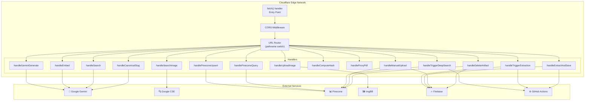
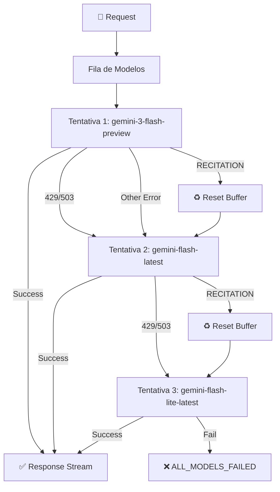

# Arquitetura do Worker — Maia API (Cloudflare)

## Visão Geral

O **Maia API Worker** é um Cloudflare Worker que serve como gateway único entre o frontend e todos os serviços externos. Roda em edge locations globais, garantindo latência mínima para usuários em qualquer parte do mundo.

### Arquivo-Fonte

| Arquivo | Linhas | Tamanho |
|---------|--------|---------|
| [`maia-api-worker/src/index.js`](file:///c:/Users/jcamp/Downloads/maia.api/maia-api-worker/src/index.js) | ~2537 | 84 KB |

---

## Diagrama de Arquitetura



---

## Entry Point: `fetch()` Handler

O Worker exporta um handler `fetch` que é chamado para cada request HTTP:

```javascript
export default {
  async fetch(request, env, ctx) {
    // 1. Handle CORS preflight
    if (request.method === 'OPTIONS') {
      return new Response(null, { headers: corsHeaders });
    }
    
    // 2. Route based on pathname
    const url = new URL(request.url);
    
    try {
      switch (url.pathname) {
        case '/generate':        return handleGeminiGenerate(request, env);
        case '/embed':           return handleEmbed(request, env);
        case '/search':          return handleSearch(request, env);
        case '/search-image':    return handleSearchImage(request, env);
        case '/upload-image':    return handleUploadImage(request, env);
        case '/pinecone-upsert': return handlePineconeUpsert(request, env);
        case '/pinecone-query':  return handlePineconeQuery(request, env);
        case '/trigger-deep-search':  return handleTriggerDeepSearch(request, env);
        case '/compute-hash':    return handleComputeHash(request, env);
        case '/proxy-pdf':       return handleProxyPdf(request, env);
        case '/trigger-extraction':   return handleTriggerExtraction(request, env);
        case '/extract-and-save':     return handleExtractAndSave(request, env);
        case '/manual-upload':   return handleManualUpload(request, env);
        case '/delete-artifact': return handleDeleteArtifact(request, env);
        case '/canonical-slug':  return handleCanonicalSlug(request, env);
        default:
          // Serve static assets from the /public directory
          return env.ASSETS?.fetch(request) ?? new Response('Not Found', { status: 404 });
      }
    } catch (error) {
      return new Response(JSON.stringify({ error: error.message }), {
        status: 500,
        headers: { ...corsHeaders, 'Content-Type': 'application/json' },
      });
    }
  },
};
```

---

## CORS Configuration

Todas as respostas incluem headers CORS permissivos:

```javascript
const corsHeaders = {
  'Access-Control-Allow-Origin': '*',
  'Access-Control-Allow-Methods': 'GET, POST, OPTIONS',
  'Access-Control-Allow-Headers': 'Content-Type',
};
```

> ⚠️ **Nota de segurança**: Em produção, `Allow-Origin: *` deveria ser restrito ao domínio da aplicação.

Todo handler que retorna streaming (TransformStream) também aplica headers CORS na resposta streaming:

```javascript
return new Response(readable, {
  headers: {
    ...corsHeaders,
    'Content-Type': 'text/plain; charset=utf-8',
    'Transfer-Encoding': 'chunked',
  },
});
```

---

## Safety Settings (Gemini)

Todas as chamadas ao Gemini usam safety settings desabilitados:

```javascript
const safetySettings = [
  { category: 'HARM_CATEGORY_HARASSMENT', threshold: 'BLOCK_NONE' },
  { category: 'HARM_CATEGORY_HATE_SPEECH', threshold: 'BLOCK_NONE' },
  { category: 'HARM_CATEGORY_SEXUALLY_EXPLICIT', threshold: 'BLOCK_NONE' },
  { category: 'HARM_CATEGORY_DANGEROUS_CONTENT', threshold: 'BLOCK_NONE' },
];
```

**Justificativa**: Conteúdo educacional (biologia reprodutiva, história de guerras, literatura com temas maduros) frequentemente aciona filtros de segurança de IA indevidamente, bloqueando respostas legítimas.

---

## Modelo Fallback Chain

O Worker implementa uma cadeia de fallback para lidar com erros do Gemini:

```javascript
const DEFAULT_MODELS = [
  'gemini-3-flash-preview',
  'models/gemini-flash-latest',
  'models/gemini-flash-lite-latest',
];
```



### Tratamento de RECITATION

Quando o Gemini retorna `finishReason: 'RECITATION'`:

1. O Worker envia `{"type":"reset"}` para o frontend
2. O frontend limpa seu buffer de resposta acumulada
3. O Worker tenta o próximo modelo na fila
4. Se `RECITATION_FALLBACKS` específicos estão configurados, eles são adicionados à fila

```javascript
if (isRecitation(candidate?.finishReason)) {
  await writeNdjson({ type: 'reset' });
  // Adiciona fallbacks específicos ao início da fila
  queue.unshift(...RECITATION_FALLBACKS.filter(m => !attemptHistory.some(h => h.model === m)));
  break; // Sai do loop de chunks e tenta próximo modelo
}
```

---

## NDJSON Streaming Protocol

Todas as respostas de longa duração usam **Newline-Delimited JSON** (NDJSON):

### Formato

```
{"type":"status","text":"Conectando ao modelo gemini-3-flash-preview..."}
{"type":"meta","event":"attempt_start","attempt":1,"model":"gemini-3-flash-preview"}
{"type":"thought","text":"Analisando a questão sobre termodinâmica..."}
{"type":"answer","text":"A primeira lei da termodinâmica estabelece que"}
{"type":"answer","text":" a energia total de um sistema isolado se conserva."}
{"type":"debug","text":"Token count: 142"}
```

### Tipos de Mensagem

| Tipo | Direção | Campos | Propósito |
|------|---------|--------|----------|
| `status` | W→B | `text` | Status de progresso para UI |
| `meta` | W→B | `event`, `attempt`, `model` | Metadados da tentativa |
| `thought` | W→B | `text` | Pensamento do modelo (thinking mode) |
| `answer` | W→B | `text` | Delta de resposta (acumulativo) |
| `debug` | W→B | `text` | Informação de debug |
| `error` | W→B | `text`, `code`, `status` | Erro com código |
| `reset` | W→B | — | Reset de buffer (recitation retry) |
| `grounding` | W→B | `metadata` | Metadados de Google Search Grounding |

---

## Tabela de Endpoints Completa

| # | Método | Endpoint | Handler | Streaming | Auth |
|---|--------|----------|---------|-----------|------|
| 1 | POST | `/generate` | `handleGeminiGenerate` | ✅ NDJSON | API Key (body) |
| 2 | POST | `/embed` | `handleEmbed` | ❌ JSON | API Key (body) |
| 3 | POST | `/search` | `handleSearch` | ✅ NDJSON | API Key (body) |
| 4 | POST | `/search-image` | `handleSearchImage` | ❌ JSON | Env |
| 5 | POST | `/upload-image` | `handleUploadImage` | ❌ JSON | Env |
| 6 | POST | `/pinecone-upsert` | `handlePineconeUpsert` | ❌ JSON | Env |
| 7 | POST | `/pinecone-query` | `handlePineconeQuery` | ❌ JSON | Env |
| 8 | POST | `/trigger-deep-search` | `handleTriggerDeepSearch` | ❌ JSON | Env |
| 9 | POST | `/compute-hash` | `handleComputeHash` | ❌ JSON | — |
| 10 | GET | `/proxy-pdf` | `handleProxyPdf` | ✅ Binary | — |
| 11 | POST | `/trigger-extraction` | `handleTriggerExtraction` | ❌ JSON | Env |
| 12 | POST | `/extract-and-save` | `handleExtractAndSave` | ❌ JSON | Env |
| 13 | POST | `/manual-upload` | `handleManualUpload` | ❌ JSON | Env |
| 14 | POST | `/delete-artifact` | `handleDeleteArtifact` | ❌ JSON | Env |
| 15 | POST | `/canonical-slug` | `handleCanonicalSlug` | ❌ JSON | API Key (body) |

---

## Helper: API Key Resolution

O Worker suporta **duas fontes** de API key para o Gemini:

1. **User API Key** (body): O usuário pode fornecer sua própria chave via `sessionStorage`
2. **Environment Key**: Fallback para a chave configurada no Worker

```javascript
const finalApiKey = userApiKey || env.GOOGLE_GENAI_API_KEY;
if (!finalApiKey) throw new Error('GOOGLE_GENAI_API_KEY not configured');
```

Isso permite que usuários com uma chave gratuita da Google utilizem a ferramenta sem custo para o operador da plataforma.

---

## Helper: Pinecone Multi-Index Routing

A função `executePineconeUpsert` roteia para o index correto baseado no parâmetro `target`:

```javascript
async function executePineconeUpsert(vectors, env, namespace = '', target = 'default') {
  let pineconeHost;
  
  switch (target) {
    case 'filter':
      pineconeHost = env.PINECONE_HOST_FILTER;
      break;
    case 'maia-memory':
      pineconeHost = env.PINECONE_HOST_MEMORY;
      break;
    default:
      // Auto-detect: deep search vectors go to deep search index
      const isDeepSearch = vectors.some(v => 
        v.metadata?.type === 'deep-search-result' || 
        v.metadata?.type === 'manual-upload-result'
      );
      pineconeHost = isDeepSearch 
        ? env.PINECONE_HOST_DEEP_SEARCH 
        : env.PINECONE_HOST;
  }
  
  // Execute upsert...
}
```

---

## Wrangler Configuration

O Worker é configurado via `wrangler.jsonc`:

```jsonc
{
  "name": "maia-api-worker",
  "main": "src/index.js",
  "compatibility_date": "2025-04-01",
  "compatibility_flags": ["nodejs_compat"],
  "placement": {
    "mode": "smart"
  },
  "observability": {
    "enabled": true
  },
  "assets": {
    "directory": "../dist"
  }
}
```

**Configurações notáveis:**

| Campo | Valor | Propósito |
|-------|-------|----------|
| `compatibility_flags: ["nodejs_compat"]` | Enabled | Permite uso de APIs Node.js no Worker |
| `placement.mode: "smart"` | Smart | Coloca o Worker na edge location ideal baseado nos serviços que acessa |
| `observability.enabled` | true | Ativa logging e tracing |
| `assets.directory` | `../dist` | Serve os assets estáticos do build do Vite |

---

## Referências Cruzadas

| Para detalhes de... | Veja... |
|---------------------|---------|
| Endpoint /generate | [/generate (Gemini)](/api-worker/generate) |
| Endpoint /search | [/search](/api-worker/search) |
| Endpoint /trigger-deep-search | [/trigger-deep-search](/api-worker/deep-search) |
| Pinecone operations | [/pinecone-upsert e /pinecone-query](/api-worker/pinecone) |
| Worker Client (frontend) | [Worker Client](/utils/worker-client) |
