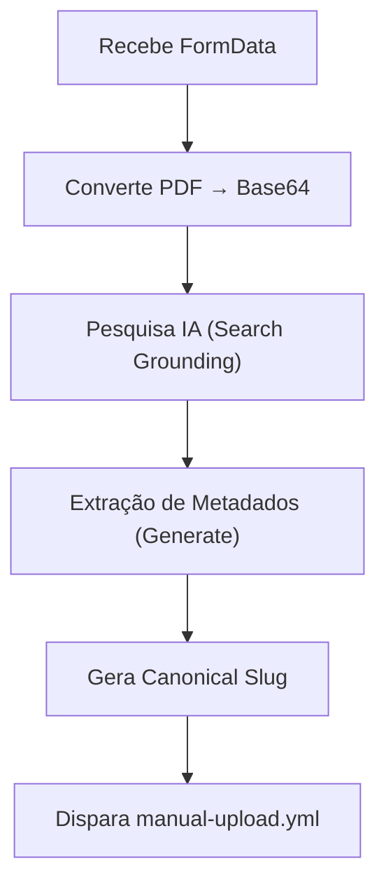

# /manual-upload e /delete-artifact — CRUD de Artefatos

> 🤖 **Disclaimer**: Documentação gerada por IA e pode conter imprecisões. [📋 Reportar erro](https://github.com/TouchRefletz/maia.api/issues/new?title=Erro+na+doc:+crud&labels=docs)

## Visão Geral

Os endpoints `/manual-upload` e `/delete-artifact` gerenciam o ciclo de vida de artefatos (provas e gabaritos) no sistema, orquestrando uploads com pesquisa de IA e deleções em cascata.

## Rotas

| Método | Caminho | Função |
|--------|---------|--------|
| POST | `/manual-upload` | Upload com pesquisa IA |
| POST | `/delete-artifact` | Deleção em cascata |

## /manual-upload — Upload com IA Research

### Request (FormData)

| Campo | Tipo | Descrição |
|-------|------|-----------|
| `title` | string | Título da prova |
| `fileProva` | File | PDF da prova |
| `source_url_prova` | string | URL original da prova |
| `source_url_gabarito` | string | URL original do gabarito |
| `pdf_url_override` | string | URL pré-uploaded (TmpFiles) |
| `gabarito_url_override` | string | URL pré-uploaded gabarito |
| `visual_hash` | string | Hash visual do PDF |
| `confirm_override` | boolean | Pular validações |

### Fluxo com IA



1. **Search com arquivo**: Envia o PDF para Gemini Search para identificar a prova
2. **Extract metadata**: Gemini gera JSON com `year`, `institution`, `phase`
3. **Canonical slug**: Gera slug normalizado
4. **GitHub dispatch**: Dispara o workflow `manual-upload.yml`

### Conversão Base64 (Worker)

Para PDFs grandes, usa chunks de 8KB para evitar stack overflow:

```javascript
const chunkSize = 8192;
for (let i = 0; i < uint8Array.length; i += chunkSize) {
  const chunk = uint8Array.subarray(i, Math.min(i + chunkSize, uint8Array.length));
  binary += String.fromCharCode.apply(null, chunk);
}
return btoa(binary);
```

## /delete-artifact — Deleção em Cascata

### Request

```json
{
  "slug": "enem-2022",
  "filename": "prova-dia1.pdf",
  "filenames": ["prova-dia1.pdf", "gabarito-dia1.pdf"],
  "manifest_only": false
}
```

### Ação

Dispara o workflow `delete-artifact.yml`:
```javascript
await fetch(url, {
  body: JSON.stringify({
    event_type: 'delete-artifact',
    client_payload: { slug, filename, filenames, manifest_only }
  })
});
```

O workflow então:
1. Remove arquivos do HuggingFace repo
2. Remove thumbnails associados
3. Atualiza manifesto (remove entradas)
4. Commit + push

## Referências Cruzadas

- [manual-upload.yml](/infra/manual-upload) — Workflow de upload
- [delete-artifact.yml](/infra/delete-artifact) — Workflow de deleção
- [/canonical-slug](/api-worker/canonical-slug) — Geração de slug
