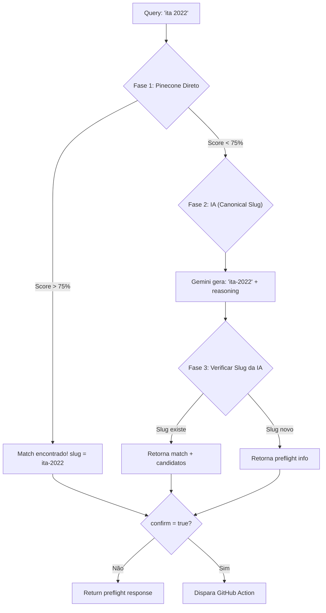

# /trigger-deep-search — 3 Fases de Busca Profunda

> 🤖 **Disclaimer**: Documentação gerada por IA e pode conter imprecisões. [📋 Reportar erro](https://github.com/TouchRefletz/maia.api/issues/new?title=Erro+na+doc:+deep-search-endpoint&labels=docs)

## Visão Geral

O endpoint `/trigger-deep-search` orquestra a busca de provas em **3 fases**: consulta direta ao Pinecone, geração de slug via IA, e verificação do slug no Pinecone. Suporta preflight (preview) antes de confirmar o disparo do GitHub Action.

## Rota

| Método | Caminho |
|--------|---------|
| POST | `/trigger-deep-search` |

## Request

```json
{
  "query": "ita 2022",
  "slug": null,
  "ntfy_topic": "false",
  "force": false,
  "cleanup": false,
  "confirm": false,
  "mode": "overwrite",
  "search_type": "provas"
}
```

## Fluxo de 3 Fases



### Fase 1: Busca Direta no Pinecone

Gera embedding da query e busca no índice `deep-search`:

```javascript
const directEmbedding = await generateEmbedding(query, apiKey);
const directResult = await executePineconeQuery(directEmbedding, env, 10, {
  type: { $in: ['deep-search-result', 'manual-upload-result'] }
});
```

- **Score > 75%**: Match forte, usa o slug do resultado
- **Score 60-75%**: Match fraco, guarda como candidatos similares
- **Score < 60%**: Sem match, vai para Fase 2

### Fase 2: Geração de Slug via IA

Chama `/canonical-slug` internamente para gerar um slug normalizado:

```javascript
const slugReq = new Request('http://internal/canonical-slug', {
  method: 'POST',
  body: JSON.stringify({ query, search_type }),
});
const slugRes = await handleCanonicalSlug(slugReq, env);
```

Fallback: sanitização simples (`toLowerCase().replace(/[^a-z0-9]+/g, '-')`)

### Fase 3: Verificação do Slug da IA

Busca no Pinecone usando o slug deslugificado:

```javascript
const slugSearchParam = canonicalSlug.replace(/-/g, ' '); // "ita-2022" → "ita 2022"
const slugEmbedding = await generateEmbedding(slugSearchParam, apiKey);
```

## Response — Preflight (`confirm: false`)

```json
{
  "success": true,
  "preflight": true,
  "canonical_slug": "ita-2022",
  "slug_reasoning": "Pinecone direct match (score: 92.3%)",
  "exact_match": {
    "slug": "ita-2022",
    "file_count": 6,
    "updated_at": "2026-04-01T12:00:00Z"
  },
  "similar_candidates": [
    { "slug": "ita-2021", "score": 0.88, "query": "ita 2021", "file_count": 4 }
  ]
}
```

## Response — Dispatch (`confirm: true`)

```json
{
  "success": true,
  "cached": false,
  "message": "Deep Search Triggered on GitHub",
  "final_slug": "ita-2022",
  "mode": "overwrite"
}
```

## Referências Cruzadas

- [deep-search.yml](/infra/deep-search) — Workflow que executa a busca
- [/canonical-slug](/api-worker/canonical-slug) — Geração de slug via IA
- [Integração Pinecone](/api-worker/pinecone) — Multi-index routing
