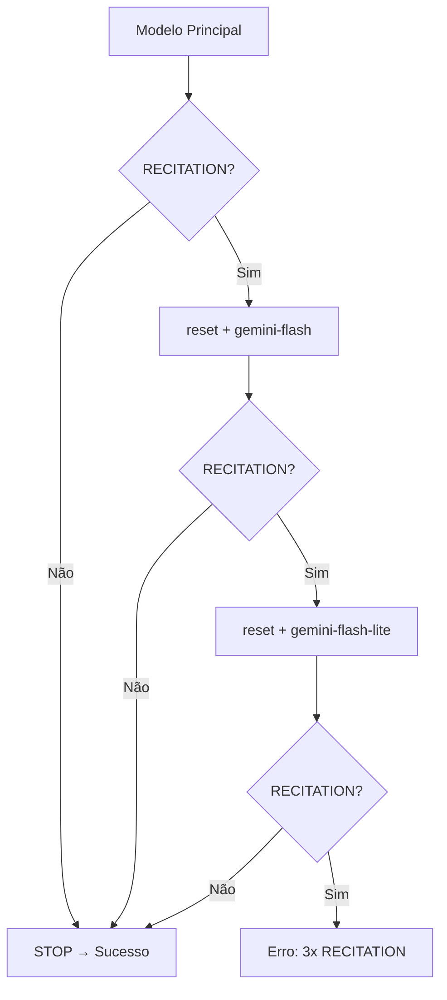

# /generate — Endpoint de Geração Gemini

> 🤖 **Disclaimer**: Documentação gerada por IA e pode conter imprecisões. [📋 Reportar erro](https://github.com/TouchRefletz/maia.api/issues/new?title=Erro+na+doc:+generate&labels=docs)

## Visão Geral

O endpoint `/generate` é o principal ponto de interação com a API Gemini. Suporta streaming NDJSON, fallback automático entre modelos, tratamento de RECITATION, modo chat multi-turn, e schema JSON.

## Rota

| Método | Caminho | Aliases |
|--------|---------|---------|
| POST | `/generate` | `/` (compatibilidade reversa) |

## Request

```json
{
  "texto": "Prompt do usuário",
  "schema": { ... },
  "listaImagensBase64": ["base64string..."],
  "mimeType": "image/jpeg",
  "model": "models/gemini-3-flash-preview",
  "apiKey": "user-api-key-override",
  "jsonMode": true,
  "thinking": true,
  "chatMode": false,
  "history": [],
  "systemInstruction": "Instruções do sistema...",
  "files": [{ "mimeType": "application/pdf", "data": "base64..." }]
}
```

### Parâmetros

| Parâmetro | Tipo | Default | Descrição |
|-----------|------|---------|-----------|
| `texto` | string | - | Prompt principal |
| `schema` | object | - | JSON Schema para resposta estruturada |
| `listaImagensBase64` | array | `[]` | Imagens em base64 |
| `mimeType` | string | `image/jpeg` | MIME type padrão das imagens |
| `model` | string | - | Modelo preferido (entra primeiro na fila) |
| `apiKey` | string | - | Override da API key (para key do usuário) |
| `jsonMode` | boolean | `true` | Se true, força `application/json` |
| `thinking` | boolean | `true` | Se true, habilita thoughts do modelo |
| `chatMode` | boolean | `false` | Modo multi-turn com histórico |
| `history` | array | `[]` | Mensagens anteriores (chatMode) |
| `systemInstruction` | string | - | System prompt |
| `files` | array | - | Arquivos genéricos (PDFs, etc.) |

## Response (NDJSON Streaming)

Content-Type: `application/x-ndjson; charset=utf-8`

Cada linha é um JSON independente:

### Tipos de Mensagem

| type | Campos | Descrição |
|------|--------|-----------|
| `meta` | `event`, `attempt`, `model` | Controle: `attempt_start`, `retrying_after_recitation` |
| `thought` | `attempt`, `model`, `text` | Pensamentos do modelo (thinking mode) |
| `answer` | `attempt`, `model`, `text` | Resposta incremental do modelo |
| `debug` | `attempt`, `model`, `text` | Info de debug (finishReason) |
| `reset` | `attempt`, `model`, `reason`, `clear` | Sinal para frontend limpar tentativa |
| `error` | `code`, `retryable`, `message`, `attempts` | Erro terminal |

### Exemplo de Stream

```ndjson
{"type":"meta","event":"attempt_start","attempt":1,"model":"models/gemini-3-flash-preview"}
{"type":"thought","attempt":1,"model":"models/gemini-3-flash-preview","text":"Analisando a questão..."}
{"type":"answer","attempt":1,"model":"models/gemini-3-flash-preview","text":"{\"layout\":\"standard\""}
{"type":"answer","attempt":1,"model":"models/gemini-3-flash-preview","text":",\"blocks\":[...]}"}
{"type":"debug","attempt":1,"model":"models/gemini-3-flash-preview","text":"Finish Reason: STOP"}
```

## Detalhamento Técnico

### Chain de Modelos

```javascript
const DEFAULT_MODELS = [
  'models/gemini-3-flash-preview',
  'models/gemini-2.5-flash',
  'models/gemini-2.5-flash-lite',
  'models/gemini-flash-latest',
  'models/gemini-flash-lite-latest',
];
```

Se um modelo específico é fornecido, ele entra primeiro na fila.

### RECITATION Handling

Quando o modelo retorna `finishReason: RECITATION`:

1. Incrementa `recitationCount`
2. Envia `type: reset` para o frontend limpar o conteúdo parcial
3. Tenta fallback: `gemini-flash-latest` → `gemini-flash-lite-latest`
4. Após 3 falhas: `type: error` com `code: RECITATION`



### Chat Mode

Quando `chatMode = true`:
```javascript
const chat = client.chats.create({
  model: modelo,
  history: history,
  config: { systemInstruction }
});
stream = await chat.sendMessageStream({ message: { role: 'user', parts }, config });
```

### Processamento de Attachments

Suporta múltiplos formatos de input:
1. **String base64 pura**: `"iVBORw0KGgo..."`
2. **Data URI**: `"data:image/png;base64,iVBORw0KGgo..."`
3. **Objeto**: `{ mimeType: "application/pdf", data: "base64..." }`

### Safety Settings

Todos os filtros de segurança desabilitados (`BLOCK_NONE`) para conteúdo educacional irrestrito.

## Edge Cases e Tratamento de Erros

| Caso | Tratamento |
|------|-----------|
| API key ausente | Erro 500 |
| Todos os modelos falham | `type: error`, `code: ALL_MODELS_FAILED` |
| RECITATION 3x | `type: error`, `code: RECITATION` |
| Stream sem finishReason | Trata como erro, tenta próximo modelo |
| User API key | Override via `body.apiKey` |

## Referências Cruzadas

- [Chat Mode](/api-worker/generate-chat) — Detalhamento do modo multi-turn
- [Pipeline Principal](/chat/pipelines-overview) — Como o frontend consome o stream
- [Worker Client](/utils/worker-client) — `callWorker()` no frontend
