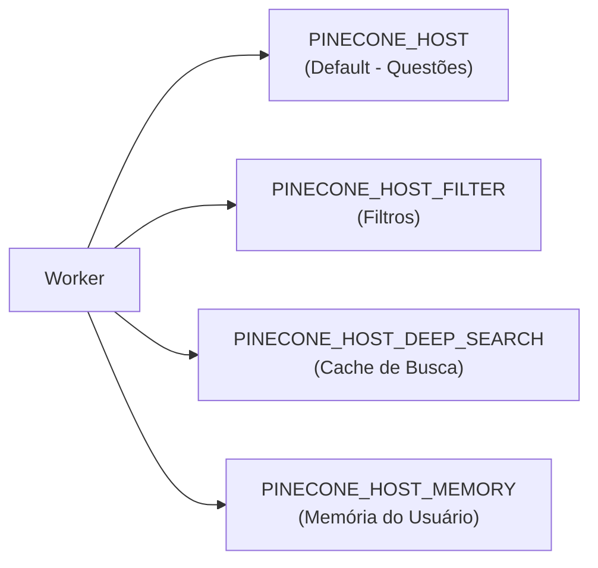

# /pinecone-upsert e /pinecone-query — Integração Pinecone

> 🤖 **Disclaimer**: Documentação gerada por IA e pode conter imprecisões. [📋 Reportar erro](https://github.com/TouchRefletz/maia.api/issues/new?title=Erro+na+doc:+pinecone&labels=docs)

## Visão Geral

Os endpoints `/pinecone-upsert` e `/pinecone-query` são proxies para a API do Pinecone, gerenciando multi-index routing automático baseado no tipo de dado e namespace.

## Rotas

| Método | Caminho | Função |
|--------|---------|--------|
| POST | `/pinecone-upsert` | Inserir/atualizar vetores |
| POST | `/pinecone-query` | Buscar vetores similares |

## Arquitetura Multi-Index

O sistema usa **4 índices Pinecone separados**:



| Target | Variável ENV | Conteúdo |
|--------|-------------|----------|
| `default` | `PINECONE_HOST` | Embeddings de questões |
| `filter` | `PINECONE_HOST_FILTER` | Índice para filtros dinâmicos |
| `deep-search` | `PINECONE_HOST_DEEP_SEARCH` | Cache de resultados de busca |
| `maia-memory` | `PINECONE_HOST_MEMORY` | Memória cognitiva do usuário |

### Roteamento Automático

Para **upsert**, o target é determinado automaticamente:

```javascript
const isDeepSearch = vectors.some(
  v => v.metadata?.type === 'deep-search-result' || v.metadata?.type === 'manual-upload-result'
);
if (isDeepSearch) pineconeHost = env.PINECONE_HOST_DEEP_SEARCH;
```

Para **query**, o target pode ser explícito ou inferido do filtro:

```javascript
if (target === 'filter') pineconeHost = env.PINECONE_HOST_FILTER;
else if (target === 'maia-memory') pineconeHost = env.PINECONE_HOST_MEMORY;
else if (filter.type?.$in?.includes('deep-search-result')) pineconeHost = env.PINECONE_HOST_DEEP_SEARCH;
```

## Request — Upsert

```json
{
  "vectors": [
    {
      "id": "questao-123",
      "values": [0.012, -0.034, ...],
      "metadata": {
        "type": "questao",
        "materia": "Física",
        "instituicao": "ENEM"
      }
    }
  ],
  "namespace": "",
  "target": "default"
}
```

## Request — Query

```json
{
  "vector": [0.012, -0.034, ...],
  "topK": 5,
  "filter": {
    "type": { "$in": ["deep-search-result", "manual-upload-result"] }
  },
  "target": "default",
  "namespace": ""
}
```

## Response — Query

```json
{
  "matches": [
    {
      "id": "enem-2022",
      "score": 0.92,
      "metadata": {
        "slug": "enem-2022",
        "query": "enem 2022",
        "institution": "INEP",
        "file_count": 4
      }
    }
  ]
}
```

## Detalhamento Técnico

### Headers Pinecone

```javascript
headers: {
  'Api-Key': apiKey,
  'Content-Type': 'application/json',
  'X-Pinecone-API-Version': '2024-07',
}
```

### Namespace

Namespaces permitem isolamento dentro do mesmo índice:
- Memória: namespace = `userId`
- Default/Filter: namespace = `""` (default)

## Referências Cruzadas

- [Pipeline de Embedding](/embeddings/pipeline) — Como embeddings são gerados
- [Integração Pinecone](/embeddings/pinecone) — Detalhamento frontend
- [Memória Cloud](/memoria/pinecone-sync) — Uso do namespace de memória
