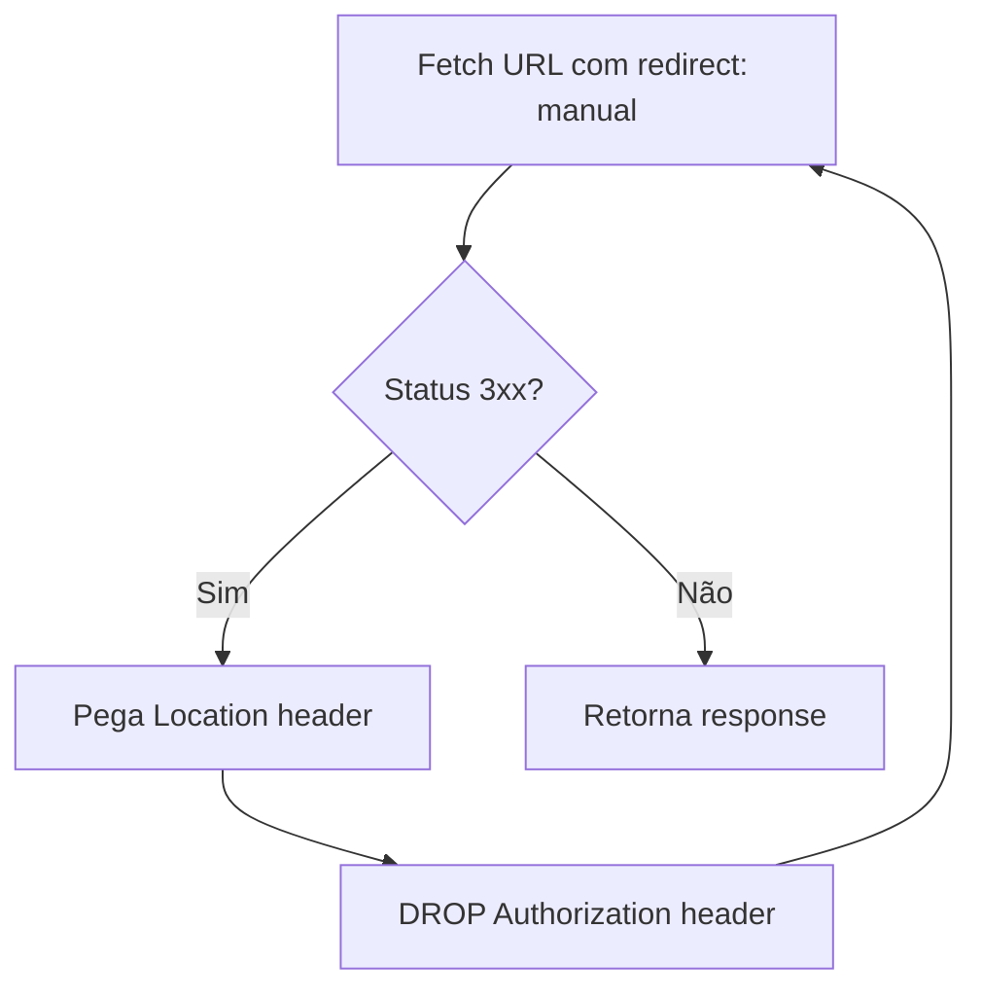

# /proxy-pdf — CORS Proxy para PDFs

> 🤖 **Disclaimer**: Documentação gerada por IA e pode conter imprecisões. [📋 Reportar erro](https://github.com/TouchRefletz/maia.api/issues/new?title=Erro+na+doc:+proxy-pdf&labels=docs)

## Visão Geral

O endpoint `/proxy-pdf` serve como proxy CORS para PDFs hospedados em servidores externos (HuggingFace, Google Drive, etc.). Resolve problemas de Mixed Content e CORS, com suporte especial para autenticação HuggingFace e seguimento de redirects.

## Rota

| Método | Caminho |
|--------|---------|
| GET | `/proxy-pdf?url=https://...` |

## Parâmetros

| Parâmetro | Tipo | Obrigatório | Descrição |
|-----------|------|-------------|-----------|
| `url` | string (query param) | Sim | URL do PDF a proxiar |

## Response

Streaming do body do PDF original com headers CORS:

```
Content-Type: application/pdf
Cache-Control: public, max-age=3600
Access-Control-Allow-Origin: *
```

## Detalhamento Técnico

### Decoding de URL

Resolve URL potencialmente double-encoded:

```javascript
let iterations = 0;
while (targetUrl.includes('%') && iterations < 5) {
  const decoded = decodeURIComponent(targetUrl);
  if (decoded === targetUrl) break;
  targetUrl = decoded;
  iterations++;
}
```

### Seguimento Manual de Redirects



**Por quê manual?** URLs do HuggingFace redirecionam para S3/CDN. O Bearer Token HF deve ser enviado para HF mas **não** para S3 (URLs assinadas falham com auth headers extras).

```javascript
// Se redirecionando para novo host, DROP AUTH
headers = { 'User-Agent': headers['User-Agent'] }; // Remove Authorization
```

### Autenticação HuggingFace

```javascript
if (currentUrl.includes('huggingface.co') && env.HF_TOKEN) {
  headers['Authorization'] = `Bearer ${env.HF_TOKEN}`;
}
```

### Detecção de Erro

Se o upstream retorna HTML/XML em vez de PDF:

```javascript
if (contentType.includes('text/html') || contentType.includes('application/xml')) {
  return new Response(`Error: Upstream returned ${contentType}`, { status: 502 });
}
```

### Caching

```
Cache-Control: public, max-age=3600   // 1 hora
```

## Edge Cases

| Caso | Tratamento |
|------|-----------|
| URL double-encoded | Decoding iterativo (máx 5x) |
| Redirect para S3 | Drop auth headers |
| Upstream retorna HTML | 502 Bad Gateway |
| Upstream 4xx/5xx | Proxy o status code |
| HF Token ausente | Request sem auth (pode falhar em repos privados) |
| Redirect loop | Máximo 5 seguimentos |

## Referências Cruzadas

- [PDF Core](/pdf/core) — Viewer que consome PDFs via proxy
- [Viewer Context](/pdf/contexto) — URLs de PDFs
