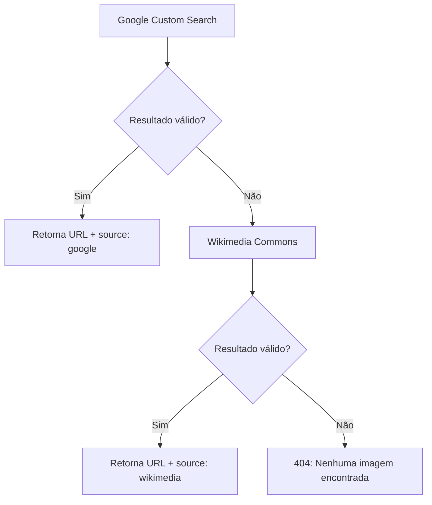

# /search-image — Busca de Imagens

> 🤖 **Disclaimer**: Documentação gerada por IA e pode conter imprecisões. [📋 Reportar erro](https://github.com/TouchRefletz/maia.api/issues/new?title=Erro+na+doc:+search-image&labels=docs)

## Visão Geral

O endpoint `/search-image` busca imagens relevantes usando **Google Custom Search API** com fallback para **Wikimedia Commons**. Suporta exclusão de URLs que falharam no client-side (403, CORS).

## Rota

| Método | Caminho |
|--------|---------|
| GET | `/search-image?q=query&exclude=[...]` |

## Parâmetros

| Parâmetro | Tipo | Obrigatório | Descrição |
|-----------|------|-------------|-----------|
| `q` | string | Sim | Query de busca |
| `exclude` | JSON array | Não | URLs a excluir (falharam no client) |

## Response

```json
{ "url": "https://image-url...", "source": "google" }
```

Ou em caso de nenhuma imagem:
```json
{ "error": "Nenhuma imagem encontrada", "source": "none" }
```

## Detalhamento Técnico

### Cadeia de Busca



### 1. Google Custom Search API

```
GET https://www.googleapis.com/customsearch/v1
  ?key={GOOGLE_SEARCH_API_KEY}
  &cx={GOOGLE_SEARCH_ENGINE_ID}
  &q={query}
  &searchType=image
  &num=5
```

Pede 5 resultados e retorna o primeiro não excluído.

### 2. Wikimedia Commons Fallback

```
GET https://pt.wikipedia.org/w/api.php
  ?action=query
  &generator=search
  &gsrsearch={query}
  &gsrlimit=5
  &prop=pageimages
  &pithumbsize=800
  &format=json
  &origin=*
```

Itera `data.query.pages` e retorna o primeiro thumbnail não excluído.

### Exclusão de URLs

O parâmetro `exclude` permite retry inteligente:

```javascript
// Frontend detecta 403 em uma imagem
const excludeList = ["https://old-url-that-failed.jpg"];
fetch(`/search-image?q=query&exclude=${JSON.stringify(excludeList)}`);
```

O Worker filtra resultados contra a lista:
```javascript
const validItem = data.items.find(item => !excludedUrls.has(item.link));
```

## Referências Cruzadas

- [Arquitetura do Worker](/api-worker/arquitetura) — Visão geral dos endpoints
- [Chat Render](/chat/render) — Exibição de imagens no chat
