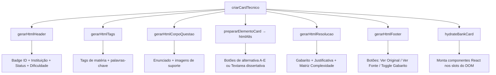

# Card Template — Fábrica de Cards de Questão

> 🤖 **Disclaimer**: Documentação gerada por IA e pode conter imprecisões. [📋 Reportar erro](https://github.com/TouchRefletz/maia.api/issues/new?title=Erro+na+doc:+Card+Template&labels=docs)

## Visão Geral

O `card-template.js` (`js/banco/card-template.js`) é o módulo central de renderização do **Banco de Questões** do maia.edu. Ele recebe dados brutos de uma questão de vestibular (JSON com enunciado, alternativas, gabarito, metadados) e produz um elemento DOM completo e interativo — o **Card de Questão**.

Com 425 linhas de lógica de template, este arquivo é a maior fábrica de HTML dinâmico do projeto. Cada card gerado é autossuficiente: contém header com badges, corpo da questão com imagens e LaTeX, alternativas clicáveis com feedback, gabarito colapsável, e integração com React via hydration.

## Anatomia de um Card



## A Função Orquestradora (`criarCardTecnico`)

Ponto de entrada único. Recebe `idFirebase` (ID do documento no Firestore) e `fullData` (objeto completo com `dados_questao`, `dados_gabarito`, `meta`). Orquestra a montagem em 5 etapas:

```javascript
export function criarCardTecnico(idFirebase, fullData) {
  const q = fullData.dados_questao || {};
  const g = fullData.dados_gabarito || {};
  const meta = fullData.meta || {};

  // 1. Prepara imagens
  const { jsonImgsQ, jsonImgsG, htmlImgsSuporte, rawImgsQ, rawImgsG } =
    prepararImagensVisualizacao(fullData);

  // 2. Corpo da questão (enunciado + imagens)
  const htmlCorpoQuestao = gerarHtmlCorpoQuestao(q, rawImgsQ, htmlImgsSuporte);

  // 3. Container + alternativas
  const { card, htmlAlts, cardId } = prepararElementoCard(idFirebase, q, g, meta);

  // 4. Junta tudo
  card.innerHTML = [
    gerarHtmlHeader(idFirebase, fullData),
    gerarHtmlTags(q, cardId),
    `<div class="q-body">${htmlCorpoQuestao}</div>`,
    `<div class="q-options" id="${cardId}_opts">${htmlAlts}</div>`,
    gerarHtmlResolucao(cardId, g, rawImgsG, jsonImgsG),
    gerarHtmlFooter(cardId, rawImgsQ, jsonImgsQ, meta.source_url),
  ].join("");

  // 5. Hydration React
  hydrateBankCard(card, { q, g, imgsOriginalQ: rawImgsQ, jsonImgsG });

  return card;
}
```

## O Header: Badges de Contexto Visual (`gerarHtmlHeader`)

O header é o "cartão de visita" da questão. Em uma faixa horizontal compacta, exibe:

### Badge de ID
Identificador único do documento no Firebase, estilizado como tag monocromática.

### Badge de Origem
Detecta se a resolução foi gerada por IA ou é material original humano:
```javascript
const origemRaw = (cred.origemresolucao || cred.origem_resolucao || "").toLowerCase();
if (origemRaw.includes("gerado") || origemRaw.includes("artificial") || origemRaw === "ia") {
  origemLabel = "Gerada com IA";
  origemIcon = "🤖";
}
```

### Badge de Dificuldade
Calculada pelo módulo `ComplexityCard.tsx`, exibe com cores semafóricas: 🟢 Fácil, 🟡 Média, 🟠 Difícil, 🔴 Desafio.

### Badge de Status de Revisão
Status editorial da questão no pipeline de QA:

| Status | Cor | Significado |
|--------|-----|-------------|
| Não Revisada | Cinza #6c757d | Recém-importada, ninguém verificou |
| Revisada | Verde #28a745 | Um humano conferiu e aprovou |
| Verificada | Azul #17a2b8 | Dupla aprovação (professor + sistema) |
| Sinalizada | Amarelo #ffc107 | Possível erro detectado |
| Invalidada | Vermelho #dc3545 | Questão removida por erro grave |

## Alternativas: O Motor Interativo (`prepararElementoCard`)

A função classifica a questão em dois tipos e gera HTML radicalmente diferente:

### Questões de Múltipla Escolha
Para cada alternativa, cria um `<button>` com data-attributes que armazenam a letra, a resposta correta, e o motivo de aprovação/reprovação (escapado contra XSS):

```html
<button class="q-opt-btn js-verificar-resp"
    data-card-id="q_abc123"
    data-letra="A"
    data-correta="C"
    data-motivo="Incorreta porque confunde velocidade com aceleração">
  <span class="q-opt-letter">A)</span>
  <div class="q-opt-content">Texto da alternativa...</div>
  <div class="q-opt-motivo" style="display:none;"></div>
</button>
```

Quando o aluno clica, o [módulo de interações](/banco/interacoes) compara `data-letra` com `data-correta`, pinta o botão de verde/vermelho, e revela o `q-opt-motivo` com feedback detalhado.

### Questões Dissertativas
Gera um `<textarea>` com dois botões de correção:
- **Correção Simples (Palavras-Chave)**: Compara contra keywords esperadas no gabarito.
- **Correção Completo (IA)**: Envia a resposta do aluno para o Gemini Flash avaliar.

```html
<div class="q-dissert-container">
  <textarea class="q-dissert-input" placeholder="Esboce sua resposta..." rows="4"></textarea>
  <div class="q-dissert-actions">
    <button class="q-dissert-btn js-check-dissert-embedding">🔑 Corrigir Simples</button>
    <button class="q-dissert-btn js-check-dissert-ai">🤖 Corrigir Completo</button>
  </div>
  <div id="q_abc123_feedback" class="q-dissert-feedback" style="display: none;"></div>
</div>
```

## Dataset Attributes para Filtragem

Cada card armazena metadados filtráveis nos `dataset` do DOM:

```javascript
card.dataset.materia = (q.materias_possiveis || []).join(" ");
card.dataset.origem = meta.material_origem || "";

const textoBusca = q.estrutura
  ? q.estrutura.map((b) => b.conteudo).join(" ")
  : q.enunciado || "";

card.dataset.texto = (textoBusca + " " + (q.identificacao || "")).toLowerCase();
```

O `dataset.texto` é usado pelo [sistema de busca textual](/banco/filtros-dinamicos) para filtrar cards por substring. O `dataset.materia` é usado pelos [filtros de UI](/banco/filtros-ui) para checkboxes de matéria.

## Resolução e Gabarito (`gerarHtmlResolucao`)

Seção oculta por padrão (`display: none`) que é revelada pelo botão "Ver/Esconder Gabarito". Contém:

1. **Badge do Gabarito**: Letra correta + confiança do modelo de IA que gerou a resposta.
2. **Resposta Modelo Esperada**: Para dissertativas, mostra o texto que uma resposta ideal deveria conter, renderizado via Markdown.
3. **Justificativa Base**: Texto curto explicando por que a alternativa correta é correta.
4. **Relatório de Pesquisa**: Se o gabarito foi gerado pelo [Deep Search](/infra/deep-search), inclui fontes e análise.
5. **Passos da Resolução**: Renderização passo-a-passo com colapsáveis.
6. **Matriz de Complexidade**: Análise detalhada de dificuldade por competência.
7. **Créditos**: Autor, instituição, ano, origem da resolução.

## Hydration React (`hydrateBankCard`)

Após montar o HTML estático, a função `hydrateBankCard` (de `bank-hydration.tsx`) varre o DOM do card e monta componentes React nos "slots" adequados — por exemplo, renderiza KaTeX para equações LaTeX encontradas no enunciado, ou monta componentes interativos de complexidade.

Esta abordagem híbrida (HTML estático gerado por JS puro + islands React hidratadas depois) é essencial para performance: cards são criados em massa durante scroll infinito, e montar componentes React para cada um seria proibitivamente lento.

## Referências Cruzadas

- [Card Partes — Submódulos de renderização](/banco/card-partes)
- [Interações — Lógica de clique e feedback](/banco/interacoes)
- [Filtros UI — Interface de filtragem](/banco/filtros-ui)
- [Hydration — Montagem de componentes React](/banco/hydration)
- [Visão Geral do Banco](/banco/visao-geral)
