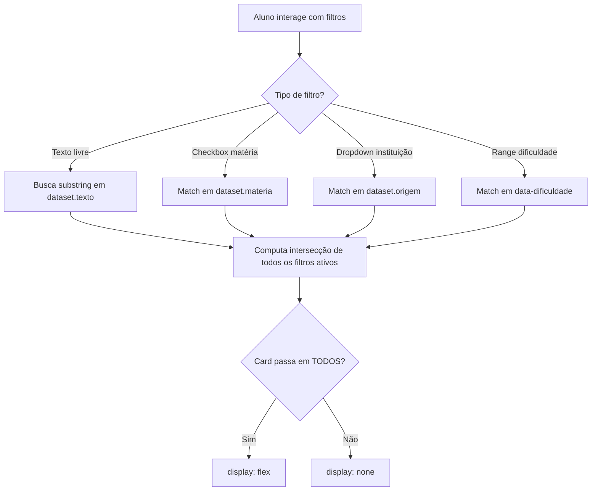

# Filtros Dinâmicos — Motor de Busca e Filtragem

> 🤖 **Disclaimer**: Documentação gerada por IA e pode conter imprecisões. [📋 Reportar erro](https://github.com/TouchRefletz/maia.api/issues/new?title=Erro+na+doc:+filtros-dinamicos&labels=docs)

## Visão Geral

O módulo `filtros-dinamicos.js` (`js/banco/filtros-dinamicos.js`) implementa a lógica de filtragem e busca textual do Banco de Questões. É o motor que permite ao estudante encontrar questões específicas por matéria, instituição, dificuldade, e texto livre — tudo sem fazer novas requisições ao servidor, filtrando diretamente os cards já renderizados no DOM.

Com 10.456 bytes de lógica de filtragem client-side, este módulo transforma o banco de centenas de questões num sistema de busca responsivo e instantâneo.

## Arquitetura de Filtragem Client-Side

A filtragem opera 100% no browser, sem chamadas ao Firebase ou Pinecone. Os cards já carregados possuem `dataset` attributes com metadados filtráveis:

```html
<div class="q-card"
  data-materia="Física Termodinâmica"
  data-origem="ENEM_2023"
  data-texto="a entropia de um sistema isolado...">
```

### Por Que Client-Side?

O Banco de Questões usa **paginação por cursor (scroll infinito)**. Cada "página" de questões é um batch de ~20 documentos carregados do Firestore. Filtrar no servidor exigiria queries compostas complexas (Firestore tem limitações severas com OR queries e full-text search), além de descartar cards já renderizados e re-buscar.

A filtragem client-side permite performance instantânea (< 5ms para 200 cards) e preserva os cards no DOM para toggle rápido quando filtros são removidos.

## Tipos de Filtro Implementados



### Filtro de Texto Livre

O input de busca textual faz matching por substring case-insensitive no `dataset.texto`:

```javascript
const searchTerm = inputBusca.value.toLowerCase().trim();
cards.forEach(card => {
  const texto = card.dataset.texto || "";
  const matchTexto = !searchTerm || texto.includes(searchTerm);
  // ... combina com outros filtros
});
```

O debounce de 300ms no input evita recálculos excessivos enquanto o aluno digita.

### Filtro de Matéria (Checkboxes)

Cada matéria presente nos cards carregados gera um checkbox dinâmico na sidebar de filtros. O matching verifica se PELO MENOS UMA matéria do card está nos filtros selecionados:

```javascript
const materiasSelecionadas = getCheckedMaterias();
const materiasDoCard = card.dataset.materia.split(" ");
const matchMateria = materiasSelecionadas.length === 0 ||
  materiasDoCard.some(m => materiasSelecionadas.includes(m));
```

### Filtro de Instituição

Dropdown com todas as instituições presentes nos cards. Suporta multi-select para combinar (ex: "ENEM + FUVEST").

### Filtro de Dificuldade

Range slider de 4 níveis (Fácil → Desafio). Questões sem análise de complexidade são tratadas como "Média" por default.

## Geração Dinâmica de Opções de Filtro

O ponto mais elegante do módulo: as opções de filtro não são hardcoded. Elas são geradas dinamicamente baseadas nos cards disponíveis:

```javascript
function gerarOpcoesFiltro(cards) {
  const materias = new Set();
  const instituicoes = new Set();

  cards.forEach(card => {
    const mats = card.dataset.materia.split(" ");
    mats.forEach(m => { if (m) materias.add(m); });

    const inst = card.dataset.origem;
    if (inst) instituicoes.add(inst);
  });

  renderCheckboxes(Array.from(materias).sort());
  renderDropdown(Array.from(instituicoes).sort());
}
```

Se o banco tem 200 questões de Física e 50 de História, o checkbox de Física mostra um counter "(200)" ao lado. Conforme cards são filtrados, os counters atualizam em tempo real.

## Composição de Filtros (AND Logic)

Quando múltiplos filtros estão ativos, eles são combinados com lógica AND: o card deve satisfazer TODOS os critérios para aparecer:

```javascript
const isVisible = matchTexto && matchMateria && matchInstituicao && matchDificuldade;
card.style.display = isVisible ? "flex" : "none";
```

### Counter de Resultados

Após cada filtragem, um badge no header do banco mostra: "Exibindo X de Y questões". Isso dá feedback imediato ao aluno sobre a eficácia dos filtros.

## Integração com Paginação

Quando novas questões são carregadas via scroll infinito (novo batch do Firestore), o módulo de filtros é re-executado para:
1. Adicionar novas opções de matéria/instituição que apareceram
2. Aplicar os filtros ativos nos novos cards (que já nascem com `display: none` se não passarem)

## Performance

Para 500 cards (cenário extremo), a filtragem completa leva < 10ms. Isso é possível porque:
- Nenhuma operação de rede
- Nenhuma manipulação de layout (apenas `display` toggle)
- Nenhuma re-renderização de componentes React
- Debounce no input textual

## Referências Cruzadas

- [Filtros UI — A interface visual dos filtros](/banco/filtros-ui)
- [Paginação — Sistema de scroll infinito](/banco/paginacao)
- [Card Template — Origem dos dataset attributes](/banco/card-template)
- [Visão Geral do Banco](/banco/visao-geral)
