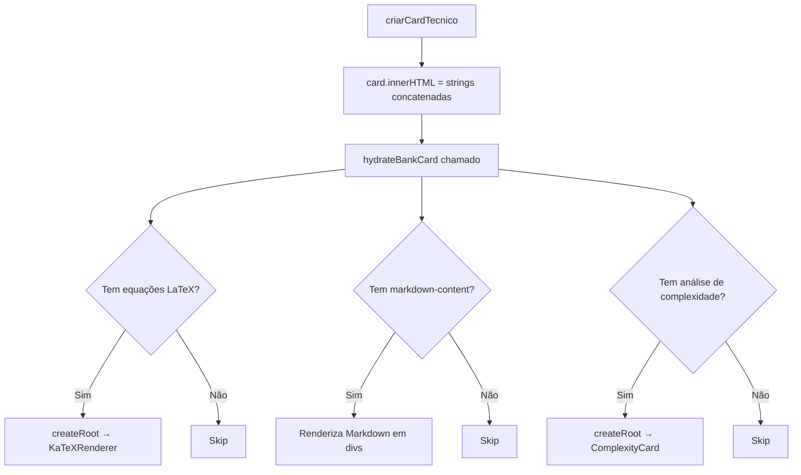

# Hydration — Componentes React no Banco de Questões

> 🤖 **Disclaimer**: Documentação gerada por IA e pode conter imprecisões. [📋 Reportar erro](https://github.com/TouchRefletz/maia.api/issues/new?title=Erro+na+doc:+banco-hydration&labels=docs)

## Visão Geral

O `bank-hydration.tsx` (`js/banco/bank-hydration.tsx`) é o módulo bridge entre o mundo do HTML estático gerado por `card-template.js` e os componentes React interativos que precisam existir dentro dos cards. Ele implementa o padrão **Islands Architecture**: o card é 95% HTML estático (rápido de gerar via innerHTML) com "ilhas" de React hidratadas em slots específicos do DOM.

## A Necessidade da Abordagem Híbrida

O Banco de Questões pode renderizar 200+ cards via scroll infinito. Se cada card fosse um componente React completo, teríamos:
- **200 React roots** competindo por CPU
- **Milhares de hooks** sendo recalculados a cada re-render
- **Memory bloat** de closures e componentes montados que o aluno nem está vendo

A solução: gerar o HTML do card via template strings (ultra-rápido, zero overhead React), e depois "hidratar" apenas os poucos elementos que precisam de interatividade rica (como renderização KaTeX, gráficos de complexidade, ou componentes de review).

## Arquitetura de Hydration



## A Função `hydrateBankCard`

```typescript
import { createRoot } from "react-dom/client";

export function hydrateBankCard(
  cardElement: HTMLElement,
  context: { q: any; g: any; imgsOriginalQ: string[]; jsonImgsG: string }
) {
  // 1. Hidratar equações LaTeX
  const mathElements = cardElement.querySelectorAll(".math-inline, .math-block");
  mathElements.forEach(el => {
    const tex = el.textContent || "";
    const root = createRoot(el);
    root.render(<KaTeXRenderer tex={tex} displayMode={el.classList.contains("math-block")} />);
  });

  // 2. Hidratar markdown renderizável
  const markdownSlots = cardElement.querySelectorAll(".markdown-content[data-raw]");
  markdownSlots.forEach(el => {
    const raw = el.getAttribute("data-raw") || "";
    // Decode HTML entities
    const decoded = raw.replace(/&quot;/g, '"').replace(/&lt;/g, '<').replace(/&gt;/g, '>');
    el.innerHTML = renderMarkdownToHTML(decoded);
  });

  // 3. Hidratar componentes de complexidade
  const complexitySlot = cardElement.querySelector(".complexity-slot");
  if (complexitySlot && context.g.analise_complexidade) {
    const root = createRoot(complexitySlot);
    root.render(<ComplexityCard data={context.g.analise_complexidade} />);
  }
}
```

## Hidratação de LaTeX (KaTeX)

Equações matemáticas dentro de questões de vestibuular são extremamente comuns. O OCR extrai o LaTeX bruto do PDF, que é armazenado como string no JSON da questão. Durante a renderização do card, blocos `$...$` (inline) e `$$...$$` (display) são marcados com classes `math-inline` e `math-block`.

A hydration substitui o texto cru pelo output renderido do KaTeX — transformando `$\int_0^1 x^2 dx$` em um gráfico vetorial SVG bonito e responsivo.

### Error Boundaries para LaTeX

KaTeX é estrito: se o LaTeX contém erros de sintaxe (comum em OCR), ele crashearia o componente. A hydration envolve cada renderização em try/catch e, em caso de falha, mantém o texto cru visível (melhor que nada) com um badge de erro discreto.

## Hidratação de Markdown (Resposta Modelo)

Na seção de gabarito, o campo "Resposta Modelo Esperada" contém Markdown cru que precisa ser renderizado (negrito, listas, links, etc.). O HTML do card armazena o texto no `data-raw` attribute (escapado contra XSS) e a hydration faz o decode + render.

## Cleanup de Roots

Quando cards são removidos do DOM (scroll muito longe do viewport, ou cleanup de memória), os React roots criados precisam ser desmontados para evitar memory leaks:

```typescript
// Armazena roots para cleanup futuro
const cardRoots = new WeakMap<HTMLElement, Root[]>();

export function cleanupBankCard(cardElement: HTMLElement) {
  const roots = cardRoots.get(cardElement) || [];
  roots.forEach(root => root.unmount());
  cardRoots.delete(cardElement);
}
```

O `WeakMap` garante que roots de cards finalizados pelo garbage collector não bloqueiem memória.

## Performance

| Métrica | HTML Puro (sem React) | Com Hydration Islands |
|---------|----------------------|----------------------|
| Render de 1 card | 0.5ms | 2ms |
| Render de 20 cards (batch) | 10ms | 40ms |
| Memória por card | ~2KB | ~5KB |
| Interatividade | Nenhuma | LaTeX + Markdown + Complexidade |

O overhead da hydration é mínimo (~3x mais lento, mas ainda < 50ms por batch), e a interatividade ganha é significativa.

## Referências Cruzadas

- [Card Template — Gera o HTML que este módulo hidrata](/banco/card-template)
- [Paginação — Trigger de renderização de novos batches](/banco/paginacao)
- [Render Structure — Renderização de estrutura de questões](/render/structure)
- [Visão Geral do Banco](/banco/visao-geral)
