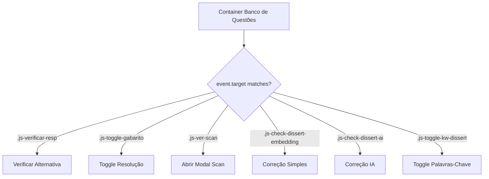

# Interações — Lógica de Clique e Feedback do Banco

> 🤖 **Disclaimer**: Documentação gerada por IA e pode conter imprecisões. [📋 Reportar erro](https://github.com/TouchRefletz/maia.api/issues/new?title=Erro+na+doc:+interacoes&labels=docs)

## Visão Geral

O módulo `interacoes.js` (`js/banco/interacoes.js`) gerencia toda a lógica de interação do usuário com os cards de questão no Banco de Questões. É ele quem ouve cliques nos botões de alternativa, revela gabaritos, processa respostas dissertativas, e orquestra o feedback visual instantâneo que transforma o banco de questões de uma lista estática em uma experiência de simulado interativo.

Com 12.291 bytes de lógica event-driven, este módulo é o coração da interatividade do banco — tudo que acontece depois que o card é renderizado na tela passa por aqui.

## Arquitetura Event-Driven

O módulo utiliza **Event Delegation** no container pai do banco. Em vez de adicionar listeners individuais a cada botão (o que seria inviável com scroll infinito criando centenas de cards dinamicamente), um único listener no container captura eventos por bubbling:



### Por Que Event Delegation?

Cards são criados e destruídos dinamicamente durante scroll infinito (paginação lazy). Adicionar `addEventListener` a cada botão em cada card criado, e removê-lo ao destruir, seria um nightmare de memory leaks. Com delegation, o listener vive no container pai — sempre presente, nunca duplicado.

## Verificação de Alternativas (Múltipla Escolha)

Quando o aluno clica numa alternativa, o handler extrai os data-attributes do botão:

```javascript
const letra = btn.dataset.letra;       // "A", "B", "C", etc.
const correta = btn.dataset.correta;   // Letra da resposta certa
const motivo = btn.dataset.motivo;     // Justificativa escapada
```

### Fluxo de Feedback

1. **Comparação**: `letra === correta`?
2. **Pintura Visual**:
   - ✅ Acerto: botão ganha classe `q-opt-correct` (verde)
   - ❌ Erro: botão ganha classe `q-opt-wrong` (vermelho) + o botão correto ganha `q-opt-correct`
3. **Revelação do Motivo**: O `div.q-opt-motivo` oculto recebe o texto do `data-motivo` e se torna visível
4. **Lock de Alternativas**: Todos os botões do card recebem `disabled = true` para impedir múltiplas tentativas
5. **Animação**: Transição CSS suave de opacidade e escala no botão correto

### Anti-Spoiler de Gabarito

As respostas corretas NÃO são reveladas até que o aluno clique. O atributo `data-correta` existe no HTML, mas está "escondido" no data-attribute do botão — o aluno teria que inspecionar o DOM para trapacear. Para simulados formais, uma versão futura pode mover essa verificação para o servidor.

## Correção de Dissertativas

Para questões sem alternativas, o banco oferece dois modos de correção:

### Correção Simples (Palavras-Chave)
Compara o texto da textarea contra a lista de `palavras_chave` do gabarito. Conta quantas keywords aparecem na resposta do aluno e gera um score percentual:

```javascript
const keywords = questao.palavras_chave || [];
const resposta = textarea.value.toLowerCase();
let matches = 0;
keywords.forEach(kw => {
  if (resposta.includes(kw.toLowerCase())) matches++;
});
const score = (matches / keywords.length) * 100;
```

O feedback mostra quais palavras-chave foram encontradas (✅) e quais estão faltando (❌).

### Correção Completa (IA)
Envia a resposta do aluno + o gabarito + a questão original para o Gemini Flash avaliar em detalhe. O LLM retorna nota, justificativa, pontos fortes, pontos a melhorar, e sugestão de estudo. O resultado é renderizado no `div.q-dissert-feedback`.

## Toggle de Gabarito

O botão "👁️ Ver/Esconder Gabarito" alterna a visibilidade do bloco `div.q-resolution` via toggle de `display: none / block`. Um ícone rotativo indica o estado atual.

## Toggle de Palavras-Chave (Dissertativas)

Em questões dissertativas, as palavras-chave são OCULTAS por padrão (para não dar spoiler). O botão "👁️ Mostrar Palavras-Chave" faz toggle do container `#cardId_keywords`.

## Modal de Scan (Imagem Original)

O botão "📄 Ver Original (Enunciado)" abre um modal lightbox com a imagem escaneada original da questão (antes do OCR). Isso permite que o aluno compare a versão processada pela IA com o PDF original e identifique erros de OCR.

As imagens são passadas via `data-imgs` (JSON stringificado de URLs do Firebase Storage) e renderizadas num modal fullscreen com zoom e pan.

## Integração com Answer Checker

Para correções complexas de dissertativas, o módulo importa o `AnswerChecker` de `js/services/answer-checker.js`, que:
1. Serializa questão + resposta do aluno
2. Envia ao Worker com prompt específico de avaliação
3. Recebe JSON estruturado com nota (0-10), critérios, e sugestões
4. Renderiza o feedback no slot `#cardId_feedback`

## Referências Cruzadas

- [Card Template — Gera o HTML que este módulo anima](/banco/card-template)
- [Filtros UI — Filtragem por matéria e busca textual](/banco/filtros-ui)
- [Paginação — Scroll infinito que cria cards dinamicamente](/banco/paginacao)
- [Hydration — Componentes React montados nos cards](/banco/hydration)
