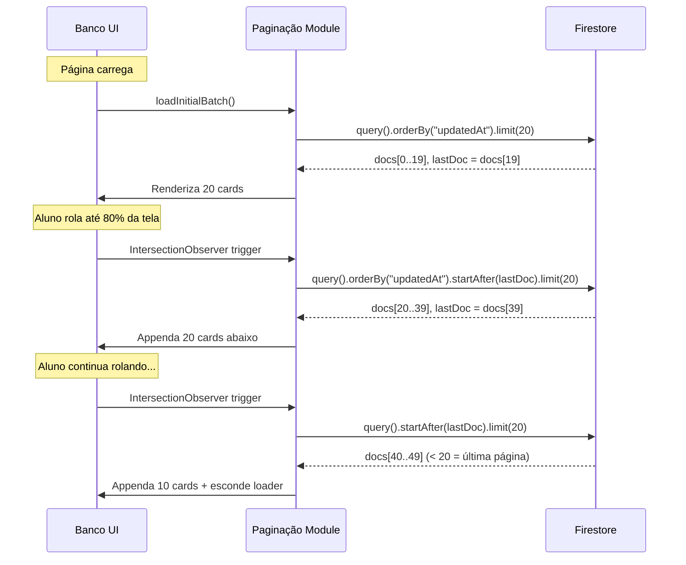

# Paginação e Carregamento — Scroll Infinito

> 🤖 **Disclaimer**: Documentação gerada por IA e pode conter imprecisões. [📋 Reportar erro](https://github.com/TouchRefletz/maia.api/issues/new?title=Erro+na+doc:+paginacao&labels=docs)

## Visão Geral

O módulo `paginacao-e-carregamento.js` (`js/banco/paginacao-e-carregamento.js`) implementa o sistema de **scroll infinito** do Banco de Questões. Em vez de carregar centenas de questões de uma vez (o que travaria o browser e custaria caro em reads do Firestore), ele carrega batches de ~20 questões por vez, adicionando mais conforme o aluno rola a tela para baixo.

## Motivação Arquitetural

O Banco de Questões pode conter milhares de documentos no Firestore. Carregar todos de uma vez seria:
- **Lento**: 1000 documentos × ~5KB cada = 5MB de download inicial
- **Caro**: Cada read do Firestore conta no billing
- **Travador**: Montar 1000 cards de DOM de uma vez congelaria o browser por 3-5 segundos
- **Desnecessário**: O aluno raramente olha mais que 50 questões numa sessão

## Arquitetura de Cursor-Based Pagination



### IntersectionObserver vs. Scroll Event

O módulo usa `IntersectionObserver` em vez de `scroll` event para detectar quando o aluno se aproxima do fim da lista. Vantagens:
- **Performance**: O Observer roda off-main-thread, sem custo de CPU por frame
- **Debounce nativo**: Não precisa de setTimeout/requestAnimationFrame
- **Threshold configurável**: Trigger quando o sentinel está 80% visível (carrega antes do aluno chegar ao fim)

```javascript
const sentinel = document.getElementById("banco-sentinel");
const observer = new IntersectionObserver((entries) => {
  if (entries[0].isIntersecting && !isLoading && hasMore) {
    loadNextBatch();
  }
}, { threshold: 0.8 });
observer.observe(sentinel);
```

O elemento `#banco-sentinel` é um div vazio posicionado no fim da lista de cards. Quando ele entra no viewport, o próximo batch é carregado.

## Estado de Paginação

```javascript
let lastDocument = null;    // Cursor do Firestore (DocumentSnapshot)
let isLoading = false;      // Lock para evitar requests paralelos
let hasMore = true;         // false quando o último batch retorna < BATCH_SIZE
const BATCH_SIZE = 20;      // Questões por batch
```

### Lock Anti-Dupla Carga

O `isLoading` é setado `true` antes da requisição e `false` após renderização. Isso previne que scrolls rápidos disparem múltiplas requisições simultâneas ao Firestore (race condition que resultaria em cards duplicados).

## Skeleton Loaders

Durante o carregamento de cada batch, skeletons animados (pulsing placeholders) são exibidos no lugar dos cards reais. Eles replicam a estrutura visual do card (header, body, options) com backgrounds `linear-gradient` animados via CSS:

```css
.skeleton-card {
  background: linear-gradient(
    90deg,
    var(--color-surface) 25%,
    var(--color-border) 50%,
    var(--color-surface) 75%
  );
  background-size: 200% 100%;
  animation: skeleton-shimmer 1.5s infinite;
}
```

Quando os cards reais chegam, os skeletons são substituídos suavemente com fade-out/fade-in.

## Integração com Filtros

Após cada batch carregado, o módulo notifica o sistema de filtros:

```javascript
window.dispatchEvent(new CustomEvent("banco-batch-loaded", {
  detail: { newCards: cardsRendered }
}));
```

O [filtros-dinamicos.js](/banco/filtros-dinamicos) escuta esse evento e:
1. Aplica filtros ativos nos novos cards
2. Atualiza contadores de matéria
3. Adiciona novas opções de checkbox se necessário

## Tratamento de Estados Especiais

### Banco Vazio
Se a primeira query retorna 0 documentos, exibe um empty state estilizado com ilustração e mensagem: "Nenhuma questão encontrada. Tente ajustar os filtros."

### Erro de Rede
Se a query Firestore falha, exibe toast de erro com botão "Tentar novamente" que re-executa a última query com o mesmo cursor.

### Fim do Banco
Quando o batch retorna menos de `BATCH_SIZE` documentos, `hasMore = false` e o sentinel é removido. Uma mensagem "Você viu todas as questões!" aparece no final.

## Referências Cruzadas

- [Filtros Dinâmicos — Reage a novos batches](/banco/filtros-dinamicos)
- [Card Template — Renderiza cada documento carregado](/banco/card-template)
- [Interações — Event listeners nos novos cards](/banco/interacoes)
- [Visão Geral do Banco](/banco/visao-geral)
