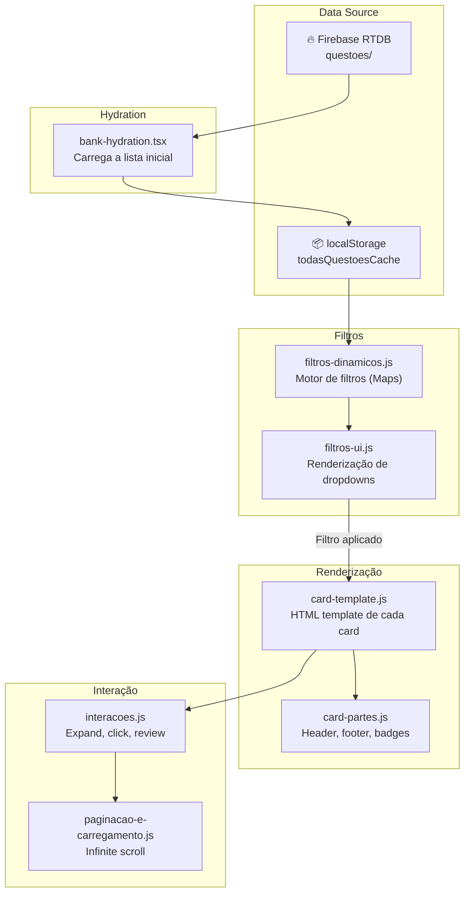
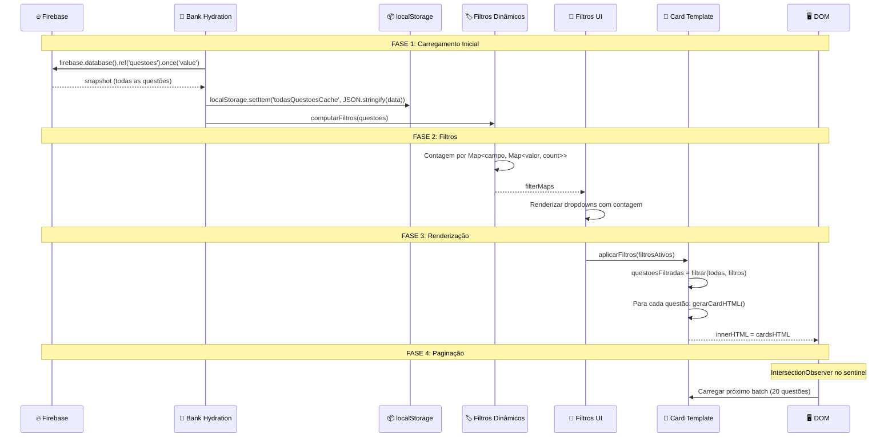
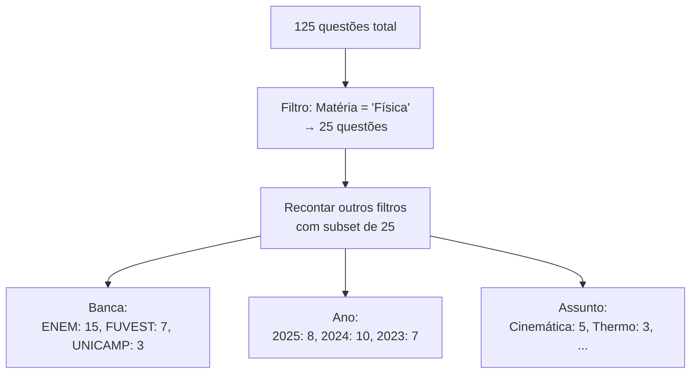

# Visão Geral do Banco de Questões

## Arquivo-Fonte

| Arquivo | Linhas | Tamanho | Propósito |
|---------|--------|---------|----------|
| [`bank-hydration.tsx`](file:///c:/Users/jcamp/Downloads/maia.api/js/banco/bank-hydration.tsx) | ~80 | 2 KB | Carregamento inicial |
| [`card-template.js`](file:///c:/Users/jcamp/Downloads/maia.api/js/banco/card-template.js) | ~500 | 15.1 KB | Template HTML do card |
| [`card-partes.js`](file:///c:/Users/jcamp/Downloads/maia.api/js/banco/card-partes.js) | ~300 | 7.6 KB | Componentes internos |
| [`filtros-dinamicos.js`](file:///c:/Users/jcamp/Downloads/maia.api/js/banco/filtros-dinamicos.js) | ~350 | 10.4 KB | Motor de filtros |
| [`filtros-ui.js`](file:///c:/Users/jcamp/Downloads/maia.api/js/banco/filtros-ui.js) | ~600 | 17.9 KB | UI dos filtros |
| [`imagens.js`](file:///c:/Users/jcamp/Downloads/maia.api/js/banco/imagens.js) | ~60 | 1.5 KB | Helpers de imagem |
| [`interacoes.js`](file:///c:/Users/jcamp/Downloads/maia.api/js/banco/interacoes.js) | ~400 | 12.3 KB | Event handlers |
| [`paginacao-e-carregamento.js`](file:///c:/Users/jcamp/Downloads/maia.api/js/banco/paginacao-e-carregamento.js) | ~200 | 5.9 KB | Paginação |
| **Total** | **~2490** | **~72.7 KB** | |

---

## Propósito

O Banco de Questões é a **interface principal de exploração** de questões catalogadas. Permite:

1. Navegar questões por matéria, assunto, banca, ano
2. Filtrar com filtros dinâmicos multi-seleção
3. Expandir cards para ver questão completa + gabarito
4. Paginar com scroll infinito

---

## Arquitetura



---

## Fluxo de Dados



---

## Motor de Filtros Dinâmicos

### Estrutura de Dados

O motor utiliza `Map` aninhados para contagem eficiente:

```javascript
// Estrutura: Map<campo, Map<valor, contagem>>
const filterMaps = {
  materia: new Map([
    ['Matemática', 42],
    ['Português', 38],
    ['Física', 25],
    ['Química', 20],
  ]),
  banca: new Map([
    ['ENEM', 80],
    ['FUVEST', 30],
    ['UNICAMP', 15],
  ]),
  ano: new Map([
    ['2025', 35],
    ['2024', 40],
    ['2023', 50],
  ]),
  assunto: new Map([
    ['Cinemática', 12],
    ['Termodinâmica', 8],
    // ... centenas de assuntos
  ]),
};
```

### Filtragem Cruzada

Quando um filtro é aplicado, as contagens dos outros filtros são **recalculadas** para refletir apenas o subset filtrado:



---

## Card de Questão

### Template HTML

Cada card é gerado por `card-template.js`:

```html
<div class="questao-card" data-id="q_abc123" data-materia="Física">
  <!-- Header -->
  <div class="card-header">
    <span class="card-number">#42</span>
    <div class="card-badges">
      <span class="badge badge-materia">Física</span>
      <span class="badge badge-banca">ENEM 2024</span>
    </div>
    <button class="card-expand-btn">▼</button>
  </div>
  
  <!-- Preview (sempre visível) -->
  <div class="card-preview">
    <p class="card-enunciado-preview">Um bloco de massa m desliza...</p>
    
  </div>
  
  <!-- Detalhes (expandível) -->
  <div class="card-details" hidden>
    <div class="card-questao-full">...</div>
    <div class="card-gabarito">...</div>
    <div class="card-actions">
      <button class="btn-review">📝 Revisar</button>
      <button class="btn-delete">🗑️ Deletar</button>
    </div>
  </div>
</div>
```

### Componentes Internos (card-partes.js)

| Componente | Função | Descrição |
|-----------|---------|-----------|
| `gerarHeader()` | Card header | Número, badges, botão expand |
| `gerarPreview()` | Preview colapsado | Primeira linha do enunciado + thumbnail |
| `gerarDetalhes()` | Conteúdo expandido | Questão completa + gabarito |
| `gerarBadges()` | Badges | Matéria, banca, ano, dificuldade |
| `gerarAcoes()` | Action buttons | Review, delete, chat, original |

---

## Interações

### Event Delegation

O módulo `interacoes.js` usa **event delegation** no container principal:

```javascript
document.getElementById('banco-container').addEventListener('click', (e) => {
  const card = e.target.closest('.questao-card');
  if (!card) return;
  
  if (e.target.closest('.card-expand-btn')) {
    toggleExpand(card);
  } else if (e.target.closest('.btn-review')) {
    openReview(card.dataset.id);
  } else if (e.target.closest('.btn-delete')) {
    confirmDelete(card.dataset.id);
  }
});
```

### Paginação (Infinite Scroll)

```javascript
const sentinel = document.getElementById('banco-sentinel');
const observer = new IntersectionObserver((entries) => {
  if (entries[0].isIntersecting) {
    loadNextBatch(20); // Carrega 20 questões por vez
  }
});
observer.observe(sentinel);
```

---

## Referências Cruzadas

| Tópico | Link |
|--------|------|
| Bank Hydration | [Bank Hydration](/banco/hydration) |
| Card Template detalhado | [Card Template](/banco/card-template) |
| Filtros Dinâmicos | [Filtros Dinâmicos](/banco/filtros-dinamicos) |
| Filtros UI | [Filtros UI](/banco/filtros-ui) |
| Interações | [Interações](/banco/interacoes) |
| Paginação | [Paginação](/banco/paginacao) |
| Firebase (data source) | [Firebase Init](/firebase/init) |
