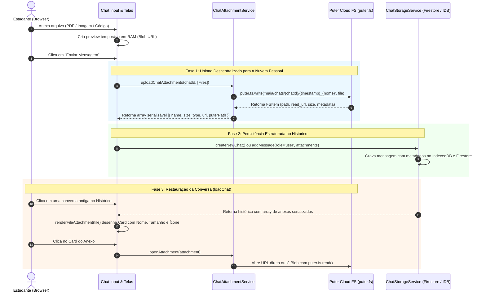

# Armazenamento e Ciclo de Vida de Anexos no Chat

> 🤖 **Disclaimer**: Documentação técnica detalhada sobre a arquitetura de arquivos e anexos do `maia.edu`.

## 1. Visão Geral e Filosofia BYOS (*Bring Your Own Storage*)

No ecossistema do `maia.edu`, os estudantes e professores frequentemente compartilham materiais de estudo, como listas de exercícios em PDF, imagens de enunciados, notas em texto e arquivos de código. 

Diferente de arquiteturas legadas centralizadas que oneram a infraestrutura do desenvolvedor com custos proibitivos de banda (*egress*) e terabytes de armazenamento estático, o Maia adota o paradigma **BYOS (*Bring Your Own Storage* / Traga Seu Próprio Armazenamento)** aliado ao **Puter Cloud Filesystem (`puter.fs`)**.

### Pilares Fundamentais:
1. **Custo Zero para o Desenvolvedor ($0.00):** O armazenamento é provisionado diretamente na conta pessoal do usuário no Puter.
2. **Privacidade e Soberania dos Dados:** O estudante é o dono absoluto dos seus arquivos e pode visualizá-los, baixá-los ou excluí-los a qualquer momento.
3. **Persistência Desacoplada e Híbrida:** O banco de dados (IndexedDB + Firebase Firestore) armazena exclusivamente os **metadados e URLs permanentes**, enquanto os binários pesados residem no filesystem distribuído do Puter.
4. **Sincronização Multi-Dispositivo:** Ao acessar o Maia em qualquer computador, navegador ou dispositivo e conectar sua conta Puter, todos os arquivos anexados em conversas anteriores permanecem acessíveis e funcionais.

---

## 2. Fluxo e Diagrama de Sequência dos Anexos

O ciclo de vida de um anexo percorre desde a seleção no input até a gravação persistente e posterior restauração no histórico:



---

## 3. Topologia e Estrutura de Dados do Anexo

Quando um arquivo é anexado, o objeto nativo `File` da DOM é processado e transformado em um objeto JSON serializável que nunca gera falhas como `undefined` ao ser salvo ou restaurado:

```json
{
  "name": "Simulado_ENEM_2025_Matematica.pdf",
  "size": 2458190,
  "type": "application/pdf",
  "url": "https://api.puter.com/drivers/fs/read?path=maia%2Fchats%2F3b7e41fa-8a12%2F1724955000000_Simulado_ENEM_2025_Matematica.pdf",
  "puterPath": "maia/chats/3b7e41fa-8a12/1724955000000_Simulado_ENEM_2025_Matematica.pdf",
  "storageType": "puter",
  "uploadedAt": 1724955000000
}
```

### Propriedades do Objeto de Anexo

| Campo | Tipo | Descrição |
| :--- | :--- | :--- |
| `name` | `string` | Nome original do arquivo exibido na interface. |
| `size` | `number` | Tamanho em bytes para exibição formatada (`formatFileSize`). |
| `type` | `string` | MIME type do arquivo (`application/pdf`, `image/png`, etc.). |
| `url` | `string` | URL direta de leitura fornecida pelo Puter.js. |
| `puterPath` | `string` | Caminho relativo do arquivo no disco virtual do usuário. |
| `storageType` | `string` | Provedor de armazenamento (`"puter"` ou `"local_fallback"`). |
| `uploadedAt` | `number` | Timestamp Epoch em milissegundos do momento do upload. |

---

## 4. Gerenciamento de Cotas e Limites

O Puter opera no modelo **User-Pays**, onde cada usuário tem sua própria cota e pode gerenciá-la autonomamente:

1. **Cota Padrão Gratuita:** Cada conta Puter recebe **500 MB** de armazenamento em nuvem gratuito (expansível até **1 GB** com bonificações de uso).
2. **Monitoramento Integrado no Maia:**
   - No modal de limites do Maia (acessível pelo botão de status do Puter), o usuário visualiza:
     - Barra de progresso visual com a porcentagem de disco consumida.
     - Quantidade total em MB utilizados por anexos do Maia.
     - Contagem total de arquivos armazenados.
     - Botão de atalho **"Abrir Gerenciador no Puter"** que direciona para o painel web em `puter.com`.
3. **Limpeza Automática ao Excluir Conversas:**
   - Quando o usuário exclui uma conversa no histórico lateral do Maia (`ChatStorageService.deleteChat(chatId)`), o serviço invoca automaticamente:
   ```javascript
   await ChatAttachmentService.deleteChatAttachments(chatId);
   ```
   Isso deleta a pasta `maia/chats/${chatId}` do Puter Cloud e libera o espaço do estudante imediatamente.
4. **Upgrade de Armazenamento:**
   - Caso o estudante atinja o limite de 500 MB, ele pode assinar o plano **Puter Pro** diretamente na plataforma da Puter para expandir seu espaço para **100 GB+**, sem necessidade de faturamento intermediário pelo Maia.

---

## 5. Módulos e Arquivos do Sistema

- **Serviço de Anexos:** `js/services/chat-attachment-service.js` — Módulo central que encapsula `puter.fs.write`, `puter.fs.read`, `puter.fs.readdir` e `puter.fs.delete`.
- **Serviço de Armazenamento:** `js/services/chat-storage.js` — Persistência híbrida de histórico no IndexedDB e Firestore com trigger de limpeza de anexos.
- **Interface e Telas:** `js/app/telas.js` — Renderização visual dos cartões de anexo (`renderFileAttachment`), abertura segura (`window.openAttachment`) e painel de consumo de disco em `showPuterLimitsModal`.
