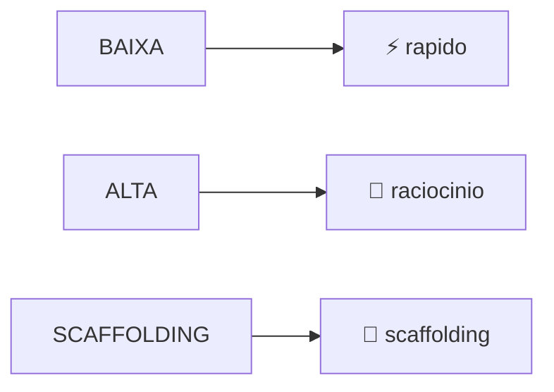
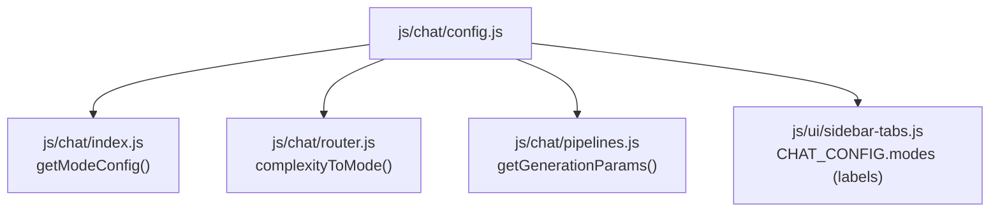

# Chat Config — Configuração do Sistema de Chat

## Arquivo-Fonte

| Propriedade | Valor |
|------------|-------|
| **Arquivo** | [`js/chat/config.js`](file:///c:/Users/jcamp/Downloads/maia.api/js/chat/config.js) |
| **Linhas** | 112 |
| **Exports** | `CHAT_CONFIG`, `getModeConfig()`, `getGenerationParams()`, `complexityToMode()` |
| **Dependências** | Nenhuma (módulo puro) |

---

## Visão Geral

O `config.js` é o **módulo de configuração central** do sistema de chat. Ele define:

1. Os modos de operação disponíveis
2. Os modelos de IA associados a cada modo
3. Os parâmetros de geração (temperatura, timeouts)
4. O mapeamento entre classificação de complexidade e modo

Este é um módulo **puro** sem side effects — ele apenas exporta configurações e funções utilitárias.

---

## Constante: `CHAT_CONFIG`

### Estrutura Completa

```javascript
export const CHAT_CONFIG = {
  modes: {
    automatico: { ... },
    rapido: { ... },
    raciocinio: { ... },
    scaffolding: { ... },
  },
  routerModel: "gemini-3-flash-preview",
  complexityToMode: { ... },
  generationParams: { ... },
  timeouts: { ... },
};
```

### `modes` — Definição dos Modos

Cada modo é um objeto com as seguintes propriedades:

| Propriedade | Tipo | Descrição |
|------------|------|-----------|
| `id` | `string` | Identificador único do modo |
| `label` | `string` | Nome exibido na UI |
| `description` | `string` | Descrição para o tooltip/menu |
| `usesRouter` | `boolean` | Se o router deve ser consultado |
| `model` | `string \| null` | Modelo Gemini a usar (`null` = router decide) |

#### Modo: `automatico`

```javascript
automatico: {
  id: "automatico",
  label: "Automático",
  description: "A IA escolhe o melhor modo para você",
  usesRouter: true,
  model: null, // decidido pelo router
},
```

**Comportamento**: Quando `usesRouter: true`, a mensagem é primeiro enviada ao [Router](/chat/router) que classifica a complexidade e determina qual pipeline executar.

#### Modo: `rapido`

```javascript
rapido: {
  id: "rapido",
  label: "Rápido",
  description: "Excelente para um estudo rápido e eficaz",
  usesRouter: false,
  model: "gemini-3-flash-preview",
},
```

**Comportamento**: Usa o modelo `gemini-3-flash-preview` sem thinking mode. Ideal para:
- Saudações e perguntas simples
- Consultas factuais rápidas
- Definições e conceitos diretos

#### Modo: `raciocinio`

```javascript
raciocinio: {
  id: "raciocinio",
  label: "Raciocínio",
  description: "Obtenha respostas com menos alucinações ou incoerências",
  usesRouter: false,
  model: "gemini-3-flash-preview",
},
```

**Comportamento**: Usa o mesmo modelo, mas com **thinking mode habilitado** (`thinkingConfig: { includeThoughts: true }`). Os pensamentos intermediários do modelo são exibidos em um bubble expansível na UI.

#### Modo: `scaffolding`

```javascript
scaffolding: {
  id: "scaffolding",
  label: "Scaffolding (Beta)",
  description: "Treinamento passo-a-passo com verdadeiro ou falso",
  usesRouter: false,
  model: "gemini-3-flash-preview",
},
```

**Comportamento**: Ativa o [Scaffolding Service](/chat/scaffolding-service) que implementa tutoria baseada na Zona de Desenvolvimento Proximal (ZPD) de Vygotsky. O estudante é guiado por perguntas de verdadeiro/falso com dificuldade adaptativa.

### `routerModel`

```javascript
routerModel: "gemini-3-flash-preview",
```

Modelo usado exclusivamente pelo Router para classificar a complexidade da mensagem. Usa **JSON mode** para retornar classificação estruturada.

### `complexityToMode`

```javascript
complexityToMode: {
  BAIXA: "rapido",
  ALTA: "raciocinio",
  SCAFFOLDING: "scaffolding",
},
```

Mapeamento direto entre a classificação do Router e o modo de operação:



### `generationParams`

```javascript
generationParams: {
  rapido: {
    temperature: 1,
  },
  raciocinio: {
    temperature: 1,
  },
  scaffolding: {
    temperature: 1,
  },
},
```

**Nota**: Todos os modos usam `temperature: 1` atualmente. A temperatura foi padronizada após testes que indicaram que valores menores (0.7, 0.8) geravam respostas "robóticas" demais para contexto educacional.

### `timeouts`

```javascript
timeouts: {
  router: 10000,    // 10 segundos
  response: 60000,  // 60 segundos
},
```

| Timeout | Valor | Propósito |
|---------|-------|----------|
| `router` | 10s | Limite para classificação de complexidade |
| `response` | 60s | Limite para geração completa da resposta |

---

## Funções Exportadas

### `getModeConfig(modeId)`

```javascript
export function getModeConfig(modeId) {
  return CHAT_CONFIG.modes[modeId] || CHAT_CONFIG.modes.automatico;
}
```

| Parâmetro | Tipo | Descrição |
|-----------|------|-----------|
| `modeId` | `string` | ID do modo (`'automatico'`, `'rapido'`, `'raciocinio'`, `'scaffolding'`) |
| **Retorno** | `object` | Configuração completa do modo |
| **Fallback** | — | Se `modeId` não existe, retorna config do `automatico` |

**Uso típico:**

```javascript
import { getModeConfig } from './config.js';

const config = getModeConfig('raciocinio');
// → { id: "raciocinio", label: "Raciocínio", ..., model: "gemini-3-flash-preview" }
```

### `getGenerationParams(modeId)`

```javascript
export function getGenerationParams(modeId) {
  return CHAT_CONFIG.generationParams[modeId] || CHAT_CONFIG.generationParams.rapido;
}
```

| Parâmetro | Tipo | Descrição |
|-----------|------|-----------|
| `modeId` | `string` | ID do modo |
| **Retorno** | `object` | Parâmetros de geração (`{ temperature }`) |
| **Fallback** | — | Retorna params do `rapido` se modo não existe |

### `complexityToMode(complexity)`

```javascript
export function complexityToMode(complexity) {
  return CHAT_CONFIG.complexityToMode[complexity] || "rapido";
}
```

| Parâmetro | Tipo | Descrição |
|-----------|------|-----------|
| `complexity` | `string` | `'BAIXA'`, `'ALTA'` ou `'SCAFFOLDING'` |
| **Retorno** | `string` | ID do modo correspondente |
| **Fallback** | — | Retorna `'rapido'` para classificações desconhecidas |

---

## Diagrama de Dependências



---

## Decisões de Design

### Por que `temperature: 1` para todos os modos?

Testes extensivos mostraram que:
- `temperature ≤ 0.7`: Respostas genéricas e "robóticas"
- `temperature = 1.0`: Melhor equilíbrio entre criatividade e coerência
- `temperature > 1.2`: Alucinações e inconsistências

Para contexto educacional, a "criatividade controlada" do `temperature: 1` gera explicações mais naturais.

### Por que o Router usa o mesmo modelo que as pipelines?

Inicialmente, o Router usava um modelo mais leve. Porém, classificações imprecisas (ex: categorizar uma integral como "BAIXA") geravam insatisfação. O modelo `gemini-3-flash-preview` é rápido o suficiente para classificação e preciso o suficiente para evitar erros.

### Por que `model: null` no modo automático?

O modo automático delega a decisão de modelo ao Router. O `null` sinaliza que o modelo será resolvido em runtime, não em configuração. Isso permite que o Router evolua sem alterar configs.

---

## Referências Cruzadas

| Para... | Veja... |
|---------|---------|
| Como o Router classifica | [Router — Classificação](/chat/router) |
| System prompts por modo | [System Prompts](/chat/system-prompts) |
| Scaffolding detalhado | [Scaffolding Service](/chat/scaffolding-service) |
| Worker que recebe os params | [/generate (Chat Mode)](/api-worker/generate-chat) |
