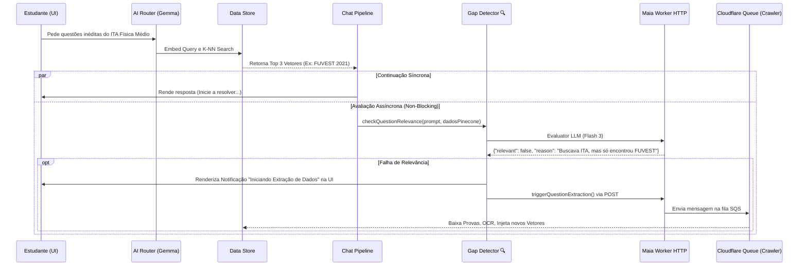

# Gap Detector (Detecção de Lacunas Educacionais)

## Visão Geral e Filosofia do Sistema

O componente **Gap Detector** (`js/chat/services/gap-detector.js`) representa um dos pilares da integridade de dados e autonomia informacional do ecosistema maia.edu. Projetado como um micro-serviço assíncrono interno da API de Chat, a sua responsabilidade primária é atuar como um "Fiscal de Qualidade Pedagógica" em tempo real.

Em sistemas educacionais baseados em LLMs tradicionais implementando RAG (Retrieval-Augmented Generation), o comportamento padrão de um banco vetorial como o Pinecone é retornar invariavelmente os vetores mais próximos matematicamente ao *query embedding*. Contudo, "proximidade estrita" no espaço vetorial não significa obrigatoriamente "satisfação da necessidade lógica do estudante". 

Se um usuário demanda *"Exercícios recentes da UNICAMP sobre Biologia Molecular focados em Síntese Proteica"*, e o banco de dados só possui *"Exercícios de 2012 do ENEM sobre Biologia Celular Básica"*, o vetor deste último é o "mais próximo" no espaço K-NN, operando sob uma similaridade cosseno razoável. Sem um fiscal, o LLM utilizaria do ENEM 2012 e entregaria isso ao usuário de forma opaca. É exatamente neste limbo que o **Gap Detector** intervém.

## A Arquitetura do Componente

A operação de detecção ocorre em uma "sombra assíncrona" paralela ao processamento da UI, não gerando travamentos nem afetando o Time-to-First-Token (TTFT) da geração de chat principal do modelo em tela.



## Mecânica 1: O Verificador de Relevância (Relevance Check)

A função cardinal do arquivo é a `checkQuestionRelevance`. 

Ela não opera sobre regras sintáticas soltas, mas através de injeção direta de estado em um modelo de avaliação extremamente ágil (`gemini-3-flash-preview`). O intuito é garantir uma inferência barata, rápida e com schema rigorosamente tipificado.

### Schema de Retorno Imposto

A declaração do JSON Schema para o avaliador obriga 3 chaves específicas e booleanas, somadas ao log explícito da justificativa:

```javascript
const RELEVANCE_SCHEMA = {
  type: "object",
  additionalProperties: false,
  properties: {
    relevant: {
      type: "boolean",
      description: "true se o resultado for genuinamente relevante para a intenção original da busca."
    },
    reason: {
      type: "string",
      description: "Justificativa curta (máximo 2 linhas)."
    },
    needs_more: {
      type: "boolean",
      description: "true se o tema existir, porém está criticamente em escassez de material para treino iterativo."
    }
  },
  required: ["relevant", "reason", "needs_more"]
};
```

### Prompt Engineering para o Evaluator

Para mitigar alucinações (falsos positivos onde o modelo Flash concorda com tudo), aplicamos **Regras Contrafactuais Fortes** ("Um resultado sobre Termodinâmica NÃO é relevante se o user pediu Óptica"). O processo extrai `institution`, `year`, e a `score` cruta do Pinecone para fornecer ao Avaliador os fatores factuais de peso.

```javascript
const prompt = `Você é um analisador de relevância de questões educacionais.

O USUÁRIO buscou: "${query}"

O MELHOR RESULTADO encontrado no banco de dados foi:
- Preview: "${preview.substring(0, 400)}"
- Instituição: ${institution}
- Ano: ${year}
- Score de similaridade: ${(score * 100).toFixed(1)}%

ANALISE:
1. O resultado é GENUINAMENTE relevante para o que o usuário buscou? (Um resultado sobre "Termodinâmica" NÃO é relevante se o user pediu "Óptica")
2. Mesmo se relevante, o banco precisa de MAIS questões sobre esse tema? (Se só tem 1 questão sobre um tema amplo, marque true)

Responda com o JSON estruturado.`;
```

## Mecânica 2: Gatilho de Sobrevivência (Trigger Extraction)

Caso o verificador falhe (isto é, `relevant === false` ou se não houve NENHUM retorno satisfatório no motor), a pipeline cai para a função engatilhadora secundária: `triggerQuestionExtraction(buscaQuestao, context)`.

Esta função possui três pilares de reatividade essenciais para manter a comunicação clara com o usuário e instanciar os recursos on-server de crawler:

### 1. Comunicação Direta com o DOM do Chat (Notificação Epêmera)
Imediatamente, o serviço invoca o *callback* de UI da pipeline via event emitter, materializando uma notificação assíncrona. Ela será flutuante na tela de quem iniciou a requisição:

```javascript
if (context.onProcessingStatus) {
  context.onProcessingStatus("extraction_triggered", {
    title: "Extração de questões solicitada",
    message: "🔍 Nossa IA identificou lacunas no banco de dados relacionado ao tema solicitado. Foi solicitada a extração de novas questões — elas estarão disponíveis em alguns minutos.",
    query: buscaQuestao.conteudo,
    props: buscaQuestao.props, // Guarda os metadados (Filttros como ANO e INSTITUICAO)
  });
}
```

### 2. Persistência Permanente na Memória do Storage
Se a página do usuário não persistir explicitamente essa resposta, ao recarregar (F5), ele não veria o status da notificação assíncrona — ficando a deriva sobre o que aconteceu.
Por reboque, o Gap Detector força a injeção local pelo IndexedDB integrando ao `ChatStorageService`, gravando um node interno não gerado pelo próprio humano:

```javascript
if (context.chatId) {
  const { ChatStorageService } = await import("../../services/chat-storage.js");
  ChatStorageService.addMessage(context.chatId, "system", {
    type: "extraction_triggered",
    message: "Nossa IA identificou lacunas...",
    query: buscaQuestao.conteudo,
    props: buscaQuestao.props,
    timestamp: new Date().toISOString(),
  }).catch(console.warn);
}
```

### 3. Chamada HTTP ao Backend Worker (The Core)
Finalmente, não estaríamos de fato suprindo lacunas sem notificar a Cloud. O script emite uma requisição de POST robusta direcionada ao endpoint central: `WORKER_URL/trigger-extraction`.

Nesta etapa, passamos obrigatoriamente os metadados:
- **`query`**: O texto da busca nua ("Física Moderna").
- **`year` / `institution` / `subject`**: Filtros de predição extraídos lá na fase do Router.

```javascript
const response = await fetch(`${WORKER_URL}/trigger-extraction`, {
  method: "POST",
  headers: { "Content-Type": "application/json" },
  body: JSON.stringify({
    query: buscaQuestao.conteudo,
    institution: buscaQuestao.props?.institution,
    subject: buscaQuestao.props?.subject,
    year: buscaQuestao.props?.year,
  }),
});
```

Caso o *worker* responda de forma satisfatória (`response.ok`), encerra-se o ciclo do front-end. O restante passa a ser delegacia da Queue Architecture no Cloudflare, onde será alocado e instanciado um Crawler/Scraper Python a fim de baixar arquivos contendo essas lacunas, passar pela engine de Tesseract OCR, classificar via Flash Módulo e finalmente ser gravado no Pinecone do ambiente.

## Tratamento de Falhas Severas (Network Resilience)

Sendo o Gap Detector uma ação assíncrona acessória, nenhuma instabilidade no servidor (timeouts, rede falhou de modo silencioso) ou quedas bruscas de API de LLM pode, de forma alguma, quebrar o envio principal da mensagem do usuário. 
Por consequência, há um fallback de "silêncio benigno" desenhado na linha 164: se qualquer coisa explodir, ele assume falsamente que a questão foi `"relevant: true"` impedindo loopings cegos.

```javascript
} catch (error) {
  if (error.name === "AbortError") throw error;

  // Lógica customizada de NETWORK_ERROR baseada no navigator API
  if (!navigator.onLine || (error.name === "TypeError" && error.message.includes("Failed to fetch"))) {
    throw new Error("NETWORK_ERROR");
  }

  // O Fallback de erro da requisição assume veridicidade falsa (True para evitar sobrecargas de crawl)
  return { relevant: true, reason: "Fallback por erro", needs_more: false };
}
```

## Evoluções Futuras
A arquitetura de *Gap* permite futura extensão visual no maia.edu, de modo que o usuário seja alertado proativamente (por SMS, WhatsApp, Webpush) quando um Crawler de 10 minutos de fato terminar de resolver a lacuna reportada, notificando-o `Sua prova do ITA acaba de ir pro banco! Vamos ao simulado?`.

## Referências Diretas
- [Engine do Router-Prompt](/chat/router-prompt)
- [Maia API Worker Arquitetura](/api-worker/arquitetura)
- [Chat UI - Hydration](/chat/hydration)
