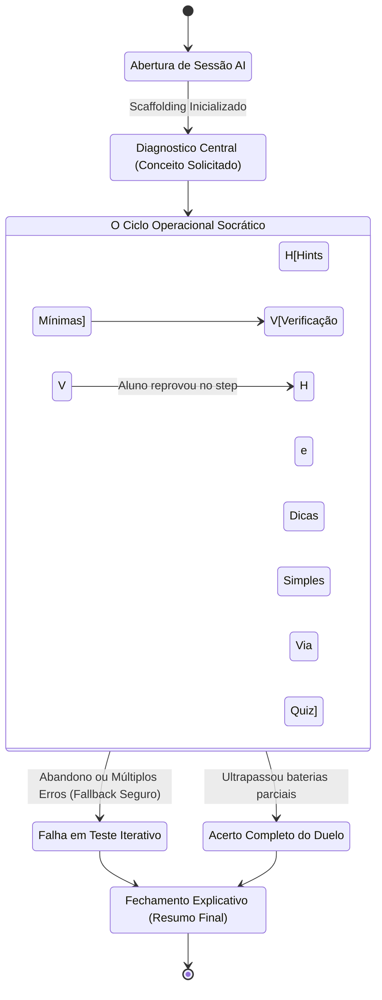

# Pipeline Scaffolding (Tutoria Pedagógica Maieutica)

## Visão Geral e a Psicologia Construtivista

Se a *Pipeline Rápida* é um duto prático e a *Pipeline de Raciocínio* é voltada puramente a cálculos estonteantes, a **Pipeline de Scaffolding** foi desenhada para encarnar o ápice da pedagogia ativa. Fundamentada nos princípios do construtivismo Socrático (também referencialmente atrelado ao conceito original de *Instructional Scaffolding* de Bruner ou *Zona de Desenvolvimento Proximal* de Vygotsky), este fluxo renega propositalmente seu instinto natural mecânico e artificial (Geração Limpa).

Na prática, o modo Scaffolding ignora a premissa de simplesmente responder ao usuário com a "resposta final e os cálculos certos". Entregar a resposta mastigada destrói o engajamento e sabota a plasticidade cerebral em reter conhecimento duro. O intuito sistêmico é mapear iterativamente o lastro real do conhecimento atual do estudante, fragmentando grandes dilemas em perguntas gradientes (Verdadeiro/Falso), guiando a conclusão de forma incremental na interface sem ceder resoluções até que as lógicas basilares se firmem. 

Trata-se de uma verdadeira "Máquina de Estados Finita" transpassada entre servidor e frontend.

## Arquitetura de Máquina de Estados (State-Machine Overlay)

Este pipeline altera agressivamente a manipulação da mensagem na porta de entrada da API. Em vez de anexar o histórico inteiro no LLM para avaliação passiva textual, ele atrela-se na inicialização ao módulo independente `ScaffoldingService`.

O serviço detecta em qual "passo lógico" o usuário está através da leitura contínua gerada em `decidirProximoStatus()`. Esse estado mutável é submetido junto de uma meta-programação de injeção pesada no Prompt:

```javascript
// Excertos simplificados de arquitetura original scaffolding
if (finalMode === "scaffolding") {
    // Computa o estado persistido localmente (Se acabou de iniciar ou já errou uma bateria)
    const decision = ScaffoldingService.decidirProximoStatus();

    // Congela a "Dúvida Master Inicial" que iniciou tudo e que norteia as parciais
    const questaoAlvo = {
      questao: message, 
      resposta_correta: "Não definido via parser",
    };

    // Refina uma String colossal de System Instruction enclausurando o comportamento a agir no recorte atual
    const promptRefinado = ScaffoldingService.generateStepPrompt(
      questaoAlvo,
      decision,
      [] 
    );

    // Contamina a pipeline central dominando o subtexto enviado!
    additionalContextMessage += "\n\n" + promptRefinado;
}
```



## A Invocação Stealth (Silent Step Generation)

A complicação maior desta máquina de estados é que, no frontend, os sub-passos do tutorial interativo (como um quiz de Múltipla Escolha renderizando do nada ou um slide de Verdadeiro/Falso sobre uma ramificação secundária do problema base) devem ser geridos na hora, sem macular a "linha do tempo estrita de bolhas da conversa de chat raiz" ou desalinhar a UI serializável por F5 (recarregamento).

Desta demanda brota a engenharia sofisticadíssima invocadora que chamamos localmente de **Fluxo Silent Scaffolding**. No arquivo de integração das rotas, desenvolvemos a `generateSilentScaffoldingStep`. Ela usa o motor Flash ultrarrápido cortando todos e quaisquer Handlers de interface frontal síncrona.

```javascript
/* O Agente Secreto Stateless */
export async function generateSilentScaffoldingStep(prompt, apiKey, attachments = []) {
  const response = await generateChatStreamed({
    model: "gemini-3-flash-preview",  // O Flash resolve aqui pra não quebrar cadência
    generationConfig: {
      responseMimeType: "application/json",
      responseSchema: SCAFFOLDING_STEP_SCHEMA,
    },
    systemPrompt: "You are a helpful assistant. Output ONLY valid JSON matching the schema.",
    userMessage: prompt,
    attachments,
    
    // A MAGIA ACONTECE AQUI: Mutando as dependências de Callback
    onStream: null, // Sem disparos de rerenders reativos visuais para a caixa Main Chat!
    onThought: null, // Quebra a captura de balões transparentes!
    chatMode: false,
    history: [] // Sem histórico da nuvem! Todo histórico já vem engavetado hardcoded no 'prompt' manual
  });

  return response;
}
```

Essa assincronia isolada repassa a inteligência estritamente programática pura (como uma API abstrata) pro Componente Visual instanciado no modal ou janela lateral de acompanhamentos. O aluno pode clicar dezenas de vezes nos botões de questionário interativo que estão renderizados dentro de um card, que o Motor responderá incisivamente, gerando feedback lógico customizado (por exemplo, "Você escolheu Falso porque esqueceu que números invertidos dão simetria. Tente novamente!"), tudo isto sem "scrollar" ou sujar a parede central do visualizador da janela primária do Chat.

## Schema de Controle Paramétrico `SCAFFOLDING_STEP_SCHEMA`

Para que as divs de interação de "Apostas" não crashassem frente a retornos imprevisíveis do modelo interativo nos cards independentes (o sistema visualizava os "Slides"), blindamos a saída do *Silent Step* em um Schema insano de amarras e amarrações obrigatórios:

```json
{
  "status": "em_progresso | concluido",
  "tipo_pergunta": "verdadeiro_ou_falso",
  "enunciado": "A teoria da Relatividade foi provada baseando-se no desvio fotônico de um eclipse real ocorrido?",
  "resposta_correta": "Verdadeiro",
  "feedback_v": "Exato! Sobral (CE) abrigou medições provando curvatura de luz via distorção gravitacional.",
  "feedback_f": "Mito. A tese puramente analítica em lousas só obteve sua confirmação inconteste com experimentação óptica em Eclipses (Notavelmente o do Brasil e Costa da África).",
  "dica": "Lembre de eventos astrais famosos nos anos 1910 ocorridos na América do Sul e costa de África para ancorar a confirmação de Eddington.",
  "raciocinio_adaptativo": "O Estudante parece esquecer que a astronomia observacional confirmou as equações; preciso jogar um dado histórico sobre experimentos pragmáticos."
}
```

Essa riqueza estruturada em um mero JSON dota os microcomponentes em React a exibirem telas altamente responsivas. O aluno acerta o V? A string do `feedback_v` acende como neon em balões de incentivo verde imediatamente. Errou? O `feedback_f` surge em janelas corretivas laranjas e a string `dica` libera o botão de "Obter Uma Dica" discretos abaixo e tudo computado ANTES MESMO DA RENDERIZAÇÃO pelo LLM no background.

## Desafios Resolvidos da Arquitetura
1. **Rescisão de Estado Interrompido:** Ao adotar tipagem modular na base de persistência, se um estudante sofrer *Crash Desktop* e atualizar a página no meio do passo 4 do Scaffolding, o banco `EntityDB` tem histórico dos Slides isolados e hidrata visualmente do mesmo ponto exato do front. A magia stateless valeu o preço.
2. **Latência X Ansiedade:** Forçar Flash-Streaming num componente lateral sem scrollar a tela impede sensação de letargia proativa do sistema.

## Bibliotecas e Referências Compatíveis do Domínio
- [Componentização e Validação Mestra JSON — O Array Infinito](/chat/schemas-blocks)
- [Classificador Primário via Regex Automático — Router e Controle Lógico Estrito](/chat/router-prompt)
- [Memoria e Cognição Avançada](/memoria/visao-geral)
