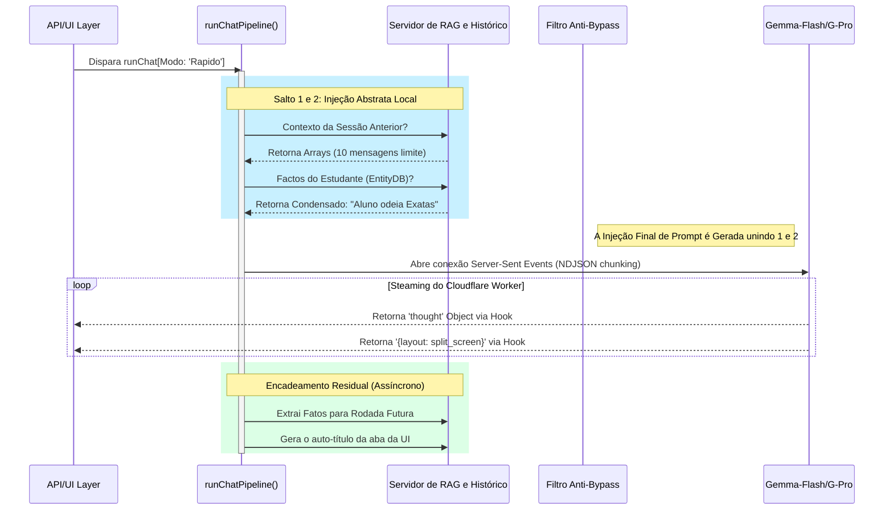

# Arquitetura das Pipelines (A Base de Execução do Motor de IA)

## O Problema dos Monólitos e o Escoamento Condicional Estruturado

No amadurecimento dos sistemas de comunicação bidirecional com Inteligência Artificial, ficou brutalmente evidente que adotar um escopo único — um único arquivo `Chat.js` mandando toda *string* para uma única função assíncrona de uma URL de LLM — gera ineficiência. Tarefas colossais de matemática concorrem no mesmo gargalo que pedidos banais de conversas amistosas ("Qual seu nome?"), acarretando em altos gastos de *billing* nas APIs de terceiros (Cloudflare / GCP) e um tempo de resposta (TTFT) inconstante para os usuários. 

O arcabouço primário do `maia.edu` soluciona todo e qualquer engarrafamento cognitivo via **Sistema de Pipelines Direcionais Assíncronas**, estabelecendo uma Triade Funcional enclausurada nas abstrações matemáticas exportadas pelo colosso `js/chat/pipelines.js`.

Esses dutos (Pipelines) não são apenas chamadas simples agrupadas; eles configuram a montagem holística do prompt injetando *system-prompts* específicos, configurando as flags do motor de streaming (NDJSON) e vinculando os sistemas periféricos secundários on-demand (O Analisador RAG e O Recuperador de Memórias).

## A Engrenagem Centralizadora (`runChatPipeline`)

Por uma questão de padronização do padrão arquitetural de fábrica (*Factory Pattern*), todas as sub-pipelines acabam desaguando silenciosamente no motor principal e unitário chamado `runChatPipeline`. 
Quando a classe invocadora passa a flag `mode` (`"rapido"`, `"raciocinio"`, `"scaffolding"`), essa função mestre aplica a diretriz base usando lógicas estritas de **"Early Returns" e "Switch/Cases Polimórficos"**.

A anatomia da execução impõe invariavelmente cinco saltos lógicos:

## A Tríade de Pipeliners Independentes

Embora as vísceras de cada rota estejam brutalmente descritas em seus documentos únicos, a abstração holística no arquivo de *Pipelines* garante que todas cumpram um rito sagrado com as APIs externas:

### Pipeline I: Rápida (`runRapidoPipeline`)
Garante predições baratas não ultrapassando o token limite superior. Bloqueia os repasses de imagens densas (como equações de 4 linhas fotográficas vindas do Firebase Storage), passando para o modelo open-source ágil as descrições brutas para um fluxo quase simultâneo.

### Pipeline II: Raciocínio (Deep Think `runRaciocinioPipeline`)
Aciona a flag primária de repasse assíncrono do tipo evento `"onThought"`. Modifica o *temperature* de predição caindo para patamares estagnados em 0.3 a 0.5 a fim de promover o determinismo absoluto na dedução e suprimir a "criatividade ficcional". 

### Pipeline III: Scaffolding (`runScaffoldingPipeline`)
Usa da arquitetura paralela (*Shadow Runner*) `generateSilentScaffoldingStep`. Em termos práticos, em vez de retornar imediatamente os chunks JSON para a caixa de *chat user* original, ela manda essas predefinições direto para os Modais de Feedback iterativos e instaura o limite parametrizado via `ScaffoldingService`.

## A Carga do Tratamento de Erros de Streaming

A manipulação da chamada JSON pura em *Streams (Fetch APIs com Readable Streams)* dentro de um colapso cognitivo é instável. Ocorrendo Timeout da Cloudflare, ou do provedor nativo, o JSON resultante no navegador seria cortado como string crua pela metade `{"sections": [{"con...`. 
No `runChatPipeline`, um bloco estendido enclausura qualquer sinal de morte do canal subjacente numa rotina de *"Graced Degradation"*; ele absorve, insere uma flag de `Interrompida!` no componente para sinalizar falhas de internet ao aluno e grava os cacos na base local para que não se perca o fôlego computacional já gasto.

## A Rotina de Hidratação das Mensagens Iniciais (`Context Window Management`)
Adotamos em *Pipelines* uma janela decrescente conservadora. Se a thread contiver 400 blocos passados com respostas de 5 páginas, submeter as 400 antigas entupiria as 2 milhões de janelas do limitador.
As pipelines operam em *Sliding Windows*: Apenas capturam as 4 últimas iterações do Estudante/Maia combinadas, mescladas com os Fatos Abstratos RAG que "sumarizam" psicologicamente os outros 396 blocos antigos que se esvaíram. O motor ganha espaço infinito aparente, sem lentidão de processamento crescente a cada turno.

## Referenciamento Modular Cruzado
- [Mergulhando no Rápido](/chat/pipeline-rapido)
- [Mergulhando no Raciocínio e Modais Visualizadores de Pensamento](/chat/pipeline-raciocinio)
- [Os Blocos de Saída Rítmica](/chat/schemas-blocks)
