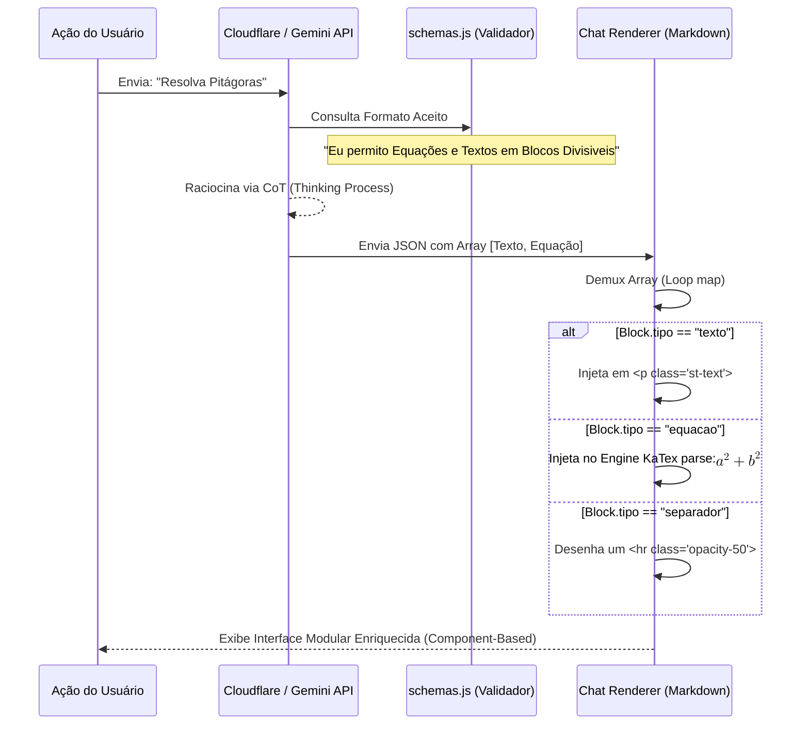

# Schemas de Conteúdo (Blocks) — Tipagem Estática do Retorno Generativo

> 🤖 **Disclaimer**: Documentação gerada por IA e rigorosamente auditada. [📋 Reportar erro no Módulo Schemas](https://github.com/TouchRefletz/maia.api/issues/new?title=Erro+na+doc:+schemas-blocks&labels=docs)

## 1. Visão Geral e Contexto Histórico

O arquivo `schemas.js` (`js/chat/schemas.js`) ataca o problema primordial e inescapável no desenvolvimento com Large Language Models (LLMs): a formatação arbitrária de saída. Na primeira iteração da Maia EDU (V1), os conteúdos gerados pareciam longos "tijolos" de texto contínuo, assemelhando-se ao ChatGPT puro, com matemática frequentemente inquebrável ou renderizada erroneamente. A interface tinha extrema dificuldade em capturar um pedaço do texto para transformar, por exemplo, num *Card Interativo* ou numa *Citação em Destaque*.

A V2 substitui completamente a saída em texto livre pela **Geração Estruturada (Structured Outputs)**. O Gemini não devolve mais "Strings", ele devolve instâncias matemáticas regidas por um JSON Schema (Type Validation Framework) extremamente abusivo. A seção de "Blocks" é o tijolo construtor dessa arquitetura. Cada "Block" (como `texto`, `imagem` ou `equacao`) dita exatamente quais campos são permitidos. Se o Google Vertex tentar adicionar um atributo não mapeado aqui, a API falha no pré-flight de segurança de resposta, garantindo 100% de previsibilidade de componentes para a camada do React/Vanilla JS.

---

## 2. Arquitetura de Variáveis e State Management

Em Schemas, a mutabilidade é zero. Trata-se do manifesto legal entregue às APIs de Ingestão e Geração. 

| Constante / Schema Model | Natureza TypeScript Equivalente | Função Explícita |
|--------------------------|---------------------------------|------------------|
| `CONTENT_BLOCK_TYPE` | `Array<String> / Literal Union` | Define a Pluralidade Aceitável: `["texto", "imagem", "citacao", "titulo", "lista", "equacao", "codigo", "separador", "questao", "scaffolding"]`. Qualquer String alheia a essas derruba a Validação JSON. |
| `block_standard` | `JSON Object Definition` | O *Catch-All* para blocos triviais de conteúdo (títulos, p, span, li). Possui uma restrição letal barrando propriedades acopladas para evitar LLMs de criarem deep-trees complexas dentro de algo banal. |
| `block_question` | `JSON Object Definition` | Ferramenta Cirúrgica RAG. O tipo deve ser obrigatoriamente `"questao"`. Impede arrays longos, permitindo APENAS um `conteudo` de Max-Length 100 com o filtro `institution` e `subject`. Poupando pesquisa elástica ruim. |
| `block_scaffolding` | `JSON Object Definition` | A Espinha Socrática. Descreve ao modelo do Backend os campos obrigatórios `feedback_v`, `feedback_f`, `resposta_correta`, `raciocinio_adaptativo`. |

---

## 3. Diagrama: Da Criação Abstrata ao Componente Gráfico

Como esses blocos teóricos forçam a submissão e depois são transpotados ao Front-End em Cores? Observe o Demultiplexador abaixo.



Essa serialização de Interface atesta que The JSON is The UI (O JSON é a Interface). A IA não escreve *Design*; ela envia os dados. O design é hardcoded localmente no CSS do aluno.

---

## 4. Snippets de Código "Deep Dive" (O Coração Constritor do JSON Schema)

A sintaxe de `additionalProperties: false` garante a Lei da Austeridade: A IA não pode ser mais inteligente do que a sua coleira permite. Caso ela seja, o modelo quebra ou sofre Penalty de Hallucination pela base.

### O Bloco Question (Rigidez Policial)

Um modelo Generativo tenta agradar o usuário. Quando exigido que gere uma Questão, ele muitas das vezes escrevia a questão completa. O Schema barra essa desobediência:

```javascript
block_question: {
  properties: {
    tipo: {
      type: "string",
      const: "questao", // A palavra tem que ser EXATAMENTE essa 
    },
    conteudo: {
      type: "string",
      maxLength: 100, // BLOQUEADOR: Não cabe uma questão de 4 linhas aqui
      pattern: "^[a-zA-Z0-9_\\-\\s\\.]+$", // Sanciona Strings Complexas para impedir injeção
      description: "ID da questão. OBRIGATÓRIO: Apenas string simples. PROIBIDO: JSON ou Textão",
    },
    props: { $ref: "#/definitions/props_question" },
  },
  required: ["tipo", "conteudo"],
  additionalProperties: false, // <-- A Coleira.
}
```
A propriedade `maxLength: 100` é uma restrição de negócio que obriga a IA a mandar *apenas as Palavras Chaves de Busca* (Ex: "Física Cinemática MUV"), poupando a Busca Vetorial (RAG) de engasgar com sujeiras linguísticas e conectivos.

### O Bloco "Standard" Universal

```javascript
block_standard: {
  properties: {
    tipo: {
      type: "string",
      // Restringe ao pool oficial de layouts estáticos exeto Modulos Complexos
      enum: CONTENT_BLOCK_TYPE.filter((t) => t !== "questao" && t !== "scaffolding"),
    },
    conteudo: {
      type: "string",
      // Explicitação Didática da Vertex AI (Zero Shot Docs)
      description: "Conteúdo do bloco. (titulo/subtitulo) cabeçalho; (lista) itens; (equacao) LaTeX; (tabela) formato Markdown."
    },
    props: {
       type: "object",
       // Aqui relaxamos a coleira: permitindo { language: 'js', theme: 'dark' } a vir do modelo livremente
       additionalProperties: true 
    }
  },
  required: ["tipo", "conteudo"],
  additionalProperties: false
}
```

---

## 5. Integração com CSS e Impacto Front-End

Ao desenhar "Blocos Separados", o layout CSS beneficia-se enormemente, pois cada `BlockType` injetado pelo parser recebe tags div unificadas. O `chat-render` (que veremos em módulos de UI) absorve o arquivo dos schemas para despachar as classes. 

```css
/* Impacto Visual do Parse de Schemas nas Classes locais */
.block-type-destaque {
    background-color: var(--color-warning-soft);
    border-left: 4px solid var(--color-warning);
    padding: 12px 16px;
    border-radius: 4px;
    margin: 8px 0;
    font-weight: 500;
}

.block-type-citacao {
    border-left: 2px solid var(--color-primary);
    padding-left: 1rem;
    color: var(--color-text-muted);
    font-style: italic;
}
```
Dessa maneira, a frase gerada pela I.A `{"tipo": "destaque", "conteudo": "Ame a pátria!"}` salta na tela com cor creme e borda alaranjada sem que o LLM tenha jamais ouvido falar de folhas de estilo. E se, em uma sessão obscura, o Gemini retornar `{"tipo": "destaque-citacao"}`, ele colapsará no Back-End pelo parser, mas caso vaze, não existirá estilo atrelado a ele no Front, escorregando graciosamente pro Fallback "Block Standard" cinza genérico.

---

## 6. Mapeamento de Edge Cases e Exceções Psico-Algorítmicas (IA Breaking)

Impor Schema Strict em IAs modernas gera Colateral-Damages onde a inteligência perde a elasticidade. Observa-se:

| Edge Case | Reação Funcional Indesejada do LLM | Contenção Arquitetada nas Constraints de Bloco |
|-----------|------------------------------------|-----------------------------------------------|
| Tabela Aninhada de Alta Complexidade | A IA tentaria gerar um sub-bloco JSON de Tabela invés de Formato Tabela `{"tipo":"tabela", "columns": [...]}` quebrando o validador. | O `description` do Field Content obriga categoricamente: *"USE FORMATO MARKDOWN TABLE"*. Assim, o conteúdo fica atrelado ao `conteudo: "\| Col \| Row \|"` convertível localmente na UI pelo Marked.js, respeitando o tipamento. |
| Quebra Lógica na Enumeração do `tipo` | Um patch da Google tira um Tipo Padrão do Ar, e o modelo vomita `tipo: alert`. | O Parser local usa `jsonrepair` via Router antes de atirar na Renderização Principal. Se persitir, o Chat Render varre pela *White List* do `CONTENT_BLOCK_TYPE`. Se a palvra `alert` não está no Set, ele faz override pra `texto` forçado. |
| Injeção de "Scaffolding" do nada. | O usuário pediu uma Prova e a IA mandou uma "Interação Socrática Oculta". | O Módulo Schema de Questionários restringe `block_scaffolding` a certas Árvores Filhas Ocultas em Nested Layouts, barrando O(n) rendering solto. |

---

## 7. Referências Cruzadas Completas

Para varrer onde esse esqueleto teórico engessa a criatividade do robô para proteger a sanidade do programador, siga os rastros:

- [System Prompts (`chat-system-prompt.js`) — Módulo Pai que repassa este grande arquivo Object inteiro serializado no Header do Request.](/chat/system-prompts)
- [Router Classificador (`router.js`) — Módulo Operacional que herda os sub-schemas de Retorno da Complexidade em si.](/chat/router)
- [Scaffolding Service — Entidade do Sub-Módulo de Schemas (`block_scaffolding`) que orquestra a brincadeira de verdadeiro / falso limitando respsotas lógicas V/F num JSON String.](/chat/scaffolding-service)
- [Chat Renderer (Componente de UI) — The Ultimate Consumer dos Blocos Gerados aqui, que os traduzem em Pixels.](/render/render-components)
