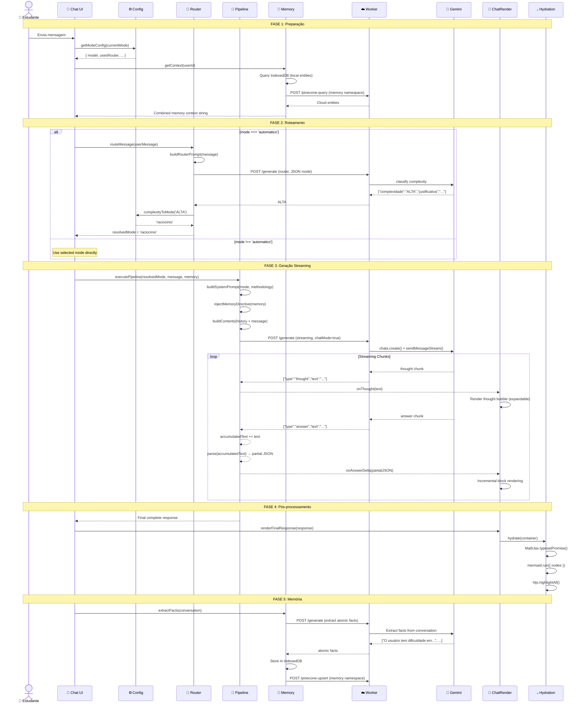
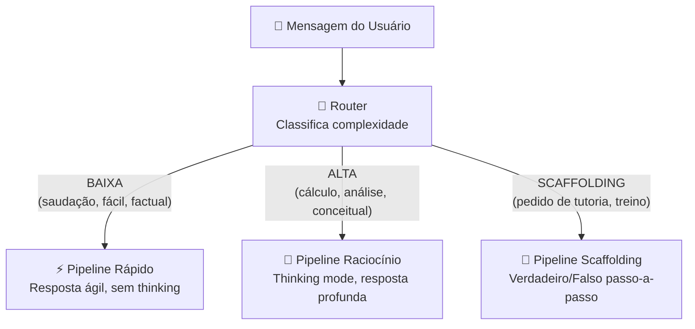
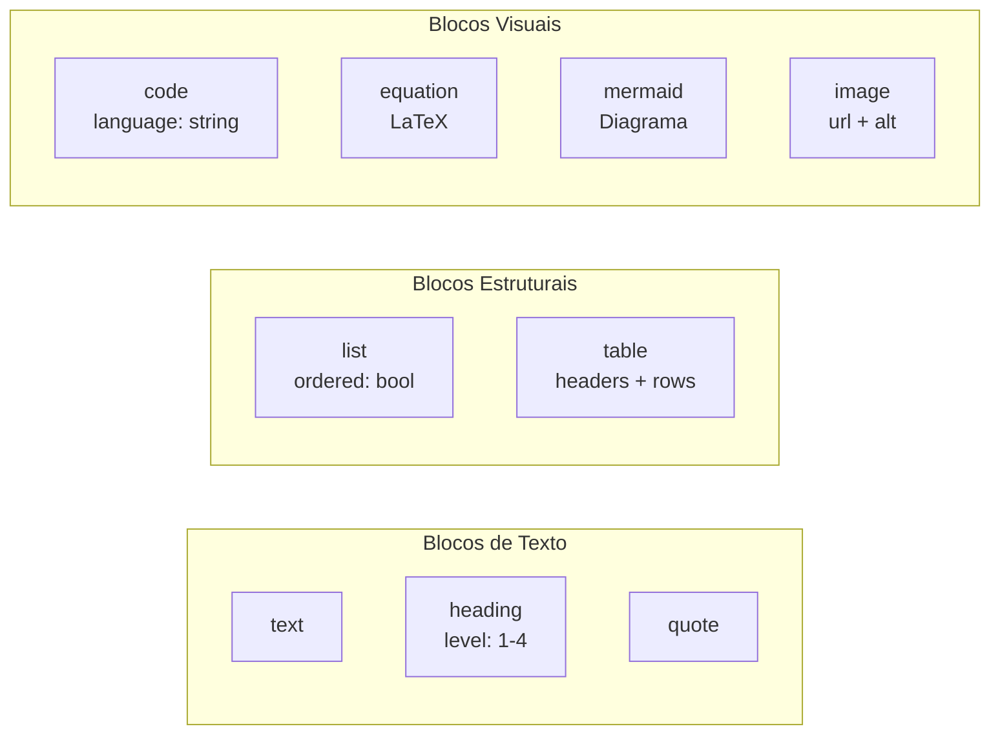
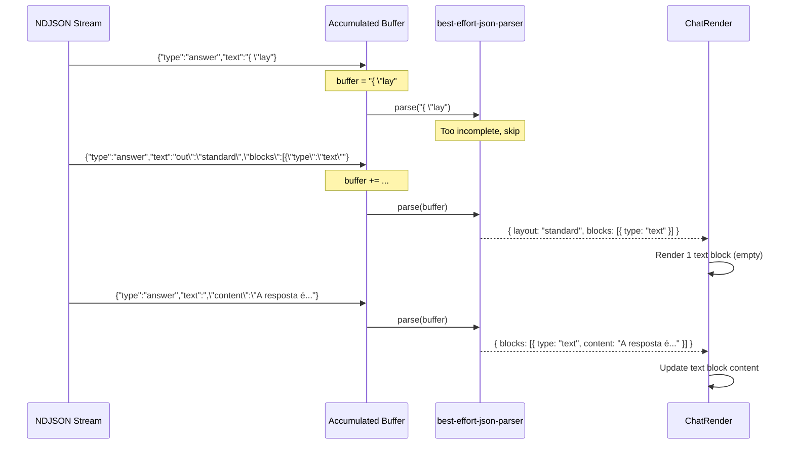

# Visão Geral do Chat

## Propósito

O sistema de chat do maia.edu é o módulo mais complexo da plataforma. Ele implementa um **tutor de IA personalizado** que combina:

- **Router inteligente** que classifica a complexidade de cada mensagem
- **3 pipelines de resposta** (rápido, raciocínio, scaffolding)
- **13 metodologias pedagógicas** selecionáveis
- **Sistema de memória** com extração de fatos atômicos
- **Rendering incremental** com suporte a LaTeX, Mermaid, código e imagens
- **Streaming em tempo real** via NDJSON

---

## Arquivos do Sistema de Chat

| Arquivo | Linhas | Propósito |
|---------|--------|----------|
| [`config.js`](/chat/config) | 112 | Configuração de modos, modelos, timeouts |
| [`index.js`](/chat/index) | ~500 | Ponto de entrada, inicialização, event listeners |
| [`router.js`](/chat/router) | ~300 | Classificação de complexidade |
| [`router-prompt.js`](/chat/router-prompt) | ~200 | Engenharia de prompt do router |
| [`pipelines.js`](/chat/pipelines-overview) | ~800 | Orquestração das 3 pipelines |
| [`chat-system-prompt.js`](/chat/system-prompts) | ~600 | System prompts por modo |
| [`memory-prompts.js`](/chat/memory-prompts) | ~200 | Prompts de extração de memória |
| [`schemas.js`](/chat/schemas-layouts) | ~400 | JSON schemas de resposta |
| [`ChatRender.tsx`](/chat/render) | ~900 | Renderização de blocos (TSX) |
| [`ChatRender.js`](/chat/render) | ~600 | Renderização de blocos (JS legacy) |
| `hydration.js` | ~680 | Pós-processamento (MathJax, Mermaid) |
| **Services:** | | |
| `scaffolding-service.js` | ~400 | Tutoria passo-a-passo |
| `gap-detector.js` | ~200 | Detecção de lacunas de conhecimento |
| `suggestion-generator.js` | ~300 | Geração de sugestões contextuais |

---

## Diagrama de Fluxo Completo



---

## Modos de Operação

### Tabela de Modos

| Modo | ID | Label | Router | Modelo | Thinking | Temperatura |
|------|----|-------|--------|--------|----------|------------|
| 🤖 Automático | `automatico` | "Automático" | ✅ Sim | Depende do router | Depende | 1.0 |
| ⚡ Rápido | `rapido` | "Rápido" | ❌ Não | `gemini-3-flash-preview` | ❌ Não | 1.0 |
| 🧠 Raciocínio | `raciocinio` | "Raciocínio" | ❌ Não | `gemini-3-flash-preview` | ✅ Sim | 1.0 |
| 📐 Scaffolding | `scaffolding` | "Scaffolding (Beta)" | ❌ Não | `gemini-3-flash-preview` | ✅ Sim | 1.0 |

### Fluxo de Decisão do Modo Automático



---

## Sistema de Metodologias Pedagógicas

O chat suporta **13 metodologias pedagógicas** que alteram o system prompt:

| # | Metodologia | Descrição Resumida |
|---|-------------|-------------------|
| 1 | Aprendizagem Ativa | Provoca reflexão antes de dar respostas |
| 2 | Método Socrático | Responde com perguntas guiadoras |
| 3 | Ensino por Descoberta | Guia o estudante a descobrir por conta própria |
| 4 | Mapas Conceituais | Organiza conhecimento em redes de conceitos |
| 5 | Analogias e Metáforas | Explica usando comparações do cotidiano |
| 6 | Elaborative Interrogation | "Por quê?" profundo e iterativo |
| 7 | Dual Coding | Combina texto + diagramas visuais (Mermaid) |
| 8 | Interleaving | Alterna entre tópicos para fortalecer conexões |
| 9 | Retrieval Practice | Testa antes de ensinar |
| 10 | Spaced Repetition | Revisão espaçada |
| 11 | Feynman Technique | Explicar como se fosse para uma criança |
| 12 | PBL (Problem-Based Learning) | Aprender resolvendo problemas |
| 13 | Gamificação | Elementos de jogo no aprendizado |

### Seleção

- **Modo Automático**: O router analisa a mensagem e escolhe a metodologia mais adequada
- **Modo Manual**: O usuário seleciona via o menu "+" do chat input

### Badge Visual

Cada resposta exibe um badge com a metodologia utilizada:

```
[Badge: 🧠 Dual Coding] 
```

---

## Schema de Resposta JSON

Toda resposta do chat segue um JSON Schema rigoroso. O schema principal é:

```json
{
  "layout": "standard | question | scaffolding",
  "methodology": "dual_coding",
  "blocks": [
    { "type": "heading", "level": 2, "content": "..." },
    { "type": "text", "content": "..." },
    { "type": "equation", "content": "\\frac{-b \\pm ...}{2a}" },
    { "type": "code", "language": "python", "content": "..." },
    { "type": "mermaid", "content": "graph LR ..." },
    { "type": "list", "ordered": false, "items": ["..."] },
    { "type": "quote", "content": "..." },
    { "type": "image", "url": "...", "alt": "..." }
  ]
}
```

### Tipos de Bloco



---

## Streaming e Rendering Incremental

O chat implementa **rendering incremental** — conforme os chunks de resposta chegam via NDJSON, o JSON parcial é parseado e os blocos são renderizados progressivamente:



**Decisão de design:** Usar `best-effort-json-parser` em vez de `JSON.parse` permite exibir conteúdo parcial mesmo quando o JSON está incompleto, minimizando o tempo percebido de espera pelo usuário.

---

## Integração com Memória

O chat integra-se com o [sistema de memória](/memoria/visao-geral) para personalização:

1. **Antes de cada mensagem**: O memory context é injetado no system prompt
2. **Após cada conversa**: Fatos atômicos são extraídos e armazenados
3. **Persistência dual**: IndexedDB (30min TTL) + Pinecone (permanente)

```javascript
// Exemplo de memory directive injetada no prompt
const memoryDirective = `
## Contexto do Estudante (Memória)
- O estudante está se preparando para o ENEM 2026
- Tem dificuldade com logaritmos e funções exponenciais
- Prefere explicações com exemplos numéricos
- Estudou recentemente cinemática (MRU e MRUV)
`;
```

---

## Referências Cruzadas

| Tópico | Página |
|--------|--------|
| Configuração detalhada | [Chat Config](/chat/config) |
| Classificação do Router | [Router](/chat/router) |
| Prompt do Router | [Router Prompt](/chat/router-prompt) |
| Pipelines de resposta | [Pipelines](/chat/pipelines-overview) |
| System Prompts | [System Prompts](/chat/system-prompts) |
| Schemas JSON | [Schemas — Layouts](/chat/schemas-layouts) |
| Renderização | [Chat Render](/chat/render) |
| Hydration | [Hydration](/chat/hydration) |
| Scaffolding | [Scaffolding Service](/chat/scaffolding-service) |
| Memória | [Visão Geral da Memória](/memoria/visao-geral) |
| Worker endpoint | [/generate (Chat Mode)](/api-worker/generate-chat) |
