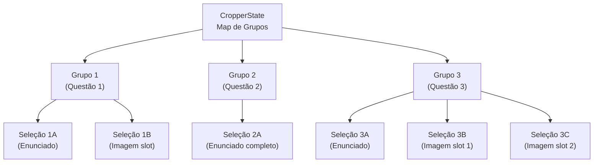
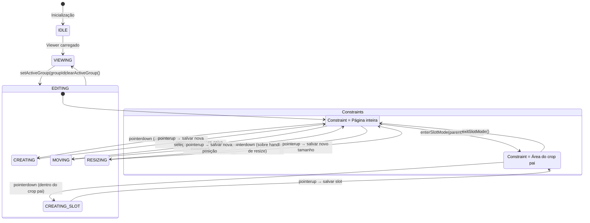
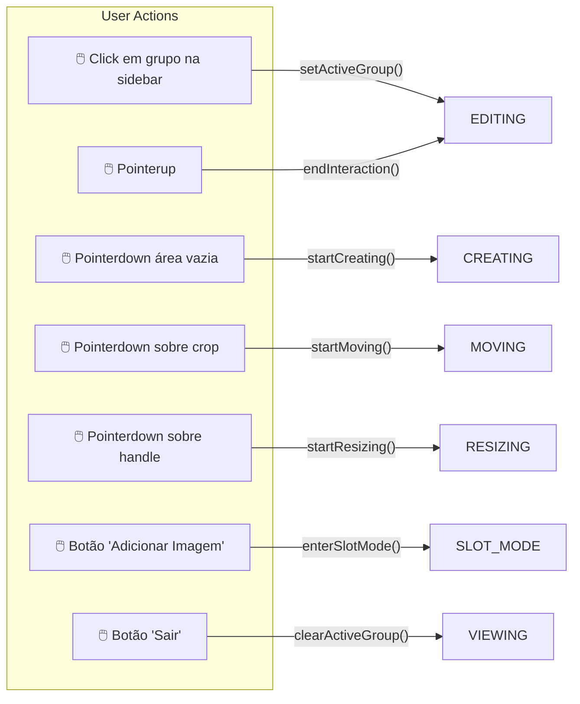
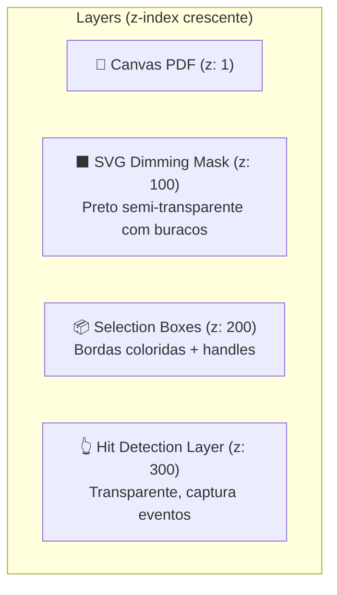
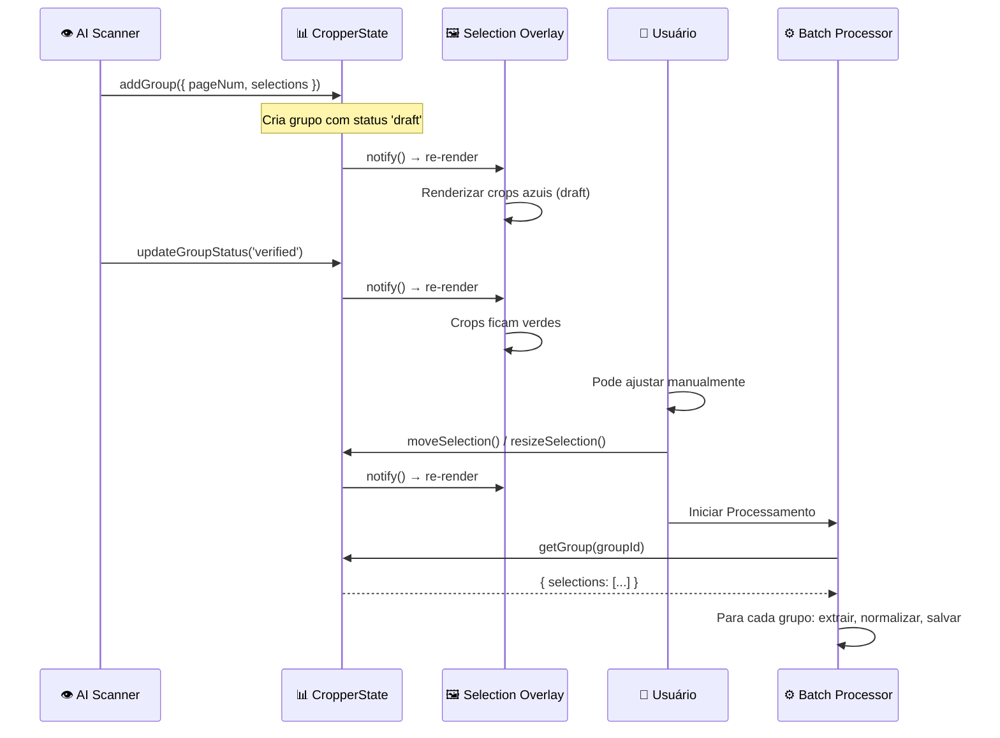
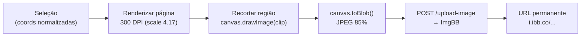

# Visão Geral do Cropper

## Arquivo-Fonte

| Arquivo | Linhas | Tamanho | Propósito |
|---------|--------|---------|----------|
| [`cropper-core.js`](file:///c:/Users/jcamp/Downloads/maia.api/js/cropper/cropper-core.js) | ~150 | 4.1 KB | Init, destroy, API pública |
| [`cropper-state.js`](file:///c:/Users/jcamp/Downloads/maia.api/js/cropper/cropper-state.js) | ~400 | 11.8 KB | Store reativo, undo/redo |
| [`mode.js`](file:///c:/Users/jcamp/Downloads/maia.api/js/cropper/mode.js) | ~700 | 22.9 KB | Máquina de estados completa |
| [`selection-overlay.js`](file:///c:/Users/jcamp/Downloads/maia.api/js/cropper/selection-overlay.js) | ~1500 | 44.6 KB | SVG overlay, pointer events |
| [`gallery.js`](file:///c:/Users/jcamp/Downloads/maia.api/js/cropper/gallery.js) | ~50 | 1.3 KB | Galeria de crops |
| [`json-loader.js`](file:///c:/Users/jcamp/Downloads/maia.api/js/cropper/json-loader.js) | ~250 | 7 KB | Import/export JSON |
| [`save-handlers.js`](file:///c:/Users/jcamp/Downloads/maia.api/js/cropper/save-handlers.js) | ~400 | 12.8 KB | Extração de crops em alta resolução |
| **Total** | **~3450** | **~104 KB** | |

---

## Propósito

O sistema de cropping é a ferramenta que permite ao usuário **selecionar regiões de interesse** em páginas de PDF. Essas regiões (crops) representam questões de prova que serão:

1. **Recortadas** em alta resolução (300 DPI)
2. **Enviadas ao Gemini** para extração de texto e alternativas
3. **Catalogadas** no banco de questões (Firebase + Pinecone)

---

## Organização Conceitual

### Hierarquia de Dados



- **Grupo**: Representa uma questão. Contém uma ou mais seleções.
- **Seleção Principal**: O crop do enunciado completo (texto + alternativas).
- **Seleções de Slot**: Crops de imagens dentro da questão (opcionais).

### Coordenadas

Todas as seleções armazenam coordenadas **normalizadas** (independentes de zoom):

```javascript
const selection = {
  id: 'sel_abc123',
  groupId: 'grp_001',
  pageNum: 3,
  // Coordenadas proporcionais (0-1) em relação à página
  relativeLeft: 0.05,    // 5% da esquerda
  relativeTop: 0.10,     // 10% do topo
  relativeWidth: 0.90,   // 90% da largura
  relativeHeight: 0.25,  // 25% da altura
  // Metadados
  status: 'verified',    // draft | verified | extracted
  isSlot: false,         // true para slots de imagem
  parentId: null,        // ID da seleção pai (para slots)
};
```

---

## Máquina de Estados

O cropper opera como uma **máquina de estados finita (FSM)**:



### Estados

| Estado | Descrição | Constraints |
|--------|-----------|------------|
| `IDLE` | Cropper não inicializado | — |
| `VIEWING` | Visualizando, sem interação | — |
| `NORMAL_MODE` | Editando grupo, pode criar/mover/redimensionar | Limites da página |
| `CREATING` | Arrastando para criar novo crop | Limites da página |
| `MOVING` | Arrastando crop existente | Limites da página |
| `RESIZING` | Arrastando handle de resize | Limites da página, tamanho mínimo |
| `SLOT_MODE` | Modo de seleção de imagem | Limites do crop pai |
| `CREATING_SLOT` | Criando slot dentro do crop pai | Limites do crop pai |

### Transições



---

## Selection Overlay — Diagrama de Renderização

O overlay é um **SVG** posicionado absolutamente sobre cada página do PDF:



### Dimming Mask

A dimming mask escurece toda a página, exceto as regiões dos crops:

```svg
<svg>
  <path 
    d="M 0 0 H {pageWidth} V {pageHeight} H 0 Z 
       M {crop1.x} {crop1.y} h {crop1.w} v {crop1.h} h {-crop1.w} Z
       M {crop2.x} {crop2.y} h {crop2.w} v {crop2.h} h {-crop2.w} Z"
    fill="rgba(0, 0, 0, 0.5)"
    fill-rule="evenodd"
  />
</svg>
```

O `fill-rule: evenodd` cria os "buracos" — áreas onde os subpaths internos (crops) cancelam o preenchimento do path externo (retângulo da página inteira).

### Status Visual dos Crops

| Status | Cor da Borda | Significado |
|--------|-------------|-------------|
| `draft` | 🔵 Azul `#3b82f6` | Detectado pelo AI Scanner, não verificado |
| `verified` | 🟢 Verde `#22c55e` | Verificado e aprovado |
| `extracted` | 🟣 Roxo `#8b5cf6` | Dados já extraídos |
| `error` | 🔴 Vermelho `#ef4444` | Erro na extração |
| `slot` | 🟡 Amarelo `#eab308` | Slot de imagem (dentro de questão) |

---

## Fluxo: Scanner → Cropper → Batch



---

## CropperState — Store Reativo

O `CropperState` implementa um pattern de store reativo com subscriptions:

```javascript
class CropperState {
  // Dados
  static #groups = new Map();     // Map<groupId, Group>
  static #activeGroupId = null;   // Grupo atualmente em edição
  static #undoStack = [];         // Stack de undo
  static #redoStack = [];         // Stack de redo
  
  // Subscriptions
  static #listeners = [];
  
  // CRUD
  static addGroup(group) { ... this.#notify(); }
  static removeGroup(groupId) { ... this.#notify(); }
  static updateSelection(selId, updates) { ... this.#notify(); }
  
  // Undo/Redo
  static undo() { ... }
  static redo() { ... }
  
  // Observer
  static subscribe(callback) {
    this.#listeners.push(callback);
    return () => {
      this.#listeners = this.#listeners.filter(l => l !== callback);
    };
  }
  
  static #notify() {
    this.#listeners.forEach(l => l());
  }
}
```

### API Pública

| Método | Parâmetros | Retorno | Descrição |
|--------|-----------|---------|-----------|
| `addGroup(group)` | `{ id, pageNum, selections }` | void | Adiciona um grupo |
| `removeGroup(groupId)` | `string` | void | Remove um grupo |
| `getGroup(groupId)` | `string` | `Group \| null` | Retorna grupo |
| `getAllGroups()` | — | `Map<string, Group>` | Todos os grupos |
| `setActiveGroup(groupId)` | `string` | void | Ativa edição |
| `clearActiveGroup()` | — | void | Desativa edição |
| `updateSelection(selId, updates)` | `string, object` | void | Atualiza seleção |
| `subscribe(callback)` | `Function` | `Function` (unsubscribe) | Observer |
| `undo()` | — | void | Desfazer última ação |
| `redo()` | — | void | Refazer última ação desfeita |

---

## Save Handlers — Extração High-Res

Quando o usuário confirma os crops, o `save-handlers.js` extrai cada seleção em alta resolução:



---

## Referências Cruzadas

| Tópico | Link |
|--------|------|
| Cropper Core | [Cropper Core (cropper-core.js)](/cropper/core) |
| Máquina de Estados detalhada | [Mode (mode.js)](/cropper/mode) |
| Selection Overlay completo | [Selection Overlay](/cropper/overlay) |
| Slot Mode | [Slot Mode](/cropper/slot-mode) |
| Save Handlers | [Save Handlers](/cropper/save) |
| AI Scanner (gera crops) | [AI Scanner Pipeline](/ocr/scanner-pipeline) |
| Batch Processor (consome crops) | [Batch Processor](/upload/batch-arquitetura) |
