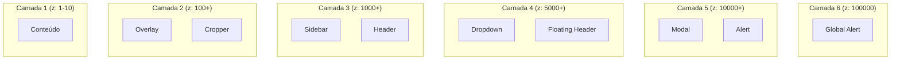

# Design Tokens — variables.css

## Arquivo-Fonte

| Propriedade | Valor |
|------------|-------|
| **Arquivo** | [`css/base/variables.css`](file:///c:/Users/jcamp/Downloads/maia.api/css/base/variables.css) |
| **Linhas** | ~500 |
| **Tamanho** | 15.3 KB |
| **Tipo** | CSS Custom Properties (`:root`) |

---

## Visão Geral

O `variables.css` é o **sistema de design tokens** do maia.edu. Define todas as variáveis CSS que garantem consistência visual em toda a aplicação. O arquivo é organizado em seções lógicas que cobrem:

1. Paleta de cores (light/dark themes)
2. Escala de espaçamento
3. Tipografia
4. Raios de borda
5. Sombras
6. Z-index layers
7. Transições e animações
8. Breakpoints

---

## Paleta de Cores

### Modo Escuro (Padrão)

O maia.edu usa **dark mode por padrão**, com cores cuidadosamente selecionadas para conforto visual em sessões longas de estudo:

```css
:root {
  /* Background Layers */
  --color-bg-primary: #0f0f0f;         /* Fundo principal */
  --color-bg-secondary: #1a1a1a;       /* Cards, sections */
  --color-bg-tertiary: #242424;        /* Inputs, elevated */
  --color-bg-hover: #2a2a2a;           /* Estado hover */
  --color-bg-active: #333333;          /* Estado ativo */
  
  /* Text */
  --color-text-primary: #e5e5e5;       /* Texto principal */
  --color-text-secondary: #a3a3a3;     /* Texto secundário */
  --color-text-tertiary: #737373;      /* Texto terciário */
  --color-text-disabled: #525252;      /* Texto desabilitado */
  
  /* Accent (Brand) */
  --color-accent: #3b82f6;             /* Azul principal */
  --color-accent-hover: #2563eb;       /* Azul hover */
  --color-accent-subtle: rgba(59, 130, 246, 0.1);  /* Background sutil */
  
  /* Status Colors */
  --color-success: #22c55e;            /* Verde */
  --color-warning: #f59e0b;            /* Amarelo */
  --color-error: #ef4444;              /* Vermelho */
  --color-info: #06b6d4;              /* Ciano */
  
  /* Borders */
  --color-border: #2a2a2a;             /* Borda padrão */
  --color-border-hover: #404040;       /* Borda hover */
  --color-border-focus: #3b82f6;       /* Borda focus */
}
```

### Modo Claro

```css
:root.light-theme {
  --color-bg-primary: #ffffff;
  --color-bg-secondary: #f5f5f5;
  --color-bg-tertiary: #eeeeee;
  --color-text-primary: #171717;
  --color-text-secondary: #525252;
  /* ... */
}
```

---

## Escala de Espaçamento

Sistema de espaçamento baseado em múltiplos de 4px:

```css
:root {
  --space-1: 4px;
  --space-2: 8px;
  --space-3: 12px;
  --space-4: 16px;
  --space-5: 20px;
  --space-6: 24px;
  --space-8: 32px;
  --space-10: 40px;
  --space-12: 48px;
  --space-16: 64px;
  --space-20: 80px;
}
```

| Token | Valor | Uso Típico |
|-------|-------|-----------|
| `--space-1` | 4px | Gaps internos muito pequenos |
| `--space-2` | 8px | Padding de badges, gaps de flex |
| `--space-3` | 12px | Padding de botões pequenos |
| `--space-4` | 16px | Padding padrão de cards |
| `--space-6` | 24px | Margin entre seções |
| `--space-8` | 32px | Padding de containers |
| `--space-12` | 48px | Margem de seção grande |
| `--space-16` | 64px | Header height |

---

## Tipografia

```css
:root {
  /* Font Families */
  --font-sans: 'Inter', -apple-system, BlinkMacSystemFont, 'Segoe UI', sans-serif;
  --font-mono: 'JetBrains Mono', 'Fira Code', 'SF Mono', monospace;
  
  /* Font Sizes (Escala Major Second) */
  --font-size-xs: 0.75rem;    /* 12px */
  --font-size-sm: 0.875rem;   /* 14px */
  --font-size-md: 1rem;       /* 16px — Base */
  --font-size-lg: 1.125rem;   /* 18px */
  --font-size-xl: 1.25rem;    /* 20px */
  --font-size-2xl: 1.5rem;    /* 24px */
  --font-size-3xl: 1.875rem;  /* 30px */
  --font-size-4xl: 2.25rem;   /* 36px */
  
  /* Font Weights */
  --font-weight-normal: 400;
  --font-weight-medium: 500;
  --font-weight-semibold: 600;
  --font-weight-bold: 700;
  
  /* Line Heights */
  --line-height-tight: 1.25;
  --line-height-normal: 1.5;
  --line-height-relaxed: 1.75;
}
```

---

## Raios de Borda

```css
:root {
  --radius-sm: 4px;
  --radius-md: 8px;
  --radius-lg: 12px;
  --radius-xl: 16px;
  --radius-2xl: 24px;
  --radius-full: 9999px;  /* Pílula */
}
```

| Token | Valor | Uso |
|-------|-------|-----|
| `--radius-sm` | 4px | Badges, tags, chips |
| `--radius-md` | 8px | Inputs, cards pequenos |
| `--radius-lg` | 12px | Cards, modais |
| `--radius-xl` | 16px | Containers grandes |
| `--radius-full` | 9999px | Botões pílula, avatares |

---

## Sombras

```css
:root {
  --shadow-sm: 0 1px 2px rgba(0, 0, 0, 0.05);
  --shadow-md: 0 4px 6px -1px rgba(0, 0, 0, 0.1);
  --shadow-lg: 0 10px 15px -3px rgba(0, 0, 0, 0.1);
  --shadow-xl: 0 20px 25px -5px rgba(0, 0, 0, 0.1);
  --shadow-glow: 0 0 20px rgba(59, 130, 246, 0.3);  /* Glow azul */
}
```

---

## Z-Index Layers

O sistema de z-index é organizado em **camadas lógicas** para evitar conflitos:

```css
:root {
  /* Camada 1: Conteúdo */
  --z-base: 1;
  --z-elevated: 10;
  
  /* Camada 2: Overlays */
  --z-overlay: 100;
  --z-cropper: 200;
  --z-dimming: 500;
  
  /* Camada 3: Navigation */
  --z-sidebar: 1000;
  --z-header: 2000;
  
  /* Camada 4: Floating */
  --z-dropdown: 5000;
  --z-tooltip: 6000;
  --z-floating: 8000;
  
  /* Camada 5: Modals */
  --z-modal-backdrop: 10000;
  --z-modal: 10001;
  --z-alert: 10002;
  
  /* Camada 6: Critical */
  --z-toast: 99999;
  --z-global-alert: 100000;
}
```



---

## Transições

```css
:root {
  --transition-fast: 150ms ease;
  --transition-base: 200ms ease;
  --transition-slow: 300ms ease;
  --transition-spring: 300ms cubic-bezier(0.34, 1.56, 0.64, 1);
}
```

| Token | Duração | Easing | Uso |
|-------|---------|--------|-----|
| `--transition-fast` | 150ms | ease | Hover de botões, tooltips |
| `--transition-base` | 200ms | ease | Transição padrão |
| `--transition-slow` | 300ms | ease | Abrir/fechar painéis |
| `--transition-spring` | 300ms | spring | Animações "bouncy" |

---

## Decisões de Design

### Por que dark mode como padrão?

1. **Uso noturno**: Estudantes frequentemente estudam à noite
2. **Conforto visual**: Leitura prolongada é mais confortável em dark mode
3. **Estética premium**: Dark mode com accents vibrantes parece mais moderno
4. **Contraste**: Elementos interativos se destacam mais

### Por que Inter como font-family?

1. **Legibilidade**: Projetada para telas (boa em tamanhos pequenos)
2. **Quantidade de weights**: 9 weights disponíveis
3. **Open-source**: Gratuita e sem restrições
4. **Suporte**: Amplo suporte a caracteres latinos (pt-BR)

### Por que escala de 4px?

1. **Divisibilidade**: 4 é divisível por 2 (half-steps possíveis)
2. **Pixel-perfect**: Todos os valores são inteiros de pixels
3. **Indústria**: Padrão usado por Material, Tailwind, etc.

---

## Referências Cruzadas

| Tópico | Link |
|--------|------|
| Primitives e Tipografia | [Primitives](/css/primitives) |
| Animações | [Animações](/css/animacoes) |
| Componentes Chat | [Chat CSS](/css/comp-chat) |
| Responsividade | [Responsividade](/css/responsividade) |
