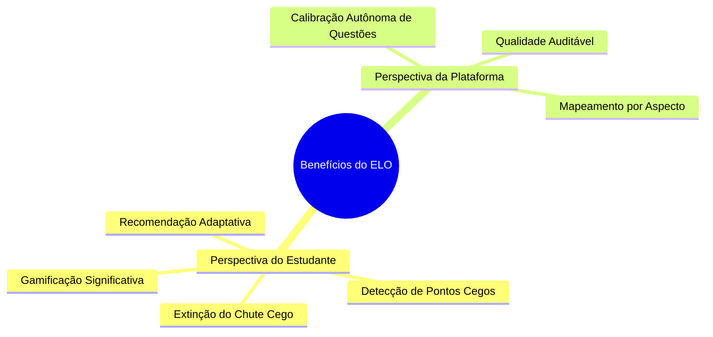

# ⚖️ Análise Pedagógica: Benefícios, Malefícios e Limitações

A implementação de um sistema de ELO e calibração metacognitiva baseada na Teoria de Resposta ao Item (TRI) traz avanços pedagógicos expressivos, mas também introduz desafios psicológicos e técnicos que precisam ser gerenciados com rigor.

---

## 🌟 1. Benefícios do Sistema de ELO

### 🎓 1.1 Perspectiva do Estudante
1. **Gamificação com Significado Pedagógico**: Diferente dos pontos de experiência (XP) convencionais que premiam apenas o volume bruto de cliques, o ELO premia a **precisão**, o **domínio conceitual** e a **consistência**.
2. **Combate ao Chute Cego e Falsa Ilusão**: Os sliders de certeza obrigam o estudante a refletir antes de confirmar a opção. Isso extingue a "falsa ilusão de domínio" decorrente de acertos casuais por eliminação ou sorte.
3. **Mapeamento Cirúrgico de Pontos Cegos**: Ao destacar os erros de alta convicção (Perfil 6: *Ponto Cego Absoluto*), o sistema indica exatamente onde o estudante possui um vício de raciocínio ou uma premissa errônea que precisa ser desfeita.
4. **Resoluções Adaptativas ao Nível Real**: Como o ELO do estudante ($\theta$) e a dificuldade da questão ($b_{efetivo}$) estão na mesma escala, o algoritmo evita submeter o aluno a questões excessivamente fáceis (desmotivadoras) ou excessivamente difíceis (frustrantes).

### 🏛️ 1.2 Perspectiva da Plataforma & Qualidade do Banco
1. **Calibração Autônoma do Banco de Questões**: O sistema não depende de especialistas humanos reavaliando manualmente a dificuldade de milhares de questões. A combinação de **Prior por IA** ($b_{IA}$) com **Shrinkage Bayesiano** ($b_{empirico}$) ajusta a dificuldade real das questões à medida que os alunos as respondem.
2. **Diagnóstico Multidimensional de Aspectos**: O ELO é rastreado separadamente para disciplinas, matérias, bancas e fatores de complexidade (ex: *Texto Extenso*, *Distratores Semânticos*, *Visão Crítica*), permitindo que a IA monte planos de estudo ultracontextualizados.

---

## ⚠️ 2. Malefícios, Riscos & Desafios Psicológicos

Apesar dos benefícios, o uso indevido ou a percepção equivocada da pontuação de ELO pode gerar impactos negativos:

> [!WARNING]
> ### 1. Ansiedade de Desempenho e Aversão à Perda (Rank Anxiety)
> Alunos em faixas de ELO mais elevadas (Platina, Esmeralda, Mestre) podem desenvolver **medo de resolver novas questões** por receio de errar e perder ELO. Isso pode paralisar o processo de aprendizado justamente nos tópicos em que o estudante necessita de mais treino.

> [!CAUTION]
> ### 2. Risco de Sobrepensamento (*Overthinking*) em Questões Fáceis
> A presença dos sliders de convicção pode induzir o estudante a duvidar de respostas diretas e simples, gerando paranoia em itens básicos e aumentando desnecessariamente o tempo gasto por questão.

> [!WARNING]
> ### 3. Frustração por Decaimento Temporal (Ebbinghaus)
> Se um estudante precisa se ausentar da plataforma por motivo de doença ou viagem, retornar e encontrar seu ELO reduzido pelo algoritmo de decaimento temporal pode gerar sensação de injustiça ou punição se a regra não estiver claramente explicada.

> [!WARNING]
> ### 4. Vício de Manipulação nos Sliders de Certeza
> Alunos novos podem tentar "burlar" o sistema marcando sempre $100\%$ de certeza na alternativa escolhida para tentar maximizar os ganhos. Contudo, quando erram com $100\%$ de certeza, a penalização na Pontuação Brier e no ELO é severamente multiplicada.

---

## 🛡️ 3. Mecanismos de Mitigação Implementados no Codebase

Para neutralizar os malefícios e proteger a jornada pedagógica do estudante, o maia.edu implementa salvaguardas técnicas no arquivo `elo-service.js`:

| Desafio / Risco | Salvaguarda Técnica Implementada | Como Funciona no Código |
| :--- | :--- | :--- |
| **Queda Brusca por Inatividade** | **Piso de Segurança Antitravamento** | O decaimento temporal nunca reduz o ELO do aluno mais do que 150 pontos abaixo do seu pico histórico ($\theta_{max} - 150$) e possui piso absoluto em $1200$. |
| **Agressividade de Perda nos Tiers Altos** | **Fator $K$ Dinâmico Amortecido** | Alunos em Tiers superiores possuem $K_{user} = 16$ ou $20$, enquanto iniciantes usam $K_{user} = 48$. Isso estabiliza a pontuação nos níveis avançados. |
| **Tentativa de Burlar os Sliders** | **Penalização Quadrática de Brier** | A fórmula Brier $S_{Brier} = 1 - 0.5 \sum (y_i - P_i)^2$ aplica uma punição matematicamente pesada ao erro de alta convicção ($I_{ilusao}$), educando o aluno a usar o slider de forma honesta. |
| **Frustração por Erro em Questão Difícil** | **Perda Proporcional à Probabilidade** | Se o aluno erra uma questão onde $P_{esperado} < 0.20$ (questão muito acima do seu nível), a perda de ELO é mínima, pois o sistema já previa a dificuldade. |

---

## 🔍 4. Resumo Comparativo: Vantagens vs. Desvantagens

| Dimensão | Vantagens (Pontos Fortes) | Desvantagens & Limitações |
| :--- | :--- | :--- |
| **Pedagógica** | Mapeamento cirúrgico de lacunas; combate ao chute; diagnósticos imediatos. | Pode causar sobrepensamento (*overthinking*) em questões de enunciado direto. |
| **Psicológica** | Sensação de evolução contínua; incentivo à autocalibração. | Risco de ansiedade de ranking (*Rank Anxiety*) em momentos de queda. |
| **Tecnológica** | Calibração de itens autônoma via TRI Rasch 1PL e Shrinkage Bayesiano. | Exige histórico mínimo de questões para estabilização de perfis ($N > 15$). |
