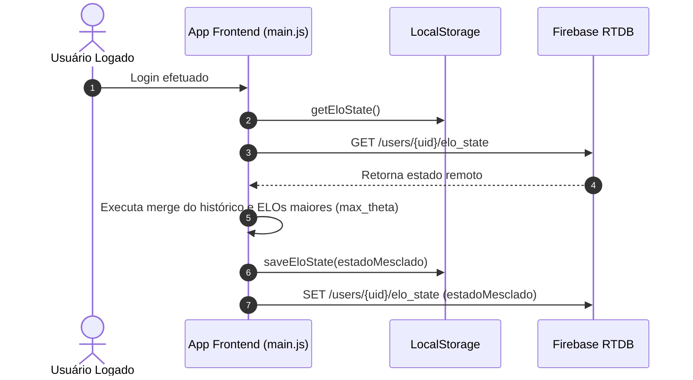

# 💾 Integração Técnica & Persistência de Dados

O estado de ELO no **maia.edu** opera sob um modelo de **armazenamento local first (offline-first)** via `localStorage`, com preparação estrutural para sincronização em nuvem via **Firebase Realtime Database / Firestore**.

---

## 📦 1. Estrutura do Objeto de Estado (`maia_elo_state`)

Toda a informação do sistema de ELO é unificada sob a chave `maia_elo_state` no `localStorage` do navegador do usuário.

```json
{
  "user": {
    "theta": 1650,
    "max_theta": 1685,
    "total_respostas": 42,
    "total_acertos": 31,
    "ultimo_acesso": 1723200000000,
    "historico": [
      {
        "questaoId": "enem_2023_mat_01",
        "tipoQuestao": "objetiva",
        "thetaBefore": 1635,
        "thetaAfter": 1650,
        "deltaTheta": 15,
        "kUserDinamico": 28,
        "isCriticalHit": false,
        "bonusAprendizado": 0,
        "bBefore": 1620,
        "bAfter": 1618,
        "acertou": true,
        "opcaoSelecionada": "C",
        "gabaritoCorreto": "C",
        "certezas": { "A": 10, "B": 10, "C": 90, "D": 10, "E": 10 },
        "sBrier": 0.92,
        "iIlusao": 0,
        "hNorm": 0.22,
        "bCoerencia": 0.78,
        "eRate": 0.75,
        "diagnosticoId": 1,
        "diagnosticoTitulo": "🎯 Domínio Teórico Pleno e Calibração Impecável",
        "aspectosKeys": ["disciplina_matematica", "banca_enem", "fator_deducao_logica"],
        "materias": ["Matemática"],
        "banca": "ENEM",
        "timestamp": 1723200000000
      }
    ]
  },
  "aspectos": {
    "disciplina_matematica": {
      "theta": 1690,
      "total_respostas": 15,
      "total_acertos": 12,
      "label": "Matemática",
      "categoria": "disciplina",
      "categoriaLabel": "Disciplinas",
      "ultimo_update": 1723200000000
    }
  },
  "questoes": {
    "enem_2023_mat_01": {
      "b_ia": 1620,
      "b_empirico": 1618,
      "b_efetivo": 1618,
      "N": 12,
      "dificuldade_ia_pct": 65,
      "criado_em": 1723100000000,
      "ultimo_update": 1723200000000
    }
  }
}
```

---

## 🛠️ 2. API do `EloService` (Funções Exportadas)

O módulo `elo-service.js` expõe funções puras e utilitários de estado:

```javascript
import { EloService } from './services/elo-service.js';

// 1. Carregar Estado com Decaimento Temporal Automático
const state = EloService.getEloState();

// 2. Processar uma Resposta
const resultado = EloService.processarResposta({
  questaoId: 'q_123',
  opcaoSelecionada: 'B',
  gabaritoCorreto: 'B',
  certezas: { A: 10, B: 85, C: 15, D: 0, E: 0 },
  complexidadeObj: { pontuacao_final_complexidade: 7.5 },
  fullData: questaoFullPayload
});

// 3. Obter o Tier de Ranking Atual
const rankTier = EloService.getEloRankTier(state.user.theta);

// 4. Calcular Arquétipos e Perfis Globais
const diagnosticoEstudante = EloService.calcularPerfisEstudante(state);
```

---

## ☁️ 3. Sincronização em Nuvem (Firebase Sync)

Quando um usuário se autentica na plataforma maia.edu, o estado local em `maia_elo_state` é mesclado com o registro remoto do usuário no Firebase:



---

## 🧪 4. Testes e Auditoria do Estado

Para inspecionar ou redefinir o estado de ELO durante testes de desenvolvimento no navegador:

```javascript
// No console de desenvolvedor do navegador:
// 1. Inspecionar ELO atual
console.log(JSON.parse(localStorage.getItem('maia_elo_state')));

// 2. Resetar ELO para padrões de fábrica
localStorage.removeItem('maia_elo_state');
location.reload();
```
