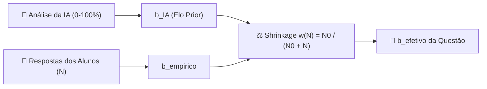

# 🧮 Modelo Matemático & Algoritmos do ELO

O sistema de ELO do **maia.edu** utiliza uma adaptação rigorosa da **Teoria de Resposta ao Item (TRI) - Modelo Rasch de 1 Parâmetro (1PL)**, enriquecida por métricas probabilísticas da teoria da informação e psicometria moderna.

---

## 1. Modelo Rasch 1PL (Probabilidade de Acerto)

A probabilidade de um estudante com habilidade $\theta$ acertar uma questão de dificuldade efetiva $b_{efetivo}$ é dada pela função logística:

$$P(\text{acerto} \mid \theta, b_{efetivo}) = \frac{1}{1 + 10^{\frac{b_{efetivo} - \theta}{S}}}$$

Onde:
- $\theta$: Elo/Habilidade do estudante (valor de referência inicial $\theta_0 = 1500$).
- $b_{efetivo}$: Elo/Dificuldade efetiva da questão.
- $S$: Escala logística ($S = 400$).

### Propriedades da Função:
- Se $\theta = b_{efetivo}$, a probabilidade de acerto é de exatamente $50\%$.
- Se $\theta > b_{efetivo} + 400$, a probabilidade de acerto supera $90.9\%$.
- Se $\theta < b_{efetivo} - 400$, a probabilidade de acerto cai abaixo de $9.1\%$.

---

## 2. Estimativa Híbrida da Dificuldade da Questão ($b_{efetivo}$)

As questões no maia.edu não começam sem calibragem. O sistema utiliza um mecanismo híbrido de duas etapas: **Prior via IA** e **Calibração Empírica via Shrinkage de Bayes**.



### 2.1 Conversão do Prior da IA ($b_{IA}$)
O motor de análise de complexidade da IA (baseado nos 14 fatores de dificuldade) gera uma pontuação percentual $D_{IA} \in [0, 100]$. O ELO Prior $b_{IA}$ é calculado como:

$$b_{IA} = \theta_0 + S \cdot \left( \frac{D_{IA} - 50}{50} \right) = 1500 + 400 \cdot \left( \frac{D_{IA} - 50}{50} \right)$$

*Exemplo:* Uma questão com dificuldade avaliada em $75\%$ pela IA recebe um $b_{IA} = 1500 + 400 \cdot (0.5) = 1700$.

### 2.2 Shrinkage Bayesiano ($w(N)$)
Conforme a questão acumula $N$ respostas de alunos reais, o peso do Prior da IA diminui suavemente em favor da dificuldade empírica observada ($b_{empirico}$):

$$w(N) = \frac{N_0}{N_0 + N}$$

Onde $N_0 = 5$ é a constante de equilíbrio (com 5 respostas, o peso é divido em $50/50$). A dificuldade efetiva final é:

$$b_{efetivo} = w(N) \cdot b_{IA} + (1 - w(N)) \cdot b_{empirico}$$

---

## 3. Atualização do ELO do Estudante e da Questão

Após o resultado de uma questão, os ELOs do aluno ($\theta$) e da questão ($b_{empirico}$) são atualizados via equações de aprendizado estocástico.

### 3.1 Fator $K$ Dinâmico do Usuário ($K_{user}$)
O fator de ajuste $K_{user}$ não é fixo; ele varia dinamicamente segundo o Tier de ELO do aluno, volume de respostas e inatividade:

```javascript
// Exemplo de calibração dinâmica em elo-service.js
if (theta < 1200) baseK = 48;       // Iniciante (alta volatilidade para rápida calibração)
else if (theta < 1350) baseK = 40;  // Aprendiz
else if (theta < 1500) baseK = 32;  // Competente (padrão)
else if (theta < 1650) baseK = 28;  // Platina
else if (theta < 1800) baseK = 24;  // Esmeralda
else if (theta < 2100) baseK = 20;  // Mestre
else baseK = 16;                    // Grão-Mestre / Lorde (exige consistência)

if (totalRespostas < 15) baseK = Math.max(baseK, 40); // Bônus de novato
if (tempoInativoDias > 3) baseK += Math.min(16, (tempoInativoDias - 3) * 2); // Boost pós-pausa
```

### 3.2 Atualização com Jitter Estocástico & Critical Hit
Para evitar rigidez e premiar acertos notáveis:

$$\Delta_{base} = K_{user} \cdot (S_{conhecimento} - P_{esperado})$$

$$\Delta_{final} = \Delta_{base} \cdot (1 + \text{Jitter}) + \text{Bônus}_{\text{CriticalHit}}$$

- **Jitter Estocástico**: Ruído controlado de desvio diário entre $-4\%$ e $+4\%$.
- **Critical Hit (Bônus de Aprendizado)**: Se o aluno acerta uma questão difícil ($P_{esperado} < 0.45$) com alta convicção ($\ge 80\%$), recebe um bônus de $+3$ a $+6$ pontos adicionais.

### 3.3 Atualização do ELO da Questão ($b_{empirico}$)
A sensibilidade da questão é calibrada com $K_{item} = 16$:

$$\Delta b_{empirico} = K_{item} \cdot (P_{esperado} - y)$$

Onde $y = 1$ se o aluno acertou e $y = 0$ se errou. Questões acertadas por alunos de baixo ELO têm sua dificuldade $b$ reduzida; questões onde alunos de alto ELO erram têm seu $b$ elevado.

---

## 4. Métricas Metacognitivas com Inversão Semântica

Ao responder a uma questão objetiva (A–E), o aluno ajusta sliders de convicção de $0\%$ a $100\%$. O maia.edu aplica uma **inversão semântica** nos valores brutos:

### 4.1 Inversão Semântica do Vetor $V$
- Para a alternativa selecionada: $V_{sel} = \text{Certeza bruta do slider}$.
- Para as alternativas não selecionadas: $V_{i} = 100 - \text{Certeza de ser Falsa}$.

O vetor $V$ é normalizado no simplex probabilístico $P$:

$$P_i = \frac{V_i}{\sum_{j=1}^5 V_j}$$

### 4.2 Métricas Calculadas

> [!IMPORTANT]
> 1. **Pontuação Brier (Brier Score)**: Mede o erro quadrático de calibração probabilística:
>    $$\text{BrierErro} = \frac{1}{2} \sum_{i=1}^5 (y_i - P_i)^2 \implies S_{Brier} = 1 - \text{BrierErro} \in [0, 1]$$
> 2. **Ilusão de Conhecimento ($I_{ilusao}$)**: Quantifica o grau de superconfiança em caso de erro:
>    $$I_{ilusao} = \begin{cases} \max\left(0, \frac{P_{selecionada} - 0.2}{0.8}\right), & \text{se errou} \\ 0, & \text{se acertou} \end{cases}$$
> 3. **Entropia de Shannon Normalizada ($H_{norm}$)**: Mede o nível de dúvida e dispersão:
>    $$H = -\sum P_i \log_2(P_i) \implies H_{norm} = \frac{H}{\log_2(5)} \in [0, 1]$$
>    *Coerência Lógica*: $B_{coerencia} = 1 - H_{norm}$.
> 4. **Taxa de Eliminação ($E_{rate}$)**: Proporção de alternativas falsas com $P_i \le 0.10$:
>    $$E_{rate} = \frac{\text{Qtd de falsas eliminadas}}{4} \in [0, 1]$$

---

## 5. Curva de Esquecimento de Ebbinghaus (Decaimento Temporal)

Se o estudante fica inativo por mais de $3$ dias ($\text{Grace Period} = 3$), a curva do esquecimento reduz gradativamente o ELO global ($\theta$) e o ELO por aspectos em direção ao ELO base ($1500$):

$$\text{DiasDecaimento} = \text{DiffDias} - 3$$

$$\theta_{novo} = 1500 + (\theta_{atual} - 1500) \cdot e^{-\lambda \cdot \text{DiasDecaimento}}$$

Onde $\lambda = 0.003$ ($0.3\%$ de retração diária suave).

> [!TIP]
> **Piso de Segurança Antitravamento**: O decaimento temporal nunca reduz o ELO do estudante mais do que $150$ pontos abaixo do seu pico histórico ($\theta_{max} - 150$) e possui um piso absoluto em $1200$ pontos.
