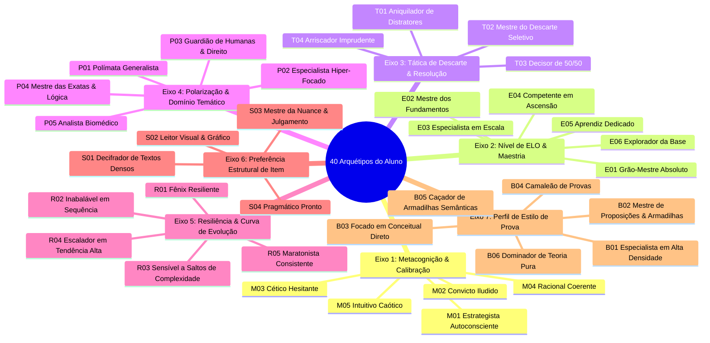

# 🧩 Perfis Diagnósticos & Arquétipos

O sistema de ELO do **maia.edu** realiza diagnósticos pedagógicos em duas escalas complementares:
1. **Feedback Instantâneo por Item (15 Perfis)**: Analisa o padrão de marcação e convicção imediatamente após a resolução de cada questão.
2. **Matriz Global do Estudante (40 Arquétipos)**: Mapeia o perfil cognitivo longitudinal do aluno em 7 eixos distintos.

---

## ⚡ 1. Catálogo dos 15 Perfis de Feedback Instantâneo

Quando o estudante submete uma questão, a função `diagnosticarPerfilMetacognitivo()` combina o resultado da resposta com os índices Brier, Ilusão de Conhecimento, Entropia e Eliminação, classificando o resultado em um dos 15 perfis:

### 🟢 Perfis de Acerto (1 a 5)

| ID | Nome do Perfil | Condições Matemáticas de Ativação | Diagnóstico Pedagógico |
| :---: | :--- | :--- | :--- |
| **1** | **🎯 Domínio Teórico Pleno** | `acertou = true`, `sSel >= 80%`, `eRate >= 0.75` | Rigor analítico perfeito. Identificou o gabarito e desarmou todos os distratores. |
| **2** | **🧠 Acerto por Eliminação** | `acertou = true`, `sSel < 50%`, `eRate >= 0.75` | Chegou à resposta eliminando as incorretas com segurança, embora mantivesse prudência. |
| **3** | **⚖️ Acerto sob Dúvida Fina (50/50)** | `acertou = true`, `opcoesPlausiveis = 2` | Isolou as duas alternativas mais fortes e optou pelo gabarito. Há uma pequena nuance a ajustar. |
| **4** | **🎲 Acerto por Incerteza (Chute)** | `acertou = true`, `hNorm >= 0.8` | Distribuição de confiança muito dispersa (alta entropia). O acerto deve ser revisado como se fosse erro. |
| **5** | **🔍 Acerto com Atração de Distrator** | `acertou = true`, distrator secundário com peso $\ge 0.25$ | Acertou, mas um distrator atraente (com premissa verdadeira em tese, mas fora do comando) gerou hesitação. |

### 🔴 Perfis de Erro (6 a 15)

| ID | Nome do Perfil | Condições Matemáticas de Ativação | Diagnóstico Pedagógico |
| :---: | :--- | :--- | :--- |
| **6** | **🔴 Ponto Cego Absoluto** | `acertou = false`, `sSel >= 75%` ou `iIlusao >= 0.5` | **Erro Crítico**: Alta convicção em uma alternativa errada. Revela um viés conceitual profundo que precisa ser desfeito. |
| **7** | **💔 Descarte Inadvertido do Gabarito** | `acertou = false`, `sGabDescarte >= 90%` | Descartou erroneamente a alternativa correta no início da leitura por estranhar a redação. |
| **8** | **🔄 Dúvida Fina Invertida (50/50)** | `acertou = false`, `opcoesPlausiveis = 2` | Isolou as duas melhores opções, mas escolheu o distrator sutil. O raciocínio estava na direção certa. |
| **9** | **🧩 Eliminação Incompleta** | `acertou = false`, `0.25 <= eRate <= 0.5` | Eliminou 1 ou 2 opções absurdas, mas não tinha critério para desempatar entre as restantes. |
| **10** | **🧠 Honestidade Metacognitiva** | `acertou = false`, `hNorm >= 0.8`, `iIlusao = 0` | Reconheceu com transparência que não dominava o assunto, marcando alta incerteza sem criar falsas ilusões. |
| **11** | **⚠️ Ancoragem por Interpretação** | `acertou = false`, viés de leitura do enunciado | Erro causado por leitura desatenta do comando do enunciado (ancorou na premissa errada). |
| **15** | **📉 Lacuna Teórica Extrema** | `acertou = false`, `pSel < 0.2`, `eRate = 0` | Ausência completa de repertório sobre o tema exigido. Requer estudo teórico guiado inicial. |

---

## 🏛️ 2. Matriz dos 40 Arquétipos Globais do Estudante (7 Eixos)

A função `calcularPerfisEstudante()` analisa todo o histórico de resoluções acumuladas e avalia a matriz de 40 arquétipos divididos em 7 eixos cognitivos:

### Detalhes dos Eixos:
1. **Metacognição & Calibração**: Mede o alinhamento entre o conhecimento real e a percepção de risco.
2. **Nível de ELO & Maestria**: Faixa absoluta de habilidade global acumulada.
3. **Tática de Descarte & Resolução**: Eficiência técnica no descarte sistemático de opções falsas.
4. **Polarização & Domínio Temático**: Homogeneidade ou especialização por matérias (Humanas, Exatas, Biológicas).
5. **Resiliência & Curva de Evolução**: Capacidade de recuperação pós-erro e manutenção de sequências (*streaks*).
6. **Preferência Estrutural de Item**: Adaptação a textos longos, gráficos, equações ou enunciados diretos.
7. **Perfil de Estilo de Prova**: Afinidade com diferentes estilos de banca e formatos de exigência.
