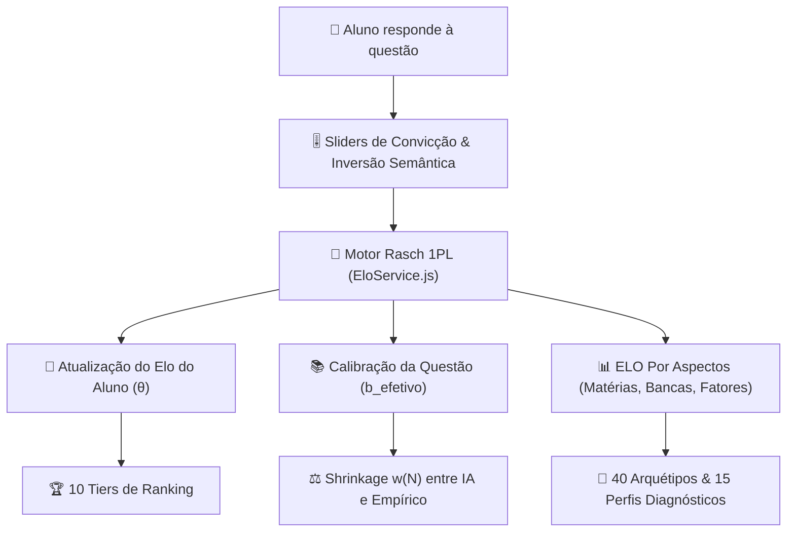
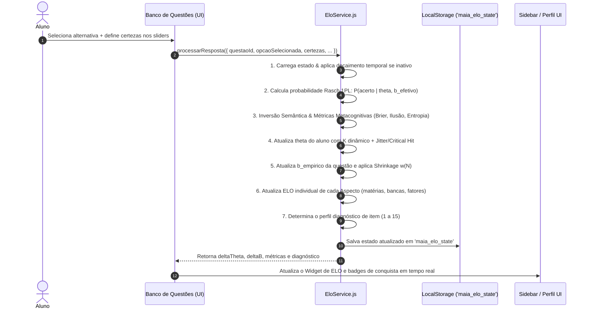

# 🏆 Visão Geral & Arquitetura do Sistema ELO

O **Sistema ELO & Diagnóstico Metacognitivo** do **maia.edu** é um motor adaptativo baseado na **Teoria de Resposta ao Item (TRI)** — especificamente no **Modelo Rasch de 1 Parâmetro (1PL)** —, combinado com algoritmos de **calibração metacognitiva com inversão semântica**, **curva de esquecimento temporal (Ebbinghaus)** e **matrizes de diagnóstico cognitivo instantâneo**.

> [!NOTE]
> O sistema de ELO do maia.edu não é apenas uma ferramenta de gamificação ou um ranking estático. Ele atua como um **tutor adaptativo em tempo real**, quantificando tanto o nível de habilidade acadêmica do estudante ($\theta$) quanto a real dificuldade de cada questão ($b_{efetivo}$), detectando pontos cegos, vieses de superconfiança e lacunas conceituais.

---

## 📐 Pilares Fundamentais do Sistema

O sistema apoia-se em 4 pilares arquiteturais:

1. **Modelo Rasch 1PL Híbrido**: Estima a probabilidade de acerto com base no diferencial $(\theta - b)$. A dificuldade inicial da questão ($b_{IA}$) é estimada pela IA e depois recalibrada empiricamente ($b_{empirico}$) à medida que os alunos a respondem.
2. **Avaliação Metacognitiva Integrada**: Através dos sliders de certeza por alternativa, o sistema mede a calibração de confiança do estudante, calculando a **Pontuação Brier**, a **Ilusão de Conhecimento**, a **Entropia de Shannon** e a **Taxa de Eliminação de Distratores**.
3. **Diagnóstico em Duas Camadas**:
   - **Camada Instantânea (15 Perfis de Item)**: Diagnóstico gerado imediatamente após cada resposta (ex: *Ponto Cego Absoluto*, *Dúvida Fina 50/50 Invertida*, *Acerto por Eliminação Sistemática*).
   - **Camada Longitudinal (40 Arquétipos do Estudante)**: Matriz determinística calculada ao longo do histórico de resolução em 7 eixos cognitivos.
4. **Resiliência e Decaimento Temporal**: Aplica decaimento baseado na Curva de Esquecimento de Ebbinghaus para alunos inativos por mais de 3 dias, incentivando a consistência e prevenindo a estagnação.

---

## 🛠️ Arquitetura de Arquivos no Codebase

O motor de ELO é totalmente desacoplado e integrado a toda a aplicação frontend e de persistência:

| Arquivo / Componente | Função & Responsabilidade |
| :--- | :--- |
| [elo-service.js](file:///c:/Users/jcamp/Downloads/maia.api/js/services/elo-service.js) | Core matemático: equações Rasch 1PL, Brier score, shrinkage $w(N)$, decaimento temporal, $K$-dinâmico e catálogo de perfis. |
| [perfil-screen.js](file:///c:/Users/jcamp/Downloads/maia.api/js/ui/perfil-screen.js) | Interface visual do Perfil de Elo do Usuário, exibindo gráficos de aspectos, arquétipos dominantes, estatísticas e estatutos de maestria. |
| [ranking-modal.js](file:///c:/Users/jcamp/Downloads/maia.api/js/ui/ranking-modal.js) | Modal pop-up com a tabela de classificação de Tiers, explicações de faixas e progresso do estudante. |
| [card-partes.js](file:///c:/Users/jcamp/Downloads/maia.api/js/banco/card-partes.js) | Renderiza os sliders de certeza e o card de feedback metacognitivo no Banco de Questões. |
| [interacoes.js](file:///c:/Users/jcamp/Downloads/maia.api/js/banco/interacoes.js) | Captura as respostas e certezas dos sliders e dispara a atualização no `EloService`. |
| [telas.js](file:///c:/Users/jcamp/Downloads/maia.api/js/app/telas.js) | Renderiza o Widget de ELO na barra lateral (`.nav-elo-widget`). |

---

## 🔄 Fluxo de Processamento de uma Resposta

Quando um estudante responde a uma questão no maia.edu, o seguinte pipeline é executado em milissegundos:

---

## 📚 Navegação da Documentação de ELO

Para explorar detalhadamente cada dimensão do sistema, consulte os tópicos especializados:

- 🧮 **[Modelo Matemático & Algoritmos](/elo/modelo-matematico)**: Equações do Rasch 1PL, Inversão Semântica, Brier Score, Shrinkage e Decaimento Temporal.
- 🏆 **[Tiers & Ranks](/elo/ranks-e-trofeus)**: Tabela de 10 Tiers de ELO, cores, limites, progressão e animações de promoção.
- 🧩 **[Perfis Diagnósticos & Arquétipos](/elo/perfis-diagnosticos)**: Catálogo dos 15 Perfis de Item e dos 40 Arquétipos do Estudante em 7 eixos.
- ⚖️ **[Benefícios, Malefícios & Limitações](/elo/beneficios-e-maleficios)**: Análise pedagógica completa dos impactos positivos, riscos de ansiedade e estratégias de mitigação.
- 💾 **[Integração & Persistência](/elo/integracao-e-persistencia)**: Detalhes técnicos da estrutura de dados, `localStorage`, sincronização Firebase e integração com a UI.
