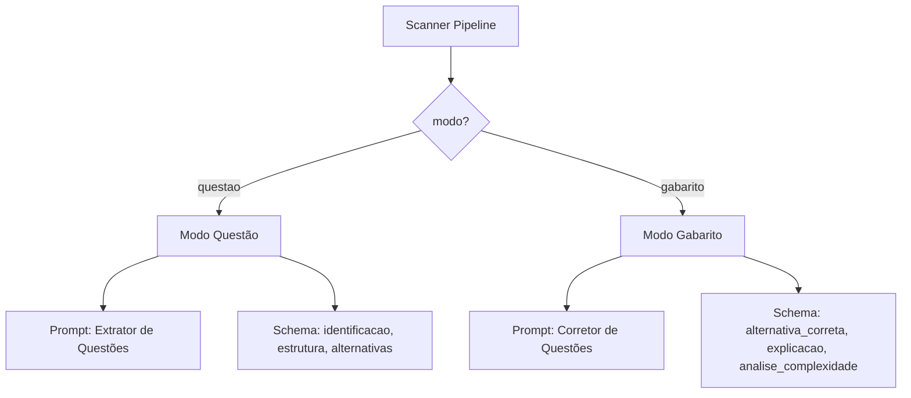

# Configuração de IA — Schemas e Prompts de Extração

> 🤖 **Disclaimer**: Documentação gerada por IA e pode conter imprecisões. [📋 Reportar erro](https://github.com/TouchRefletz/maia.api/issues/new?title=Erro+na+doc:+config-ia&labels=docs)

## Visão Geral

O `config.js` (`js/ia/config.js`) é o arquivo mais denso de engenharia de prompts do maia.edu. Com 539 linhas, ele define os **schemas JSON** e **prompts de extração** que controlam como o scanner de questões (OCR → IA) processa PDFs de provas e gabaritos. É a "Constituição" que dita a estrutura exata dos dados que a IA deve gerar ao analisar imagens de vestibulares.

O módulo exporta uma única função `obterConfiguracaoIA(modo)` que retorna um par `{ promptDaIA, JSONEsperado }` — o prompt de instrução e o JSON Schema obrigatório — baseado no modo de operação: `"questao"` (extração de enunciado) ou `"gabarito"` (extração de resolução).

## Dois Modos de Extração

### Modo Questão

Acionado quando imagens de enunciado são processadas. O prompt instrui a IA a:
1. Identificar a questão (ex: "ENEM 2023 - Q45")
2. Fatiar o enunciado em blocos sequenciais (texto → imagem → equação → texto)
3. Extrair alternativas com suas estruturas internas
4. Classificar matérias possíveis e palavras-chave
5. Detectar se é objetiva ou dissertativa

### Modo Gabarito

Acionado quando imagens de gabarito/resolução são processadas. O prompt instrui a IA a:
1. Identificar a alternativa correta
2. Gerar resolução passo-a-passo com blocos estruturados
3. Analisar cada alternativa (por que correta/incorreta)
4. Computar a Matriz de Complexidade (14 fatores booleanos)
5. Credititar a fonte da resolução (material original vs. gerado por IA)

## Schema de Questão (Modo "questao")

### Campos Principais

| Campo | Tipo | Descrição |
|-------|------|-----------|
| `identificacao` | string | Ex: "ENEM 2023 - Q45" |
| `materias_possiveis` | string[] | Ex: ["Física", "Termodinâmica"] |
| `tipo_resposta` | enum | "objetiva" ou "dissertativa" |
| `palavras_chave` | string[] | Termos-chave para busca e embedding |
| `estrutura` | BlocoConteudo[] | Array sequencial de blocos do enunciado |
| `alternativas` | Alternativa[] | Array de alternativas A-E (vazio se dissertativa) |

### Tipos de Bloco (`BlocoConteudo`)

O schema define 12 tipos de bloco, cada um com regras específicas de conteúdo:

| Tipo | Conteúdo Esperado | Exemplo |
|------|-------------------|---------|
| `texto` | Parágrafos em Markdown com LaTeX inline | "A massa de $H_2O$ é..." |
| `imagem` | Descrição visual (alt-text), **sem OCR** | "Gráfico de barra mostrando PIB..." |
| `equacao` | LaTeX puro sem cifrões | `\int_0^1 x^2 dx` |
| `citacao` | Texto citado do enunciado | "Segundo Darwin (1859)..." |
| `tabela` | Tabela em formato Markdown | `\| Col1 \| Col2 \| ...` |
| `titulo` | Cabeçalho interno (NÃO identificação) | "Texto I" ou "Considere o gráfico" |
| `subtitulo` | Subcabeçalho | "Fragmento" |
| `lista` | Itens em linhas separadas | "- Item 1\n- Item 2" |
| `codigo` | Código fonte | `print("hello")` |
| `destaque` | Callout visual | "ATENÇÃO: Use g = 10 m/s²" |
| `separador` | Pode ser vazio | "" |
| `fonte` | Créditos/referência | "Fonte: IBGE, 2023" |

### Regra Anti-OCR

Uma das diretivas mais rigorosas: blocos do tipo `imagem` devem conter apenas **descrição visual** (alt-text para acessibilidade), NUNCA o texto extraído via OCR da imagem. Isso é porque o OCR já é feito separadamente, e duplicar texto poluiria o embedding.

### Regra de Formatação LaTeX

A IA deve usar LaTeX inline (`$...$`) para fórmulas dentro de frases, e bloco `equacao` para fórmulas isoladas. ASCII para matemática (`x^2`, `H2O`) é **proibido** — deve ser `$x^2$` e `$H_2O$`.

## Schema de Gabarito (Modo "gabarito")

### Matriz de Complexidade (14 Fatores)

O campo `analise_complexidade` é um dos mais sofisticados schemas do projeto. Ele obriga a IA a analisar 14 fatores booleanos que determinam a dificuldade da questão, agrupados em categorias:

**Suporte e Leitura:**
- `texto_extenso`: Enunciado muito longo
- `vocabulario_complexo`: Termos arcaicos ou técnicos densos
- `multiplas_fontes_leitura`: Cruzar Texto 1 × Texto 2
- `interpretacao_visual`: Depende de ler gráfico/mapa

**Conhecimento Prévio:**
- `dependencia_conteudo_externo`: Resposta não está no texto
- `interdisciplinaridade`: Envolve 2+ disciplinas
- `contexto_abstrato`: Cenários hipotéticos não explicados

**Raciocínio:**
- `raciocinio_contra_intuitivo`: Desafia senso comum
- `abstracao_teorica`: Conceitos sem representação física
- `deducao_logica`: Silogismo ou eliminação complexa

**Operacional:**
- `resolucao_multiplas_etapas`: Cadeia de passos dependentes
- `transformacao_informacao`: Conversão de unidades/formatos
- `distratores_semanticos`: Alternativas-armadilha
- `analise_nuance_julgamento`: Escolher a "mais correta"

### Sistema de Créditos

O gabarito registra meticulosamente a origem de cada passo da resolução:
- `extraido_do_material`: Passo veio do PDF original scanneado
- `gerado_pela_ia`: Passo foi criado pelo modelo

Isso permite que o frontend exiba badges de origem e alertas de crédito quando a fonte não é identificável.

### Self-Check de Coerência

O campo `coerencia` obriga a IA a fazer um auto-check:
- A letra correta existe nas alternativas fornecidas?
- Todas as alternativas foram analisadas?
- Há observações de inconsistência?

Isso detecta cenários como "gabarito de outra questão misturado" — um bug comum em OCR de cadernos de prova.

## Referências Cruzadas

- [Scanner Pipeline — Onde esta configuração é consumida](/ocr/scanner-pipeline)
- [Pipeline de Embedding — Usa os textos extraídos para vetorização](/embeddings/pipeline)
- [Scripts Python — Porta Python destes schemas para batch processing](/infra/scripts-python)
- [Visão Geral da Arquitetura](/guia/arquitetura)
