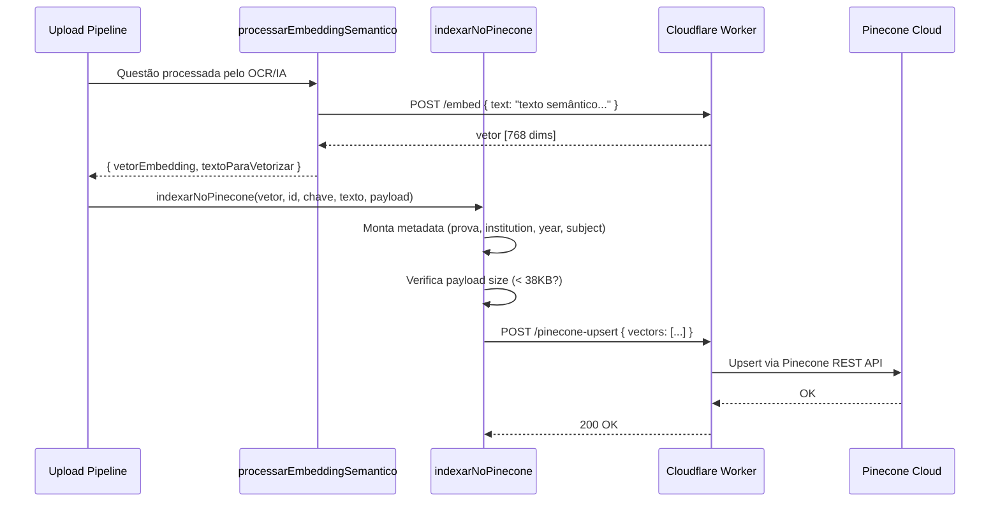

# Pinecone — Banco Vetorial Cloud para Questões

> 🤖 **Disclaimer**: Documentação gerada por IA e pode conter imprecisões. [📋 Reportar erro](https://github.com/TouchRefletz/maia.api/issues/new?title=Erro+na+doc:+pinecone&labels=docs)

## Visão Geral

O módulo de integração Pinecone no contexto de embeddings (`js/ia/embedding-e-pinecone.js` + endpoints do Worker) gerencia a indexação e busca vetorial de questões de vestibular na nuvem. Diferente do [Pinecone de memória](/memoria/pinecone-sync) que armazena fatos sobre o aluno, este Pinecone armazena **embeddings de questões** — permitindo que o chat encontre exercícios relevantes por similaridade semântica.

## Dois Índices, Duas Missões

O maia.edu utiliza o Pinecone com dois propósitos distintos, idealmente em índices separados:

| Índice | Conteúdo | Namespace | Quem escreve | Quem lê |
|--------|----------|-----------|-------------|---------|
| `maia-questions` (default) | Embeddings de questões | Por prova/matéria | Pipeline de Upload | Gap Detector / Chat |
| `maia-memory` | Fatos atômicos do aluno | Por `user.uid` | MemoryService | queryContext |

Este documento foca no índice de **questões**.

## Fluxo de Indexação



## Estrutura dos Vetores

Cada questão indexada no Pinecone possui:

```json
{
  "id": "ENEM_2023_Q45_a9f3e7b2",
  "values": [0.0234, -0.1456, 0.8921, ...],
  "metadata": {
    "prova": "ENEM_2023_Caderno1",
    "texto_preview": "A entropia de um sistema isolado sempre...",
    "institution": "ENEM",
    "year": "2023",
    "subject": ["Física", "Termodinâmica"],
    "has_full_json": true,
    "full_json": "{...dados completos da questão...}"
  }
}
```

### O Campo `full_json`

Este é o campo mais valioso e mais problemático. Armazenar o JSON completo da questão nos metadados do Pinecone permite que uma busca vetorial retorne a questão inteira sem precisar fazer uma segunda chamada ao Firebase. Isso economiza latência e reads do Firestore.

Porém, o Pinecone impõe um **limite de 40KB** por vetor (incluindo metadados). Questões complexas (muitas alternativas, explicações longas, imagens descritas) podem exceder esse limite. Nesses casos, `has_full_json` é setado `false` e o frontend sabe que precisa buscar a questão no Firebase.

## Fluxo de Busca (Query)

O chat do maia.edu usa a busca vetorial quando o aluno pede exercícios. O [Gap Detector](/chat/gap-detector) gera o embedding da pergunta e consulta o Pinecone:

```javascript
const results = await queryPineconeWorker(
  queryVector,     // Embedding da pergunta do aluno
  topK,            // Número máximo de resultados (ex: 5)
  filters,         // Filtros de metadata (matéria, ano, etc.)
  "maia-questions", // Index name
  namespace,       // Opcional
);
```

### Filtros de Metadata

O Pinecone suporta filtros nativos nos metadados, permitindo buscas como "questões de Física do ENEM 2023":

```json
{
  "filter": {
    "subject": { "$in": ["Física"] },
    "institution": { "$eq": "ENEM" },
    "year": { "$eq": "2023" }
  }
}
```

Esses filtros são combinados com a busca vetorial (similaridade cosseno) para resultados precisos e relevantes.

## Geração do ID do Vetor

O ID de cada vetor segue o padrão `{chaveProva}_{hash}`, onde:
- `chaveProva`: Identificador textual da prova no Firebase (ex: "ENEM_2023_Caderno1")
- `hash`: Hash parcial do conteúdo para evitar duplicatas

Isso permite que re-indexações da mesma questão atualizem o vetor existente em vez de criar duplicatas.

## Metadados para Filtragem

Os metadados são extraídos com cascata de fallbacks para lidar com JSONs variados:

```javascript
// Instituição: tenta 3 campos diferentes
const inst =
  payloadCompleto?.dados_gabarito?.creditos?.autor_ou_instituicao ||
  payloadCompleto?.dados_questao?.institution ||
  payloadCompleto?.dados_questao?.vestibular ||
  "Desconhecida";

// Matéria: normaliza para array (Pinecone suporta $in em arrays)
const valorBruto = payloadCompleto?.dados_questao?.materias_possiveis ||
  payloadCompleto?.dados_questao?.materia || "Geral";
const materia = Array.isArray(valorBruto) ? valorBruto : [valorBruto];
```

## Proxy via Worker

O browser nunca se comunica diretamente com o Pinecone. Todas as operações passam pelo Cloudflare Worker que:
1. Armazena a API Key do Pinecone como secret
2. Valida e sanitiza payloads
3. Aplica rate limiting
4. Loga operações para debugging

```
Browser → POST /pinecone-upsert → Worker → Pinecone REST API
Browser → POST /pinecone-query → Worker → Pinecone REST API
```

## Limitações e Considerações

1. **Dimensionalidade**: Vetores de 768 dimensões (Gemini Embedding). Mudar de modelo requer re-indexação.
2. **Latência de query**: 50-200ms dependendo da região e carga.
3. **Custo**: O plano gratuito do Pinecone suporta ~100K vetores. Para bancos maiores, upgrade necessário.
4. **Consistência eventual**: Upserts no Pinecone não são imediatamente visíveis em queries (delay de ~1s). Questões recém-indexadas podem não aparecer em buscas imediatas.

## Referências Cruzadas

- [Pipeline de Embedding — Gera vetores e chama a indexação](/embeddings/pipeline)
- [Gap Detector — Consome os vetores via busca semântica](/chat/gap-detector)
- [Worker Pinecone — Endpoints do Cloudflare Worker](/api-worker/pinecone)
- [Pinecone Sync (Memória) — O outro uso do Pinecone no projeto](/memoria/pinecone-sync)
