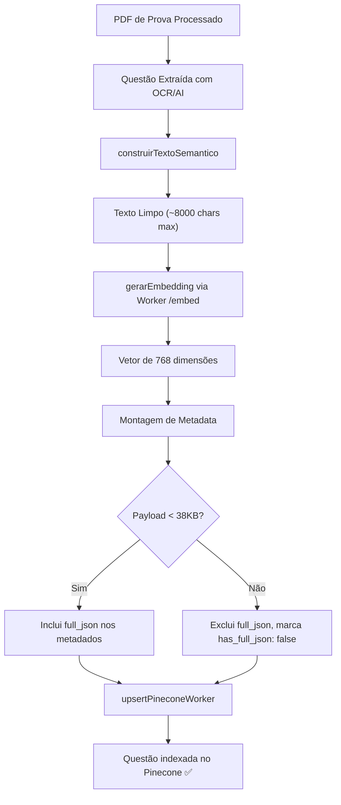
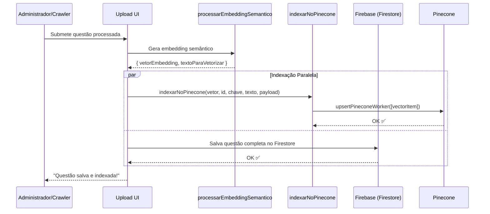

# Pipeline de Embedding — Vetorização Semântica de Questões

> 🤖 **Disclaimer**: Documentação gerada por IA e pode conter imprecisões. [📋 Reportar erro](https://github.com/TouchRefletz/maia.api/issues/new?title=Erro+na+doc:+embedding-pipeline&labels=docs)

## Visão Geral

O módulo de **Pipeline de Embedding** (`js/ia/embedding-e-pinecone.js`) é responsável por transformar questões de vestibular brutas (texto + gabarito + metadados) em **vetores semânticos de 768 dimensões** e indexá-los no banco vetorial Pinecone. É o processo que alimenta toda a busca inteligente de questões do maia.edu — sem ele, o chat não conseguiria encontrar exercícios relevantes para o aluno.

Este módulo é invocado durante o fluxo de **upload de questões**, não durante o chat. Quando um administrador ou o sistema de extração automática processa um PDF de prova, cada questão extraída passa por esta pipeline antes de ser disponibilizada para busca.

## Arquitetura da Pipeline



## Fase 1: Construção do Texto Semântico (`construirTextoSemantico`)

A função auxiliar importada de `js/ia/envio-textos.js` recebe os dados brutos da questão e do gabarito, e produz uma string textual otimizada para embedding.

A construção semântica não é simplesmente concatenar tudo. Ela prioriza os campos mais relevantes para busca:
- **Enunciado da questão**: O texto principal que o aluno leria.
- **Alternativas**: As opções A-E com seus textos completos.
- **Gabarito**: A resposta correta e justificativa (quando disponível).
- **Metadados**: Instituição, ano, matéria — informações que ajudam na filtragem.

O texto resultante é normalizado (espaços múltiplos → espaço único) e truncado em 8.000 caracteres:

```javascript
let textoParaVetorizar = construirTextoSemantico(
  questaoFinal.dados_questao || questaoFinal,
  gabaritoLimpo,
);

textoParaVetorizar = textoParaVetorizar
  .replace(/\s+/g, " ")
  .trim()
  .substring(0, 8000);
```

O limite de 8.000 caracteres existe porque modelos de embedding possuem limites de input tokens. Com média de 4 caracteres por token, 8.000 chars ≈ 2.000 tokens — confortável para o Gemini Embedding Model.

### Por Que Não Usar o JSON Puro?

Enviar o JSON bruto da questão como input para embedding geraria vetores dominados por ruído estrutural (`{"tipo": "texto", "conteudo": ...}`). O `construirTextoSemantico` extrai apenas o conteúdo semântico relevante, produzindo embeddings mais precisos para busca por similaridade.

## Fase 2: Geração do Embedding (`processarEmbeddingSemantico`)

A função exportada `processarEmbeddingSemantico` orquestra a geração do vetor:

```javascript
export async function processarEmbeddingSemantico(btnEnviar, questaoFinal, gabaritoLimpo) {
  // Feedback visual no botão de upload
  if (btnEnviar) btnEnviar.innerText = "🧠 Criando Cérebro...";

  let textoParaVetorizar = construirTextoSemantico(
    questaoFinal.dados_questao || questaoFinal,
    gabaritoLimpo,
  );

  // Normalização e truncagem
  textoParaVetorizar = textoParaVetorizar.replace(/\s+/g, " ").trim().substring(0, 8000);

  let vetorEmbedding = null;

  // Mínimo de 20 chars para gerar embedding (evitar vetores sem significado)
  if (textoParaVetorizar.length > 20) {
    try {
      vetorEmbedding = await gerarEmbedding(textoParaVetorizar);
    } catch (errEmbed) {
      console.warn("⚠️ Falha ao gerar embedding:", errEmbed);
    }
  }

  return { vetorEmbedding, textoParaVetorizar };
}
```

### Threshold de 20 Caracteres

Textos muito curtos (ex: "Q1" ou "Alternativa A") produzem embeddings degenerados — vetores que não representam nenhum conceito significativo. O threshold de 20 chars garante que apenas questões com conteúdo substancial sejam vetorizadas.

### Tratamento de Falha

Se a geração do embedding falhar (rede, API key inválida, quota excedida), o vetor retorna `null`. A questão ainda será salva no Firebase — ela simplesmente não será buscável via similaridade semântica até que o embedding seja gerado com sucesso em uma tentativa futura.

## Fase 3: Indexação no Pinecone (`indexarNoPinecone`)

A função `indexarNoPinecone` recebe o vetor gerado e o publica no banco vetorial cloud:

### Extração Resiliente de Metadados

Os metadados para filtragem são extraídos com cascata de fallbacks para lidar com JSONs de estruturas variáveis:

```javascript
const inst =
  payloadCompleto?.dados_gabarito?.creditos?.autor_ou_instituicao ||
  payloadCompleto?.dados_questao?.institution ||
  payloadCompleto?.dados_questao?.vestibular ||
  "Desconhecida";

const ano =
  payloadCompleto?.dados_gabarito?.creditos?.ano ||
  payloadCompleto?.dados_questao?.year ||
  payloadCompleto?.dados_questao?.ano ||
  "0000";

const valorBruto =
  payloadCompleto?.dados_questao?.materias_possiveis ||
  payloadCompleto?.dados_questao?.materia ||
  payloadCompleto?.dados_questao?.disciplina ||
  "Geral";

// Normaliza para array (Pinecone suporta arrays em metadata para filtro $in)
const materia = Array.isArray(valorBruto) ? valorBruto : [valorBruto];
```

### O Problema dos 40KB

O Pinecone impõe um limite de **40KB** por vetor (incluindo metadados). Questões complexas com muitas alternativas, imagens em Base64, ou textos longos podem exceder esse limite. A pipeline verifica o tamanho antes de incluir o JSON completo:

```javascript
const jsonString = JSON.stringify(payloadCompleto || {});
const jsonSizeKB = new TextEncoder().encode(jsonString).length / 1024;

const metadata = {
  prova: chaveProva,
  texto_preview: textoParaVetorizar.substring(0, 300),
  institution: String(inst),
  year: String(ano),
  subject: materia,
  has_full_json: true,
};

if (jsonSizeKB < 38) {
  metadata.full_json = jsonString;  // Inclui JSON completo nos metadados
} else {
  metadata.has_full_json = false;   // Sinaliza que o JSON está no Firebase
  metadata.error_size = "Payload exceeded 40KB limit";
}
```

Se o payload cabe (< 38KB, com margem de segurança), ele é armazenado diretamente no metadata do Pinecone. Isso permite que buscas retornem a questão completa sem precisar fazer uma segunda chamada ao Firebase. Se não cabe, o campo `has_full_json: false` sinaliza ao frontend que ele precisa buscar a questão no Firebase usando a chave da prova.

### Estrutura Final do Vetor

```json
{
  "id": "ENEM_2023_Q45_hash",
  "values": [0.0234, -0.1456, ...],
  "metadata": {
    "prova": "ENEM_2023_Caderno1",
    "texto_preview": "A entropia de um sistema isolado...",
    "institution": "ENEM",
    "year": "2023",
    "subject": ["Física", "Termodinâmica"],
    "has_full_json": true,
    "full_json": "{...}"
  }
}
```

### Isolamento de Erros

A indexação no Pinecone é isolada do salvamento no Firebase. Se o Pinecone falhar, a questão ainda é salva no banco de dados principal — apenas não será buscável por similaridade semântica:

```javascript
} catch (errPine) {
  console.error("❌ Erro Pinecone Worker:", errPine);
  customAlert("⚠️ Aviso: Indexação falhou, mas questão será salva.");
}
```

## Fluxo Completo no Contexto de Upload



## Referências Cruzadas

- [Envio de Textos — Construção do texto semântico](/embeddings/envio-textos)
- [Worker /embed — Endpoint de geração de embedding](/api-worker/embed)
- [Worker /pinecone-upsert — Endpoint de upsert](/api-worker/pinecone)
- [Config IA — Configurações de modelo para embedding](/embeddings/config-ia)
- [Gap Detector — Consome os vetores indexados via busca](/chat/gap-detector)
