# Arquitetura Geral do maia.edu

## Visão Macro

O maia.edu é uma plataforma de arquitetura distribuída que combina processamento no cliente (browser), computação no edge (Cloudflare Workers) e serviços de IA na nuvem (Google Gemini, Pinecone). Este documento detalha **cada camada, suas responsabilidades, e como os dados fluem entre elas**.

---

## Diagrama de Arquitetura Completa

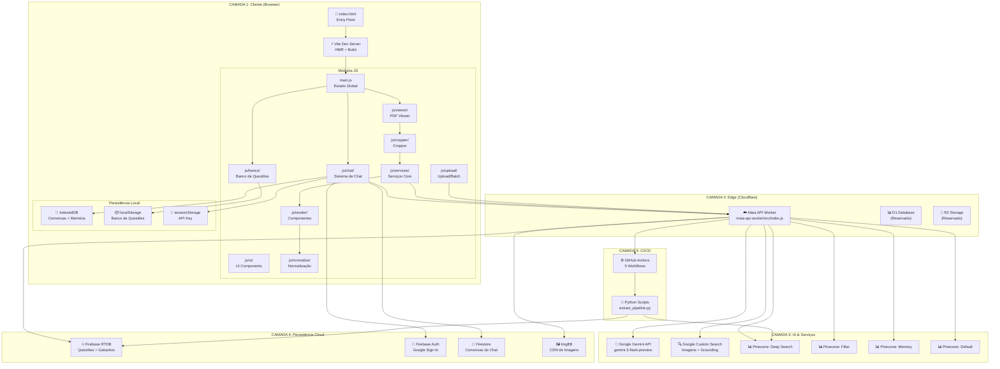

---

## Camada 1: Cliente (Browser)

### Estado Global (`main.js`)

O ponto de entrada da aplicação é o `main.js`, que inicializa e exporta dois objetos de estado global:

```javascript
// Estado do Viewer
export const viewerState = {
  pdfDoc: null,       // Instância do pdfjs-dist
  pageNum: 1,         // Página atual
  pdfScale: 1.0,      // Zoom atual
};

// Estado do Banco de Questões
export const bancoState = {
  todasQuestoesCache: [], // Cache local de todas as questões
};
```

**Decisão de design:** O maia.edu usa estado global simples em vez de um state manager como Redux ou Zustand. Isso foi escolhido porque:
- A maioria dos módulos é Vanilla JS (não React)
- O estado é relativamente plano e previsível
- Os módulos comunicam-se via `CustomEvent` do DOM

### Estratégia de Módulos

O projeto usa uma estratégia **híbrida** de módulos:

| Padrão | Usado Em | Razão |
|--------|---------|-------|
| **ES Modules (import/export)** | Todos os módulos JS | Padrão moderno, tree-shaking |
| **TSX/React** | Componentes complexos de render | JSX para UI declarativa |
| **Vanilla JS + DOM** | UI simples, viewers, cropper | Performance, controle direto |
| **Classes ES6** | Serviços (TerminalUI, AiScanner, BatchProcessor) | Encapsulamento de estado |
| **Funções puras** | Normalização, utils | Testabilidade, composição |

### Comunicação Entre Módulos

Os módulos se comunicam por três mecanismos:

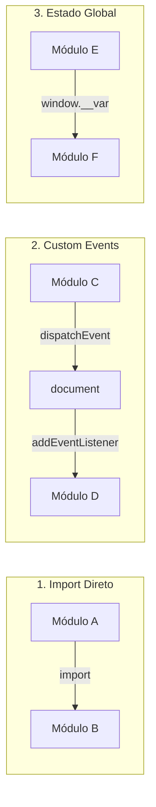

**Eventos customizados importantes:**

| Evento | Emissor | Consumidor | Dados |
|--------|---------|-----------|-------|
| `maia:pagechanged` | `pdf-core.js` | `sidebar-cropper.js` | `{ pageNum }` |
| `maia:cropstatechanged` | `cropper-state.js` | `selection-overlay.js` | — |
| `maia:questionextracted` | `batch-processor.js` | `render-components.js` | `{ dados }` |

### Persistência Local

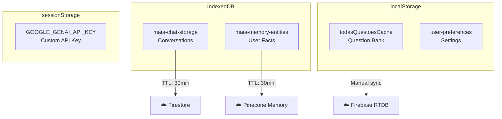

**Política de expiração:**
- IndexedDB: dados expiram após **30 minutos** de inatividade
- Antes de expirar, dados são **sincronizados para a nuvem** (se usuário autenticado)
- localStorage: sem expiração automática (manual via UI)
- sessionStorage: limpo ao fechar a aba

---

## Camada 2: Edge Computing (Cloudflare Workers)

### Modelo de Execução

O Maia API Worker é um Cloudflare Worker que roda em **edge locations globais**. Cada request é processado na location mais próxima do usuário.

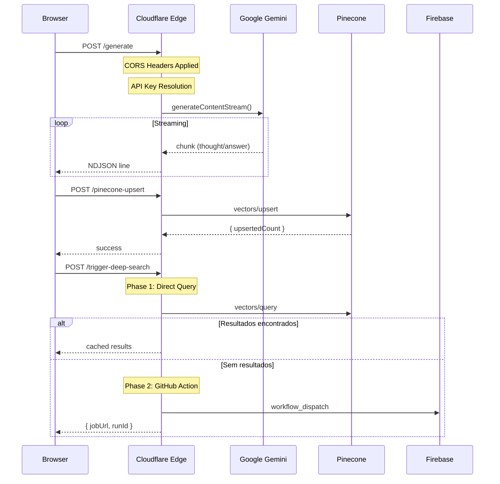

### Roteamento

O Worker usa um **roteamento manual** baseado em `URL.pathname`:

```javascript
// Simplificado do código real
const url = new URL(request.url);

switch (url.pathname) {
  case '/generate':     return handleGeminiGenerate(request, env);
  case '/embed':        return handleEmbed(request, env);
  case '/search':       return handleSearch(request, env);
  case '/search-image': return handleSearchImage(request, env);
  // ... 15+ endpoints
}
```

### CORS Strategy

O Worker implementa CORS permissivo para desenvolvimento:

```javascript
const corsHeaders = {
  'Access-Control-Allow-Origin': '*',
  'Access-Control-Allow-Methods': 'GET, POST, OPTIONS',
  'Access-Control-Allow-Headers': 'Content-Type',
};
```

> ⚠️ **Nota de segurança:** Em produção, o `Allow-Origin` deveria ser restrito ao domínio do app.

### Safety Settings (Gemini)

Todos os requests ao Gemini usam safety settings **desabilitadas** para evitar bloqueios em conteúdo educacional:

```javascript
const safetySettings = [
  { category: 'HARM_CATEGORY_HARASSMENT', threshold: 'BLOCK_NONE' },
  { category: 'HARM_CATEGORY_HATE_SPEECH', threshold: 'BLOCK_NONE' },
  { category: 'HARM_CATEGORY_SEXUALLY_EXPLICIT', threshold: 'BLOCK_NONE' },
  { category: 'HARM_CATEGORY_DANGEROUS_CONTENT', threshold: 'BLOCK_NONE' },
];
```

**Justificativa:** Conteúdo educacional (biologia, história, literatura) frequentemente aciona filtros de segurança indevidamente.

---

## Camada 3: IA & Serviços Externos

### Google Gemini — Modelo Principal

O maia.edu utiliza o modelo `gemini-3-flash-preview` como modelo principal, com fallbacks automáticos:

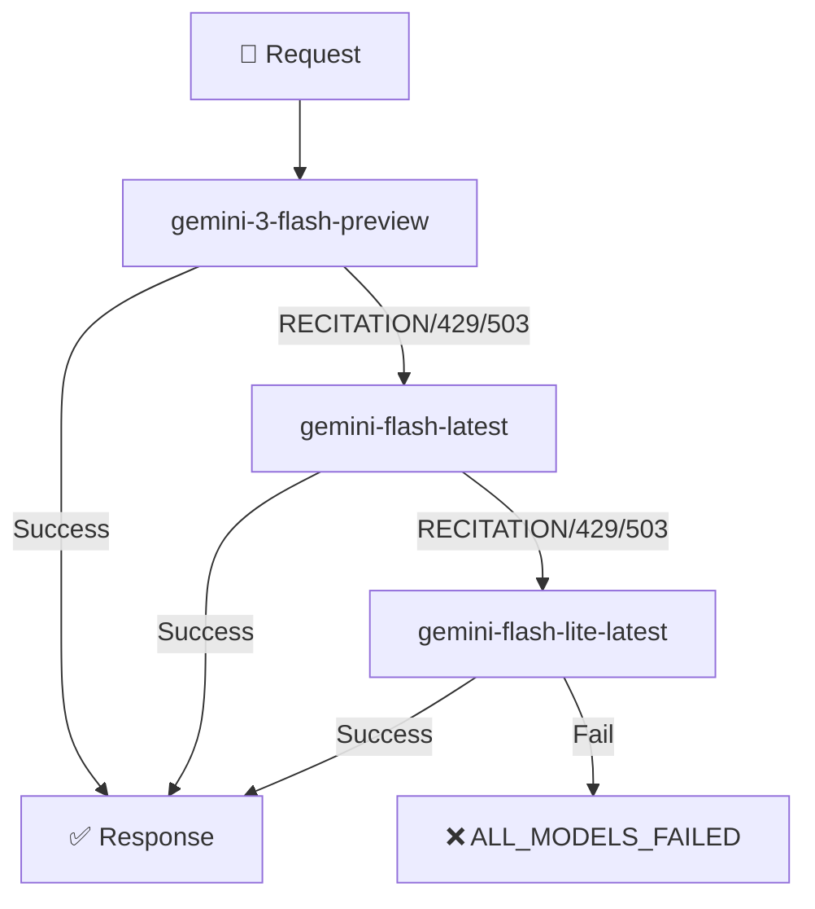

**Modos de uso do Gemini:**

| Modo | Parâmetros | Uso |
|------|-----------|-----|
| **JSON Generation** | `responseMimeType: 'application/json'`, `responseJsonSchema` | Extração de questões, classificação |
| **Streaming** | `generateContentStream()` | Chat, gabarito, pesquisa |
| **Chat Multi-Turn** | `client.chats.create()` + `sendMessageStream()` | Conversas do chat |
| **Thinking Mode** | `thinkingConfig: { includeThoughts: true }` | Raciocínio e scaffolding |
| **Vision** | `inlineData: { mimeType, data }` | Scanner, extração de imagens |
| **Search Grounding** | `googleSearch` tool | Pesquisa de resoluções |

### Pinecone — Arquitetura Multi-Index

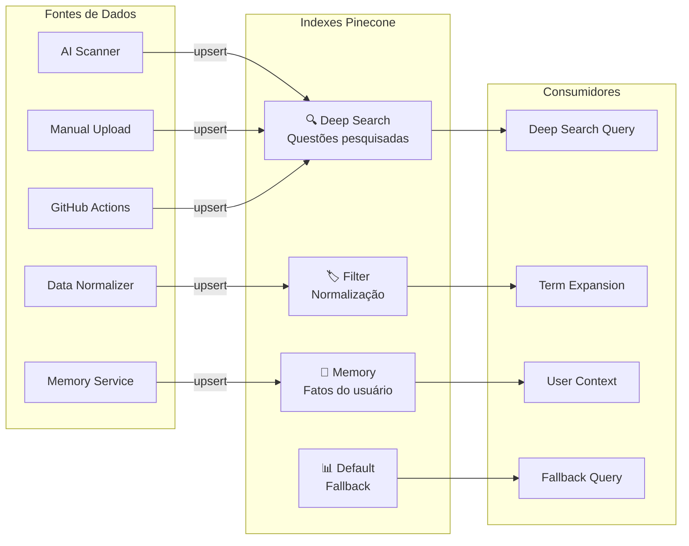

---

## Camada 4: Persistência Cloud

### Firebase Realtime Database — Schema

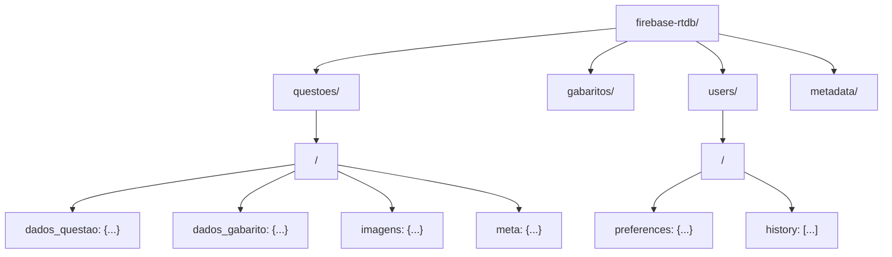

### Firestore — Schema de Conversas

```
firestore/
├── users/
│   └── <userId>/
│       └── conversations/
│           └── <conversationId>/
│               ├── title: string
│               ├── createdAt: timestamp
│               ├── updatedAt: timestamp
│               └── messages/
│                   └── <messageId>/
│                       ├── role: 'user' | 'model'
│                       ├── content: string (JSON)
│                       ├── timestamp: timestamp
│                       └── metadata: { mode, methodology }
```

---

## Camada 5: CI/CD

### Pipeline de Workflows

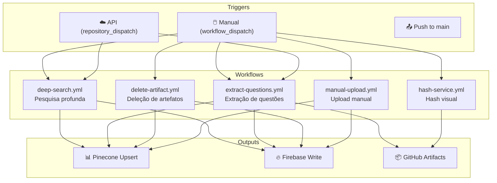

---

## Padrões Arquiteturais Recorrentes

### 1. NDJSON Streaming

Todas as comunicações de longa duração entre Worker e Browser usam **Newline-Delimited JSON** (NDJSON):

```
{"type":"status","text":"Conectando..."}
{"type":"thought","text":"Analisando a questão..."}
{"type":"answer","text":"A resposta é..."}
{"type":"answer","text":" letra B porque..."}
{"type":"grounding","metadata":{...}}
```

**Tipos de mensagem:**

| Tipo | Direção | Propósito |
|------|---------|----------|
| `status` | Worker → Browser | Atualização de progresso |
| `thought` | Worker → Browser | Pensamento do modelo (thinking mode) |
| `answer` | Worker → Browser | Delta de resposta (acumulativo) |
| `debug` | Worker → Browser | Log de debug |
| `error` | Worker → Browser | Erro com código |
| `reset` | Worker → Browser | Reset de buffer (recitation retry) |
| `grounding` | Worker → Browser | Metadados de pesquisa |
| `meta` | Worker → Browser | Informações sobre tentativa (model, attempt) |

### 2. Reactive State via Subscribe

O `CropperState` implementa um padrão observer simples:

```javascript
class CropperState {
  static #listeners = [];
  
  static subscribe(callback) {
    this.#listeners.push(callback);
    return () => {
      this.#listeners = this.#listeners.filter(l => l !== callback);
    };
  }
  
  static #notify() {
    this.#listeners.forEach(l => l());
  }
}
```

### 3. Best-Effort JSON Parsing

```javascript
import { parse } from 'best-effort-json-parser';

// Mesmo com JSON incompleto, retorna o máximo possível
const partial = parse('{"blocks":[{"type":"text","content":"Hello');
// → { blocks: [{ type: "text", content: "Hello" }] }
```

### 4. Double Buffering (PDF)

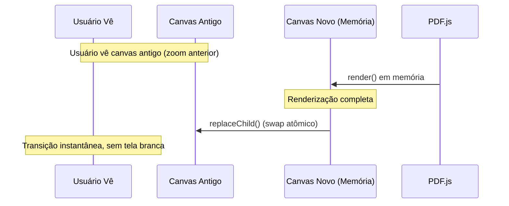

### 5. Constraint-Based Editing (Cropper)

O sistema de cropping implementa **edição baseada em constraints**:

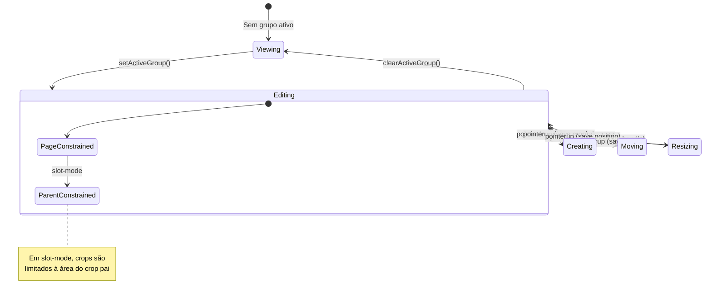

---

## Fluxos de Dados Críticos

### Fluxo 1: Upload de PDF → Banco de Questões

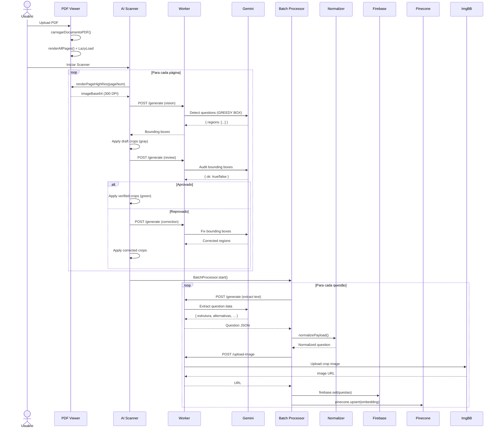

### Fluxo 2: Mensagem no Chat → Resposta Renderizada

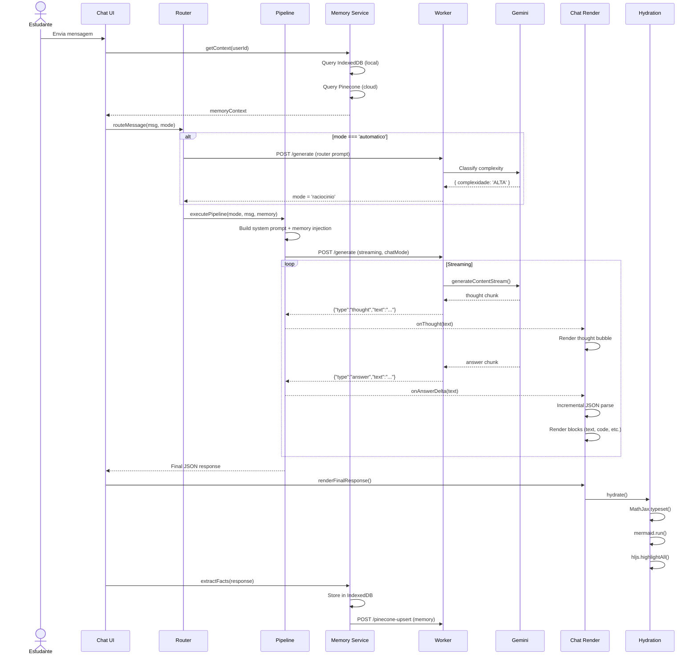

---

## Decisões Arquiteturais Notáveis

### Por que Cloudflare Workers em vez de um backend tradicional?

1. **Latência global**: Workers rodam em 300+ edge locations
2. **Custo**: Modelo pay-per-request (sem servidor idle)
3. **Simplicidade**: Um único arquivo JS para toda a API
4. **Segurança**: API keys ficam no edge, nunca no browser

### Por que não usar um framework frontend (Next.js, SvelteKit)?

1. **Progressividade**: O projeto cresceu organicamente de um protótipo HTML
2. **Performance**: Vanilla JS é mais rápido que frameworks para este caso de uso
3. **Controle**: Renderização de PDF e cropping exigem controle total do DOM
4. **Híbrido TSX**: Componentes complexos usam TSX/React onde faz sentido

### Por que 4 indexes Pinecone separados?

1. **Isolamento de dados**: Memória do usuário não se mistura com questões
2. **Escalabilidade**: Cada index pode crescer independentemente
3. **Custos**: Indexes menores são mais baratos de consultar
4. **Semântica**: Cada index tem metadata schemas diferentes

---

## Referências Cruzadas

| Para Saber Mais Sobre... | Veja... |
|--------------------------|---------|
| Endpoints da API | [API Worker: Arquitetura](/api-worker/arquitetura) |
| Sistema de Chat completo | [Motor de IA: Visão Geral](/chat/visao-geral) |
| Renderização de PDF | [PDF Viewer: Core](/pdf/core) |
| Sistema de Cropping | [Cropper: Visão Geral](/cropper/visao-geral) |
| Normalização de dados | [Normalização: Primitives](/normalizacao/primitives) |
| CI/CD completo | [Infraestrutura: Visão Geral](/infra/visao-geral) |
| Design System CSS | [CSS: Design Tokens](/css/design-tokens) |
