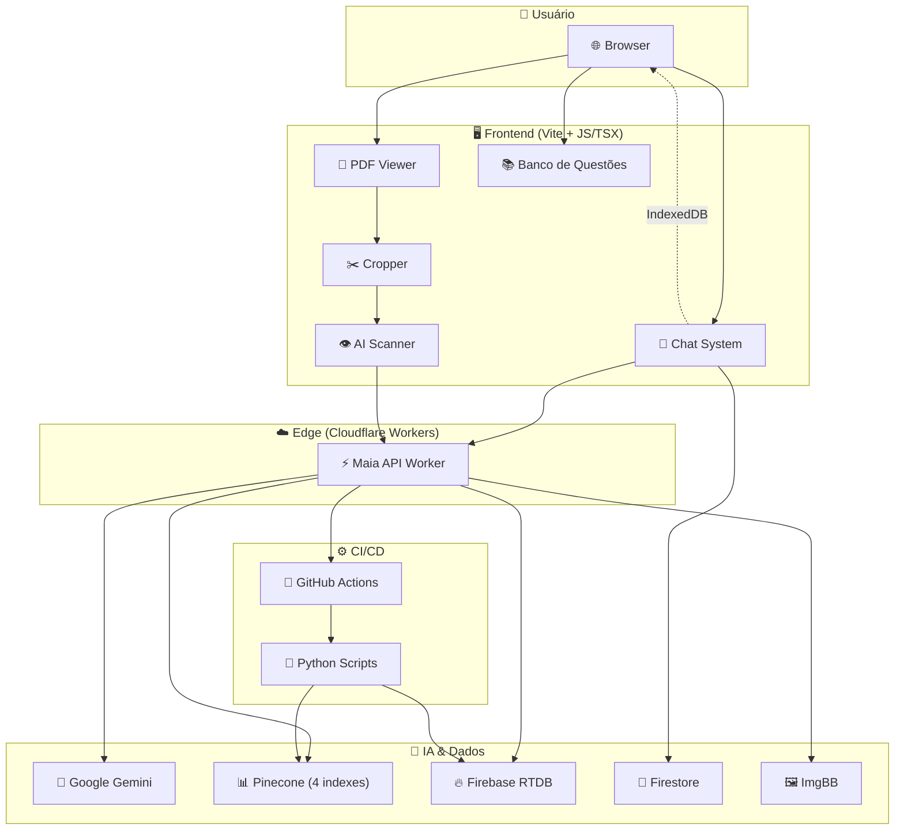
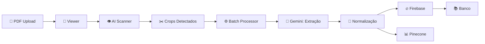
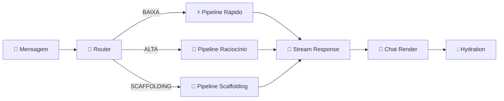

# Introdução ao maia.edu

## O que é o maia.edu?

O **maia.edu** é uma plataforma educacional de ponta construída para revolucionar a forma como estudantes brasileiros se preparam para vestibulares e o ENEM. A plataforma combina inteligência artificial avançada (powered by **Google Gemini**), processamento de documentos PDF, visão computacional e um sistema de memória cognitiva para oferecer uma experiência de aprendizado personalizada e profundamente interativa.

### Proposta de Valor

O maia.edu resolve três problemas fundamentais da educação preparatória:

1. **Extração automatizada de questões**: A partir de qualquer PDF de prova, o sistema identifica, recorta e cataloga questões automaticamente usando visão computacional e IA.
2. **Gabarito inteligente com pesquisa**: Cada questão recebe uma resolução detalhada gerada por IA, enriquecida com pesquisa em tempo real de fontes confiáveis (sites de pré-vestibular, gabaritos oficiais).
3. **Tutoria adaptativa**: Um chatbot pedagógico que se adapta ao nível do estudante, utilizando memória persistente e múltiplas metodologias de ensino.

---

## Público-Alvo

| Perfil | Uso Principal |
|--------|--------------|
| Estudantes pré-vestibular | Resolução de questões, estudo guiado, revisão |
| Professores | Criação de bancos de questões, análise de complexidade |
| Instituições de ensino | Catalogação massiva de provas, analytics |

---

## Stack Tecnológica Completa

O maia.edu é uma aplicação **híbrida** que combina tecnologias de frontend moderno com computação no edge e serviços de IA na nuvem.

### Frontend

| Tecnologia | Versão | Propósito |
|-----------|--------|-----------|
| **Vanilla JavaScript (ES Modules)** | ES2022+ | Lógica principal, módulos de negócio |
| **React (via Preact/JSX)** | TSX | Componentes complexos de UI (renders, modais) |
| **Vite** | 6.x | Build tool, dev server, HMR |
| **TypeScript** | 5.x | Tipagem em módulos críticos (OCR, renders) |
| **PDF.js** | 3.11.174 | Renderização de documentos PDF no browser |
| **Tesseract.js** | via CDN | OCR (Optical Character Recognition) |
| **MathJax** | 3.x | Renderização de equações LaTeX |
| **Mermaid.js** | 10.x | Diagramas interativos no chat |

### Edge Computing (Backend)

| Tecnologia | Propósito |
|-----------|-----------|
| **Cloudflare Workers** | API gateway, proxy, orquestração |
| **Wrangler** | CLI de deploy e desenvolvimento local |
| **Google Gemini API** | Geração de texto, visão computacional, embeddings |
| **Google Custom Search** | Pesquisa de imagens e resoluções |

### Armazenamento e Dados

| Tecnologia | Propósito |
|-----------|-----------|
| **Firebase Realtime Database** | Persistência principal de questões e gabaritos |
| **Firebase Auth** | Autenticação (Google Sign-In) |
| **Firestore** | Armazenamento de conversas do chat |
| **IndexedDB** | Cache local de conversas e memória do usuário |
| **Pinecone** | Banco de dados vetorial (4 indexes) |
| **ImgBB** | Hosting de imagens de questões |

### CI/CD e Automação

| Tecnologia | Propósito |
|-----------|-----------|
| **GitHub Actions** | Pipelines de extração, deep search, hash |
| **Python** | Scripts de extração e processamento de dados |

---

## Arquitetura em Alto Nível



---

## Indexes Pinecone (4 Bancos Vetoriais)

O maia.edu utiliza **quatro indexes Pinecone distintos**, cada um com um propósito específico:

| # | Index | Variável de Ambiente | Propósito | Dimensão |
|---|-------|---------------------|----------|---------|
| 1 | **Main / Deep Search** | `PINECONE_HOST_DEEP_SEARCH` | Armazena resultados de pesquisa profunda e uploads manuais | 768 |
| 2 | **Filter** | `PINECONE_HOST_FILTER` | Index de normalização de dados (matérias, termos expandidos) | 768 |
| 3 | **Memory** | `PINECONE_HOST_MEMORY` | Memória cognitiva do usuário (fatos atômicos, entidades) | 768 |
| 4 | **Default** | `PINECONE_HOST` | Index principal (fallback) | 768 |

---

## Modos de Operação

O maia.edu opera em dois contextos principais:

### 1. Modo Extração (PDF → Questões)



**Fluxo detalhado:**
1. O usuário faz upload de um PDF de prova
2. O **PDF Viewer** renderiza o documento com lazy loading
3. O **AI Scanner** processa cada página usando visão computacional (Gemini)
4. As questões detectadas geram **crops** (recortes) no sistema de cropping
5. O **Batch Processor** processa cada crop sequencialmente:
   - Extrai texto e alternativas via IA
   - Detecta e preenche slots de imagem
   - Gera gabarito com pesquisa online
6. Os dados são **normalizados** e enviados para Firebase + Pinecone

### 2. Modo Chat (Estudante ↔ IA)



**Fluxo detalhado:**
1. O estudante envia uma mensagem no chat
2. O **Router** classifica a complexidade (BAIXA, ALTA, SCAFFOLDING)
3. A pipeline correspondente é executada com o modelo Gemini apropriado
4. A resposta é **streamed** em tempo real (NDJSON)
5. O **Chat Render** processa blocos incrementalmente (texto, código, equações, diagramas)
6. A **Hydration** pós-renderização ativa MathJax, Mermaid, syntax highlighting

---

## Princípios de Design

### 1. Best-Effort Parsing
O sistema prioriza **resiliência sobre perfeição**. JSON de streams da IA é parseado com `best-effort-json-parser`, permitindo exibição parcial mesmo quando o output é malformado.

### 2. Híbrido Local + Cloud
Dados críticos (conversas, memória) existem simultaneamente no **IndexedDB local** e na **nuvem** (Firestore/Pinecone). Isso garante:
- Funcionamento offline
- Sincronização transparente
- Expiração automática do cache local (30 minutos)

### 3. Multi-Model Resilience
O Worker implementa uma **cadeia de fallback de modelos**:
1. Modelo principal (`gemini-3-flash-preview`)
2. Fallback automático em caso de RECITATION ou rate limit
3. Modelos alternativos (`gemini-flash-latest`, `gemini-flash-lite-latest`)

### 4. Double Buffering Visual
O PDF Viewer usa **double buffering** para evitar tela branca durante zoom:
1. Canvas novo é criado em memória
2. Página é renderizada no canvas novo
3. Canvas antigo é substituído atomicamente

---

## Estrutura do Repositório

```
maia.api/
├── .github/
│   ├── actions/          # Custom GitHub Actions (compute-hash)
│   ├── scripts/          # Python scripts (extract_pipeline, update_manifest)
│   └── workflows/        # CI/CD workflows (5 workflows)
├── css/
│   ├── base/             # Design tokens, variables, animations
│   ├── brand/            # Branding assets
│   ├── components/       # Estilos de componentes (22 arquivos)
│   ├── elements/         # Elementos atômicos
│   ├── functions/        # Funções CSS
│   ├── handlers/         # Estilos de handlers (17 arquivos)
│   ├── mobile/           # Mobile-specific
│   ├── pdf/              # PDF viewer styles
│   ├── responsivity/     # Breakpoints e responsive
│   ├── result/           # Result page styles
│   └── wrappers/         # Container wrappers
├── docs/                 # Esta documentação (VitePress)
├── js/
│   ├── api/              # Worker client (worker.js)
│   ├── banco/            # Banco de questões (8 módulos)
│   ├── chat/             # Sistema de chat (8+ módulos)
│   │   ├── prompts/      # Engenharia de prompts
│   │   └── services/     # Scaffolding, Gap Detector
│   ├── cropper/          # Sistema de cropping (7 módulos)
│   ├── firebase/         # Integração Firebase (2 módulos)
│   ├── ia/               # IA e embeddings (4 módulos)
│   ├── normalize/        # Normalização de dados (5 módulos)
│   ├── normalizer/       # Data normalizer (1 módulo)
│   ├── render/           # Componentes de renderização (15+ módulos)
│   │   └── final/        # Renderizadores finais (7 módulos)
│   ├── services/         # Serviços core (13 módulos)
│   ├── ui/               # Componentes de UI (22 módulos)
│   ├── upload/           # Upload e batch (9 módulos)
│   ├── utils/            # Utilitários (7 módulos)
│   └── viewer/           # PDF viewer (9 módulos)
├── maia-api-worker/      # Cloudflare Worker (src/index.js + wrangler.jsonc)
├── public/               # Assets estáticos
├── index.html            # Entry point
├── vite.config.js        # Build configuration
├── tsconfig.json         # TypeScript configuration
└── package.json          # Dependencies
```

---

## Métricas do Projeto

| Métrica | Valor Estimado |
|---------|---------------|
| Total de arquivos JS/TS/TSX | ~100+ |
| Total de arquivos CSS | ~60+ |
| Linhas de código (JS) | ~25.000+ |
| Linhas de código (CSS) | ~8.000+ |
| Endpoints da API | 18+ |
| Workflows GitHub Actions | 5 |
| Indexes Pinecone | 4 |
| Modelos Gemini utilizados | 3+ |
| Metodologias pedagógicas | 13 |

---

## Navegando a Documentação

Esta documentação está organizada em **16 seções** que cobrem todos os subsistemas do maia.edu:

1. **[Fundação](/guia/arquitetura)** — Arquitetura, setup, glossário
2. **[Infraestrutura](/infra/visao-geral)** — CI/CD, build, variáveis de ambiente
3. **[API Worker](/api-worker/arquitetura)** — Todos os 18+ endpoints
4. **[Motor de IA](/chat/visao-geral)** — Chat, router, pipelines, prompts
5. **[Memória](/memoria/visao-geral)** — Sistema cognitivo local + cloud
6. **[Embeddings](/embeddings/pipeline)** — Vetorização e Pinecone
7. **[PDF Viewer](/pdf/core)** — Renderização e navegação
8. **[Cropper](/cropper/visao-geral)** — Recorte de questões
9. **[Normalização](/normalizacao/primitives)** — Higienização de dados
10. **[Upload/Batch](/upload/batch-arquitetura)** — Processamento em lote
11. **[OCR](/ocr/scanner-pipeline)** — Scanner de visão computacional
12. **[Renderização](/render/render-components)** — Componentes TSX/JS
13. **[Banco de Questões](/banco/visao-geral)** — Exploração e filtros
14. **[UI](/ui/scanner-ui)** — Componentes de interface
15. **[Firebase](/firebase/init)** — Persistência e autenticação
16. **[CSS](/css/design-tokens)** — Design system e tokens

---

::: tip Próximos Passos
Recomendamos começar pela **[Arquitetura Geral](/guia/arquitetura)** para entender como todos os sistemas se conectam, e depois mergulhar na seção que mais interessa ao seu caso de uso.
:::
