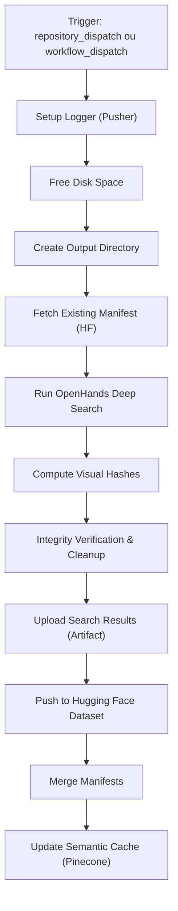

# deep-search.yml — Pipeline de Busca Profunda

> 🤖 **Disclaimer**: Documentação gerada por IA e pode conter imprecisões. [📋 Reportar erro](https://github.com/TouchRefletz/maia.api/issues/new?title=Erro+na+doc:+deep-search.yml&labels=docs)

## Visão Geral

O workflow `deep-search.yml` é o coração do sistema de aquisição automatizada de provas e questões. Ele utiliza o **OpenHands** (agente de IA autônomo) rodando em Docker para buscar, baixar e catalogar PDFs de provas e gabaritos na internet, armazenando os resultados no **Hugging Face Datasets**.

## Arquivos Relacionados

| Arquivo | Papel |
|---------|-------|
| `.github/workflows/deep-search.yml` | Definição do workflow |
| `.github/actions/compute-hash/` | Action de hash visual |
| `.github/scripts/update_manifest.py` | Atualização de manifesto |
| `maia-api-worker/src/index.js` | Endpoints `/trigger-deep-search`, `/update-deep-search-cache` |

## Diagrama de Fluxo



## Triggers

O workflow pode ser disparado de duas formas:

### 1. `repository_dispatch` (Produção)
Disparado pelo Cloudflare Worker via endpoint `/trigger-deep-search`:
```json
{
  "event_type": "deep-search",
  "client_payload": {
    "query": "ita 2022",
    "slug": "ita-2022",
    "ntfy_topic": "false",
    "search_type": "provas"
  }
}
```

### 2. `workflow_dispatch` (Manual)
Disparado manualmente via GitHub Actions UI com inputs:
- **query**: Consulta de busca (ex: `"ita 2022"`)
- **slug**: Slug para nome da pasta (ex: `"ita-2022"`)
- **ntfy_topic**: Tópico ntfy.sh para streaming de logs
- **search_type**: `"provas"` (padrão) ou `"questoes"`

## API / Interface Pública

### Variáveis de Ambiente

| Variável | Fonte | Descrição |
|----------|-------|-----------|
| `LLM_API_KEY` | Secret | Chave da API Gemini para o OpenHands |
| `TAVILY_API_KEY` | Secret | Chave da API Tavily para busca web |
| `PUSHER_APP_ID` | Secret | ID do app Pusher para logs em tempo real |
| `PUSHER_KEY` | Secret | Chave pública Pusher |
| `PUSHER_SECRET` | Secret | Chave secreta Pusher |
| `PUSHER_CLUSTER` | Secret | Cluster Pusher |
| `HF_TOKEN` | Secret | Token do Hugging Face Hub |

### Outputs

| Output | Step | Formato |
|--------|------|---------|
| `existing_manifest` | `fetch_manifest` | JSON compacto (array de itens) |
| `final_slug` | `deep_search` | String slug normalizado |

## Detalhamento Técnico

### 1. Logger Pusher (`logger.py`)

Script Python inline que atua como middleware de logs com duas threads:

- **Log Worker**: Bufferiza linhas de stdout e envia em batch (1s) para o Pusher via HTTP
- **Task Watcher**: Polling ativo do container Docker para ler `TASKS.md` e broadcastar atualizações de progresso

O logger também detecta `AgentStuckInLoopError` e aborta o workflow com `sys.exit(1)`.

```python
# Autenticação Pusher: HMAC-SHA256
sign_string = f"POST\n/apps/{APP_ID}/events\nauth_key={KEY}&auth_timestamp={ts}&auth_version=1.0&body_md5={md5}"
auth_signature = hmac.new(SECRET, sign_string, hashlib.sha256).hexdigest()
```

### 2. Prompt do Agente

O prompt é construído dinamicamente baseado no `search_type`:

| Modo | Objetivo | Regras |
|------|----------|--------|
| `provas` | Buscar provas + gabaritos de uma instituição/ano | Sites oficiais, Google Drive, máx 3 buscas |
| `questoes` | Buscar listas de questões de um tema | Cursinhos, sites educativos, PDFs de listas |

**Regras críticas para downloads:**
1. Usar `curl -I` para verificar `Content-Type` antes de baixar
2. Nunca baixar o mesmo link duas vezes
3. Apagar arquivos < 1KB ou que contenham HTML
4. Não criar arquivos fake

### 3. Manifesto Existente

Antes de rodar o OpenHands, o workflow tenta buscar o manifesto existente do HuggingFace:

```bash
MANIFEST_URL="https://huggingface.co/datasets/toquereflexo/maia-deep-search/resolve/main/output/$SLUG/manifest.json"
```

Se encontrado, injeta instruções no prompt para evitar duplicatas e focar em lacunas.

### 4. Container Docker

O OpenHands roda em Docker com as seguintes configurações:

```yaml
Container: docker.openhands.dev/openhands/openhands:1.0
Runtime: docker.openhands.dev/openhands/runtime:1.0-nikolaik
Modelo: gemini/gemini-3-flash-preview
Volume: /workspace (compartilhado)
```

### 5. Hash Visual

Após a busca, executa a action `compute-hash` que calcula hashes visuais (dHash) dos PDFs para deduplicação.

### 6. Verificação de Integridade

Script `verify_integrity.py` com 4 camadas de validação:

| Camada | Verificação |
|--------|------------|
| 1. Tamanho | Arquivo > 500 bytes |
| 2. Assinatura | `%PDF-` nos primeiros 10 bytes |
| 3. Renderizabilidade | `pdf2image.convert_from_path()` sem exceção |
| 4. Deduplicação | Hash visual não existe no manifesto anterior |

### 7. Push para Hugging Face

Realiza merge de manifestos via `merge_manifests.py`:
- Itens base: manifesto existente no repo
- Itens novos: manifesto da busca atual (validados)
- Deduplicação por `visual_hash` e `filename`

### 8. Cache Semântico

Atualiza o índice Pinecone (deep-search) para permitir buscas futuras sem re-executar o agente.

## Edge Cases e Tratamento de Erros

| Caso | Tratamento |
|------|-----------|
| Rate limit do OpenHands | Timeout de 25 minutos no job |
| Download falha | Item marcado como `"reference"` (link-only) |
| PDF corrompido | Removido na etapa de verificação |
| Hash duplicado | Arquivo novo descartado, mantém existente |
| AgentStuckInLoopError | Logger detecta e mata o processo |
| Push para HF falha (503 RPC) | `http.postBuffer=524MB`, retry com `git reset --hard` |
| Conflito de merge no HF | Até 5 tentativas com random backoff |

## Decisões de Design

1. **OpenHands em vez de scraping direto**: O agente de IA consegue navegar sites dinâmicos, resolver CAPTCHAs e tomar decisões contextuais que um scraper estático não poderia.

2. **Cleanup desabilitado**: A flag de cleanup está forçada como `false` para evitar deleção acidental de dados existentes.

3. **Logs via Pusher (não WebSocket)**: Pusher tem infraestrutura global com reconexão automática, ideal para um frontend que precisa acompanhar o progresso em tempo real.

4. **Hash visual (dHash)**: Em vez de hash de arquivo (SHA-256), usa hash perceptual que detecta o mesmo PDF mesmo que tenha metadados diferentes.

## Referências Cruzadas

- [Visão Geral CI/CD](/infra/visao-geral) — Diagrama geral de workflows
- [Endpoint /trigger-deep-search](/api-worker/deep-search) — Worker que dispara o workflow
- [Hash Service](/infra/hash-service) — Workflow dedicado de hash
- [Manual Upload](/infra/manual-upload) — Upload direto sem busca
