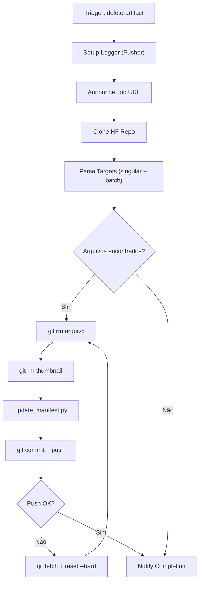

# delete-artifact.yml — Workflow de Limpeza

> 🤖 **Disclaimer**: Documentação gerada por IA e pode conter imprecisões. [📋 Reportar erro](https://github.com/TouchRefletz/maia.api/issues/new?title=Erro+na+doc:+delete-artifact.yml&labels=docs)

## Visão Geral

O workflow `delete-artifact.yml` realiza a **cascata de deleção** de artefatos (PDFs, thumbnails, entradas de manifesto) do dataset HuggingFace. Suporta deleção singular e em lote (batch), com retry automático e atualização de manifesto via `update_manifest.py`.

## Arquivos Relacionados

| Arquivo | Papel |
|---------|-------|
| `.github/workflows/delete-artifact.yml` | Definição do workflow |
| `.github/scripts/update_manifest.py` | Remoção de entradas do manifesto |
| `maia-api-worker/src/index.js` | Endpoint `/delete-artifact` |

## Diagrama de Fluxo



## Triggers

### `repository_dispatch`
```json
{
  "event_type": "delete-artifact",
  "client_payload": {
    "slug": "enem-2022",
    "filename": "prova-dia1.pdf",
    "filenames": ["prova-dia1.pdf", "gabarito-dia1.pdf"]
  }
}
```

### `workflow_dispatch`
Inputs: `slug` (obrigatório), `filename` (obrigatório).

## Detalhamento Técnico

### 1. Suporte Batch

O workflow suporta deleção em lote via `FILENAMES_JSON`:

```python
# batch_targets.py
singular = os.environ.get("FILENAME")        # Legado: um arquivo
plural_json = os.environ.get("FILENAMES_JSON") # Novo: array JSON
```

Ambos são combinados para gerar a lista final de alvos.

### 2. Cascata de Deleção

Para cada arquivo alvo:
1. **Arquivo principal**: `output/{slug}/{filename}` ou `output/{slug}/files/{filename}`
2. **Thumbnail**: `output/{slug}/thumbnails/{stem}.jpg`
3. **Entrada no manifesto**: Removida via `update_manifest.py`

### 3. Retry com Hard Reset

Até 10 tentativas com:
- Random backoff: `sleep $(( (RANDOM % 6) + 2 ))` 
- `git fetch origin main && git reset --hard origin/main`
- Re-aplicação das deleções locais
- Novo push

### 4. update_manifest.py

Script Python que remove entradas do manifesto:
- Match flexível: `filename`, `link`, `link_origem`, `url_source`, `path`
- Normalização de paths: remove prefixo `files/`
- Preserva estrutura wrapper (`{"results": [...]}`)

### 5. Logger Pusher

Mesma infraestrutura do deep-search: buffer de logs com broadcasting via Pusher para feedback em tempo real no frontend.

## Edge Cases e Tratamento de Erros

| Caso | Tratamento |
|------|-----------|
| Arquivo já deletado | `git rm --ignore-unmatch`, não falha |
| Push concorrente | Até 10 tentativas com hard reset |
| `FILENAMES_JSON` inválido | `try/except`, fallback para `FILENAME` singular |
| Nenhum alvo | Exit gracioso sem commit |
| Manifesto com wrapper dict | Detecta e preserva estrutura `{"results": [...]}` |

## Decisões de Design

1. **Retry agressivo (10x)**: O HuggingFace Hub aceita pushes concorrentes de múltiplas Actions, gerando conflitos frequentes.
2. **Thumbnail cleanup automático**: Previne thumbnails órfãos no dataset.
3. **Batch via JSON array**: Permite deleção de múltiplos arquivos em uma única execução para eficiência.

## Referências Cruzadas

- [Endpoint /delete-artifact](/api-worker/crud) — Worker que dispara este workflow
- [Scripts Manifest](/infra/scripts-manifest) — Detalhamento do `update_manifest.py`
- [Visão Geral CI/CD](/infra/visao-geral) — Contexto geral
