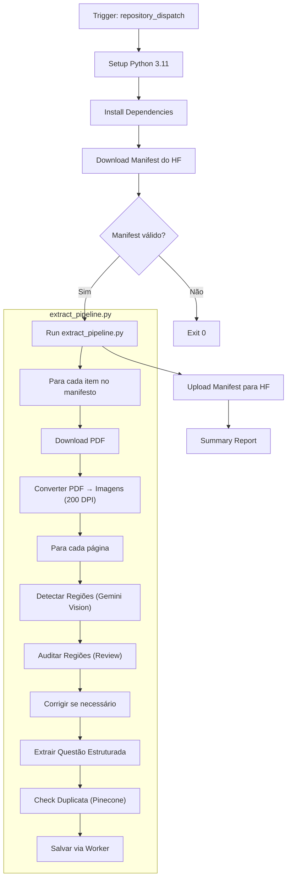

# extract-questions.yml — Pipeline de Extração de Questões

> 🤖 **Disclaimer**: Documentação gerada por IA e pode conter imprecisões. [📋 Reportar erro](https://github.com/TouchRefletz/maia.api/issues/new?title=Erro+na+doc:+extract-questions.yml&labels=docs)

## Visão Geral

O workflow `extract-questions.yml` é responsável por processar PDFs de provas já catalogados pelo Deep Search e extrair questões individuais usando a API Gemini. Ele transforma cada página do PDF em imagens, detecta regiões de questões via visão computacional, e extrai o conteúdo estruturado (enunciado, alternativas, fórmulas LaTeX, imagens) em JSON padronizado.

## Arquivos Relacionados

| Arquivo | Papel |
|---------|-------|
| `.github/workflows/extract-questions.yml` | Definição do workflow |
| `.github/scripts/extract_pipeline.py` | Pipeline principal de extração |
| `maia-api-worker/src/index.js` | Endpoints `/trigger-extraction`, `/check-duplicate`, `/extract-and-save` |

## Diagrama de Fluxo



## Triggers

### `repository_dispatch`
Disparado pelo Worker via endpoint `/trigger-extraction`:
```json
{
  "event_type": "extract-questions",
  "client_payload": {
    "slug": "enem-2022",
    "query": "enem 2022",
    "institution": "ENEM",
    "subject": "Física"
  }
}
```

### `workflow_dispatch`
Inputs manuais: `slug` (obrigatório), `query`, `institution`, `subject`.

## API / Interface Pública

### Variáveis de Ambiente

| Variável | Descrição |
|----------|-----------|
| `GOOGLE_GENAI_API_KEY` | Chave Gemini (via `LLM_API_KEY`) |
| `WORKER_URL` | URL do Cloudflare Worker |
| `HF_TOKEN` | Token do HuggingFace Hub |
| `HF_REPO` | Dataset HF: `toquereflexo/maia-deep-search` |
| `SLUG` | Identificador da coleção |
| `INSTITUTION` | Filtro: instituição |
| `SUBJECT` | Filtro: matéria |

## Detalhamento Técnico

### 1. Setup & Download do Manifesto

O workflow faz download do `manifest.json` existente no HuggingFace usando `huggingface_hub.HfApi`. Suporta retomada de execuções interrompidas:

- Se `rate_limit_hit = true`: Retoma do ponto onde parou
- Se `status = "complete"`: Pula execução
- Caso normal: Continua processamento

### 2. extract_pipeline.py — Visão Geral

O script é a porta Python do `ai-scanner.js` do frontend, com 3 estágios Gemini:

#### Estágio 1: Detecção de Regiões (`detect_regions`)

Usa Gemini Vision com o princípio **"CAIXA GULOSA" (GREEDY BOX)**: a bounding box deve englobar TUDO que pertence à questão, incluindo:
- Cabeçalho/número da questão
- Textos de apoio completos
- Referências bibliográficas (fontes em letras miúdas)
- Imagens, gráficos, tabelas
- TODAS as alternativas (até a última)

**Schema de resposta:**
```json
{
  "coordinateSystem": "normalized_0_1000_y1x1y2x2",
  "regions": [
    {
      "id": "q1",
      "questionId": "45",
      "tipo": "questao_completa",
      "kind": "QUESTION",
      "box": [120, 50, 680, 490],
      "confidence": 0.95
    }
  ]
}
```

**Tipos de região:**
- `questao_completa`: Bloco com enunciado + alternativas
- `parte_questao`: Texto de apoio compartilhado ou questão dividida em colunas

#### Estágio 2: Auditoria (Review Loop)

Após a detecção, um segundo call Gemini revisa as bounding boxes:

1. **Review**: Verifica se todas as boxes seguem o princípio GREEDY BOX
2. Se `ok = false`: Envia feedback com erros específicos
3. **Correction**: Refaz as boxes com base no feedback
4. Máximo de 1 correção por página (não loopa infinitamente)

#### Estágio 3: Extração Estruturada (`extract_question`)

Cada região é cropada da imagem e enviada para extração:

```json
{
  "identificacao": "ENEM 2023 - Q45",
  "materias_possiveis": ["Física", "Matemática"],
  "tipo_resposta": "objetiva",
  "estrutura": [
    { "tipo": "texto", "conteudo": "Enunciado em **Markdown**..." },
    { "tipo": "imagem", "conteudo": "Gráfico de velocidade x tempo" },
    { "tipo": "equacao", "conteudo": "v = v_0 + at" }
  ],
  "alternativas": [
    { "letra": "A", "estrutura": [{ "tipo": "texto", "conteudo": "$2 \\text{ m/s}$" }] }
  ],
  "palavras_chave": ["cinemática", "aceleração"]
}
```

**Tipos de bloco suportados:**
`texto`, `imagem`, `citacao`, `titulo`, `subtitulo`, `lista`, `equacao`, `codigo`, `destaque`, `separador`, `fonte`, `tabela`

### 3. Deduplicação e Salvamento

Após extrair, o pipeline:

1. Constrói texto semântico concatenando matéria + identificação + enunciado + alternativas
2. Chama `/check-duplicate` no Worker (embedding + Pinecone query)
3. Se duplicata (score > threshold): marca como `skipped_dedup`
4. Se novo: chama `/extract-and-save` no Worker

### 4. Busca de Gabarito (`search_gabarito`)

Para cada questão extraída, busca a resposta via `/search` (Google Search Grounding):
- Constrói query: `"Gabarito e resolução: {identificação} - {enunciado}"` 
- Usa schema de gabarito com: `alternativa_correta`, `justificativa`, `explicacao`, `analise_complexidade`, `creditos`

### 5. Rate Limiting

```python
MAX_RETRIES = 3
RETRY_DELAY = 30  # segundos
```

Se rate limit é detectado (429/quota), salva checkpoint no manifesto (`rate_limit_hit = true`) e encerra graciosamente com `sys.exit(0)` para permitir retomada.

### 6. Upload do Manifesto

O step `Upload Manifest to HuggingFace` roda com `if: always()`, garantindo que o progresso é salvo mesmo se steps anteriores falharem.

## Edge Cases e Tratamento de Erros

| Caso | Tratamento |
|------|-----------|
| PDF não encontrado | Marca `extraction_results.status = "error"` |
| PDF corrompido | Pula item, salva manifesto |
| Rate limit (429) | Salva checkpoint, `exit(0)` para retomada |
| Região sem questão | Pula silenciosamente |
| Questão duplicata | Marca como `skipped_dedup` |
| Gabarito não encontrado | Salva questão sem gabarito |
| Questão em 2 colunas | Multi-região com mesmo `questionId`, stack vertical |
| SSL cert inválido | `ssl.CERT_NONE` para downloads |

## Decisões de Design

1. **Pipeline em Python (não Node)**: A Action roda em Ubuntu com dependências Python (pdf2image, google-genai) que são mais simples de instalar e têm melhor suporte para processamento de imagens server-side.

2. **Audit Loop (3 calls Gemini por página)**: Extração → Review → Correção. Garante qualidade das bounding boxes, especialmente para fontes bibliográficas que são frequentemente cortadas.

3. **Modelo `gemini-3-flash-preview`**: Versão mais recente do Flash com vision melhorada para OCR de documentos.

4. **DPI 200**: Equilíbrio entre qualidade de OCR e tamanho da imagem para envio à API.

## Referências Cruzadas

- [Scripts Python (extract_pipeline.py)](/infra/scripts-python) — Detalhamento do script
- [Endpoint /trigger-extraction](/api-worker/extraction) — Worker que dispara o workflow
- [Scanner de IA (Frontend)](/ocr/scanner-pipeline) — Versão browser do scanner
- [Visão Geral CI/CD](/infra/visao-geral) — Contexto geral
