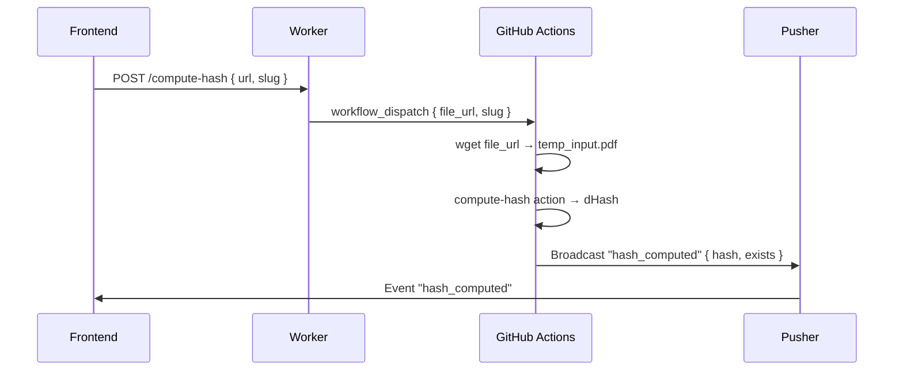

# hash-service.yml — Serviço de Hash Visual

> 🤖 **Disclaimer**: Documentação gerada por IA e pode conter imprecisões. [📋 Reportar erro](https://github.com/TouchRefletz/maia.api/issues/new?title=Erro+na+doc:+hash-service.yml&labels=docs)

## Visão Geral

O workflow `hash-service.yml` é um serviço dedicado para computar hashes visuais (dHash) de PDFs remotos. Ele é disparado pelo Worker via `/compute-hash` quando o frontend precisa verificar se um PDF já existe no sistema antes de processá-lo. Após o cálculo, notifica o frontend via Pusher.

## Arquivos Relacionados

| Arquivo | Papel |
|---------|-------|
| `.github/workflows/hash-service.yml` | Definição do workflow |
| `.github/actions/compute-hash/` | Composite action que calcula o hash |
| `scripts/compute-hash.js` | Script de hash visual (dHash algorithm) |
| `maia-api-worker/src/index.js` | Endpoint `/compute-hash` |

## Diagrama de Fluxo



## Detalhamento Técnico

### Inputs

| Input | Obrigatório | Descrição |
|-------|-------------|-----------|
| `file_url` | Sim | URL do arquivo para download e hash |
| `slug` | Sim | Identificador usado como canal Pusher |

### Steps

#### 1. Download File
```bash
wget -O temp_input.pdf "${{ inputs.file_url }}"
```
Valida que o arquivo não está vazio (`[ -s temp_input.pdf ]`).

#### 2. Compute Hash (Composite Action)
Delega para `.github/actions/compute-hash` que:
1. Converte a primeira página do PDF para imagem
2. Redimensiona para grid 9×8
3. Compara pixels adjacentes (dHash)
4. Gera string hexadecimal de 64 bits

Output: `steps.compute.outputs.hash`

#### 3. Notify Frontend (Pusher)
Constrói payload JSON e assina a request via HMAC-SHA256:

```json
{
  "hash": "a1b2c3d4e5f6...",
  "exists": false,
  "found_slug": ""
}
```

> **Nota**: O campo `exists` é sempre `false` aqui. A verificação de existência foi movida para o Worker/Frontend, que consulta o Pinecone diretamente.

### Algoritmo dHash

O dHash (difference hash) é um hash perceptual que:
1. Converte imagem para escala de cinza
2. Redimensiona para (W+1) × H (ex: 9×8)
3. Para cada pixel, compara com o adjacente: `hash_bit = pixel[x] > pixel[x+1] ? 1 : 0`
4. Resultado: 64 bits = 16 caracteres hexadecimais

**Propriedade chave**: Dois PDFs do mesmo documento (com metadados diferentes) produzem o mesmo hash.

## Edge Cases e Tratamento de Erros

| Caso | Tratamento |
|------|-----------|
| Download falha | `::error::` annotation, exit 1 |
| Arquivo vazio | Verificação `-s`, exit 1 |
| PDF corrompido | Hash action falha, Pusher notifica com hash vazio |
| Pusher indisponível | Apenas log, não bloqueia |

## Decisões de Design

1. **GitHub Action em vez de Worker**: O cálculo de hash requer download do PDF completo + processamento de imagem, operações pesadas para um Cloudflare Worker (limite de CPU/memória).

2. **Deduplicação movida para o Worker**: Originalmente este workflow verificava existência no repositório. Agora apenas computa o hash — a verificação é feita no frontend/Worker via Pinecone.

3. **Pusher como canal de retorno**: Como o workflow é assíncrono, o Pusher permite que o frontend receba o resultado sem polling.

## Referências Cruzadas

- [Endpoint /compute-hash](/api-worker/compute-hash) — Worker que dispara este workflow
- [PDF Hashing](/utils/pdf-hash) — Implementação do hash no frontend
- [Deep Search](/infra/deep-search) — Usa hashes para deduplicação
