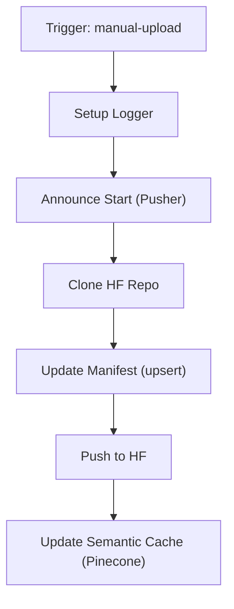

# manual-upload.yml — Upload Manual para HuggingFace

> 🤖 **Disclaimer**: Documentação gerada por IA e pode conter imprecisões. [📋 Reportar erro](https://github.com/TouchRefletz/maia.api/issues/new?title=Erro+na+doc:+manual-upload.yml&labels=docs)

## Visão Geral

O workflow `manual-upload.yml` gerencia o upload manual de provas e gabaritos para o dataset HuggingFace. Opera em **Link Mode**: não faz download dos PDFs, apenas atualiza o manifesto com URLs de origem, metadados e hashes visuais. Após o manifesto, atualiza o cache semântico no Pinecone.

## Arquivos Relacionados

| Arquivo | Papel |
|---------|-------|
| `.github/workflows/manual-upload.yml` | Definição do workflow |
| `maia-api-worker/src/index.js` | Endpoint `/manual-upload` |

## Diagrama de Fluxo



## Detalhamento Técnico

### 1. Metadados Recebidos

O `client_payload` contém dados ricos do frontend:

| Campo | Descrição |
|-------|-----------|
| `slug` | Identificador da coleção (ex: `enem-2023`) |
| `title` | Título da prova |
| `metadata.year` | Ano do exame |
| `metadata.institution` | Instituição |
| `metadata.phase` | Fase (1ª fase, 2ª fase, etc.) |
| `metadata.pdf_filename` | Nome sanitizado do PDF da prova |
| `metadata.gabarito_filename` | Nome sanitizado do PDF do gabarito |
| `metadata.pdf_display_name` | Nome de exibição da prova |
| `metadata.gabarito_display_name` | Nome de exibição do gabarito |
| `source_url_prova` | URL original da prova |
| `source_url_gabarito` | URL original do gabarito |
| `visual_hash` | Hash visual do PDF da prova |
| `visual_hash_gabarito` | Hash visual do gabarito |

### 2. Estratégia de Manifesto

O manifesto usa **upsert por filename**:

```python
items_map = {item.get('filename'): item for item in items}
items_map[pdf_fname] = {
    "nome": pdf_display,
    "tipo": "prova",
    "status": "verified",
    "visual_hash": v_hash,
    ...
}
```

Isso garante que re-uploads do mesmo arquivo atualizem a entrada existente em vez de duplicar.

### 3. Entradas do Manifesto

Cada item tem a estrutura:

```json
{
  "nome": "ENEM 2023 - Dia 1",
  "tipo": "prova",
  "ano": 2023,
  "instituicao": "INEP (ENEM)",
  "fase": "1ª Aplicação",
  "link_origem": "https://...",
  "status": "verified",
  "filename": "enem-2023-dia1.pdf",
  "visual_hash": "a1b2c3d4..."
}
```

### 4. Push para HuggingFace

Configuração robusta para evitar falhas:
```bash
git config --global http.postBuffer 524288000      # 500MB
git config --global lfs.activitytimeout 300         # 5 min
git config --global http.version HTTP/1.1           # Compatibilidade
```

### 5. Atualização do Cache Semântico

Após push ao HF, envia embedding do slug para o Pinecone:

```json
{
  "query": "enem 2023",
  "slug": "enem-2023",
  "metadata": {
    "source": "manual-upload",
    "original_query": "ENEM 2023 - Caderno Azul",
    "file_count": 4,
    "institution": "INEP",
    "type": "manual-upload-result"
  }
}
```

O embedding é gerado a partir do slug deslugificado (`enem-2023` → `enem 2023`).

## Edge Cases e Tratamento de Erros

| Caso | Tratamento |
|------|-----------|
| Manifesto não existe | Criado do zero com `mkdir -p` |
| Manifesto corrompido | `try/except` com `sys.exit(1)` |
| Push para HF falha | LFS otimizado, mas sem retry explícito |
| Cache update falha | Warning non-blocking, não para o workflow |
| Sem PDF (`has_pdf=false`) | Pula entrada da prova, mantém gabarito |

## Decisões de Design

1. **Link Mode (sem download de PDF)**: PDFs ficam hospedados onde estão. O manifesto aponta para URLs de origem.
2. **Cache via Pinecone**: Permite que buscas futuras encontrem o upload sem re-executar o workflow.
3. **`type: manual-upload-result`**: Distingue de `deep-search-result` para queries Pinecone.

## Referências Cruzadas

- [Endpoint /manual-upload](/api-worker/crud) — Worker que processa o upload
- [Deep Search](/infra/deep-search) — Busca automática de provas
- [Visão Geral CI/CD](/infra/visao-geral) — Contexto geral
