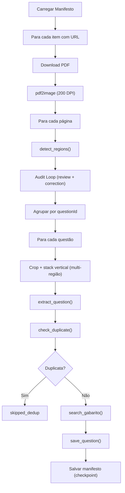

# extract_pipeline.py — Pipeline de Extração Server-Side

> 🤖 **Disclaimer**: Documentação gerada por IA e pode conter imprecisões. [📋 Reportar erro](https://github.com/TouchRefletz/maia.api/issues/new?title=Erro+na+doc:+extract-pipeline.py&labels=docs)

## Visão Geral

O `extract_pipeline.py` é a porta Python do scanner de IA do frontend (`ai-scanner.js`). Roda dentro do GitHub Actions e usa a API Gemini diretamente para: (1) detectar regiões de questões em imagens de páginas de PDF, (2) extrair conteúdo estruturado em JSON, e (3) buscar gabaritos via Google Search Grounding.

## Arquivos Relacionados

| Arquivo | Caminho | Papel |
|---------|---------|-------|
| `extract_pipeline.py` | `.github/scripts/extract_pipeline.py` | Pipeline principal |
| `extract-questions.yml` | `.github/workflows/extract-questions.yml` | Workflow que executa |
| `ai-scanner.js` | `js/ia/ai-scanner.js` | Versão frontend (browser) |
| `config.js` | `js/ia/config.js` | Schemas e prompts (referência original) |

## Dependências

| Pacote | Versão | Papel |
|--------|--------|-------|
| `google-genai` | Latest | SDK Gemini Python |
| `pdf2image` | Latest | Conversão PDF → PIL Image |
| `Pillow` | Latest | Manipulação de imagens |
| `requests` | Latest | Chamadas HTTP ao Worker |
| `poppler-utils` | Sistema | Backend do pdf2image |

## API / Interface Pública

### Funções Exportadas

| Função | Parâmetros | Retorno | Descrição |
|--------|-----------|---------|-----------|
| `detect_regions(page_img)` | PIL Image | dict | Detecta bounding boxes de questões |
| `extract_question(cropped_img)` | PIL Image | dict | Extrai questão estruturada |
| `search_gabarito(question_json)` | dict | dict \| None | Busca gabarito via Worker |
| `check_duplicate(text)` | str | dict | Verifica duplicata no Pinecone |
| `save_question(questao, gabarito, ...)` | dict, dict, str, int | dict \| None | Salva via Worker |
| `load_manifest()` | - | dict | Carrega ou cria manifesto |
| `save_manifest(manifest)` | dict | None | Salva manifesto no disco |

### Helpers

| Função | Descrição |
|--------|-----------|
| `image_to_base64(img, fmt)` | Converte PIL Image para base64 |
| `crop_region(page_img, box)` | Recorta região usando coords normalizadas 0..1000 |
| `call_gemini_with_retry(...)` | Wrapper com retry para rate limits |
| `build_review_prompt(json)` | Gera prompt de auditoria |
| `build_correction_prompt(json, feedback)` | Gera prompt de correção |

## Detalhamento Técnico

### Prompts

#### REGION_DETECT_PROMPT
Prompt de visão computacional com princípio **CAIXA GULOSA**:
- Regras de tipo: `questao_completa` vs `parte_questao`
- Formato de coordenadas: `[y1, x1, y2, x2]` em escala 0..1000
- Tratamento de questões em colunas e textos compartilhados

#### QUESTION_EXTRACT_PROMPT
Prompt de extração com regras rigorosas:
- **Markdown obrigatório** para todo texto
- **LaTeX obrigatório** para toda matemática/química (`$inline$` e blocos `equacao`)
- Estruturação em blocos sequenciais (texto → imagem → equação)
- Tabelas em Markdown table format
- `alt-text` para imagens (sem OCR)

#### REVIEW_SCHEMA
Schema JSON para auditoria binária:
```json
{
  "ok": true/false,
  "feedback": "Questão 05 cortou alternativa E"
}
```

### Schemas

#### `REGION_DETECT_SCHEMA`
```json
{
  "coordinateSystem": "normalized_0_1000_y1x1y2x2",
  "regions": [
    { "id", "questionId", "tipo", "kind", "box", "confidence" }
  ]
}
```

#### `QUESTION_EXTRACT_SCHEMA`
```json
{
  "identificacao": "ENEM 2023 - Q45",
  "materias_possiveis": ["Física"],
  "estrutura": [{ "tipo": "texto", "conteudo": "..." }],
  "alternativas": [{ "letra": "A", "estrutura": [...] }],
  "palavras_chave": ["cinemática"],
  "tipo_resposta": "objetiva"
}
```

#### Gabarito Schema
```json
{
  "alternativa_correta": "B",
  "justificativa_curta": "...",
  "confianca": 0.95,
  "explicacao": [{ "estrutura": [...], "origem": "..." }],
  "alternativas_analisadas": [{ "letra": "A", "correta": false, "motivo": "..." }],
  "analise_complexidade": { "fatores": {...}, "justificativa_dificuldade": "..." },
  "creditos": { "origem_resolucao": "...", "material": "..." }
}
```

### Fluxo Principal (`main()`)



### Rate Limit Handling

```python
class RateLimitError(Exception): pass

def call_gemini_with_retry(model, contents, config, max_retries=3):
    for attempt in range(max_retries):
        try:
            return client.models.generate_content(...)
        except Exception as e:
            if "429" in str(e).lower():
                wait = 30 * (attempt + 1)  # 30s, 60s, 90s
                time.sleep(wait)
            else:
                raise
    raise RateLimitError("Max retries exceeded")
```

Se `RateLimitError` ocorre durante processamento de página:
1. Marca `manifest["rate_limit_hit"] = True`
2. Salva manifesto no disco
3. `sys.exit(0)` — encerramento gracioso

Re-execuções do workflow detectam `rate_limit_hit` e retomam do ponto.

### Multi-Região (Questões em Colunas)

Quando uma questão está dividida em 2+ regiões:

```python
# Stack vertical das imagens cropadas
combined = Image.new("RGB", (max_w, total_h), "white")
y_offset = 0
for img in cropped_images:
    combined.paste(img, (0, y_offset))
    y_offset += img.height
```

## Referências Cruzadas

- [extract-questions.yml](/infra/extract-questions) — Workflow que executa este script
- [Scanner de IA (Frontend)](/ocr/scanner-pipeline) — Equivalente browser
- [Schemas de Resposta](/chat/schemas-layouts) — Schemas compartilhados
