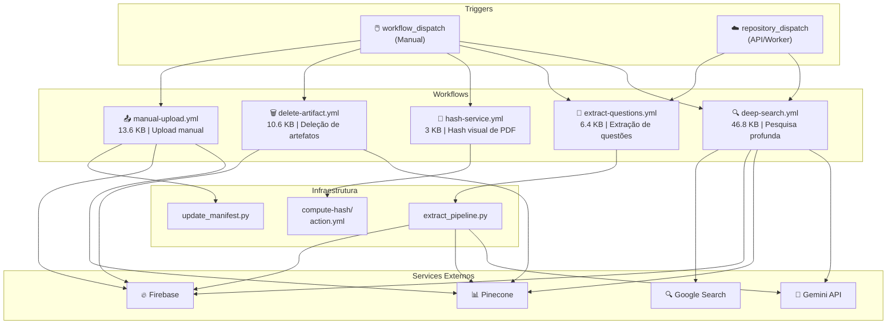
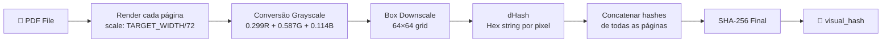
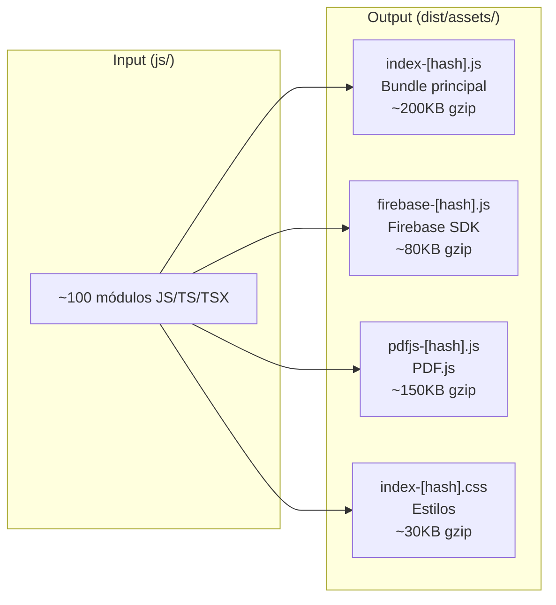

# Visão Geral — Infraestrutura, CI/CD e Build

## Contexto

O maia.edu depende de uma infraestrutura de CI/CD robusta para automatizar tarefas que seriam impraticáveis manualmente: extração de questões de PDFs em larga escala, pesquisa profunda com agentes de IA, hash visual para deduplicação, e gerenciamento de artefatos no Firebase e Pinecone.

---

## Mapa de Workflows

O projeto possui **5 workflows GitHub Actions**, cada um com um propósito distinto:



---

## Tabela Comparativa de Workflows

| Workflow | Trigger | Duração Típica | Outputs | Arquivo-Fonte |
|----------|---------|---------------|---------|---------------|
| **deep-search** | `repository_dispatch` via Worker | 3-10 min | Pinecone upserts + Firebase write | `.github/workflows/deep-search.yml` |
| **extract-questions** | `repository_dispatch` via Worker | 5-15 min | Questões extraídas + embeddings | `.github/workflows/extract-questions.yml` |
| **hash-service** | `workflow_dispatch` (manual) | 1-3 min | Hash visual do PDF | `.github/workflows/hash-service.yml` |
| **delete-artifact** | `repository_dispatch` via Worker | 1-2 min | Deleção no Firebase + Pinecone | `.github/workflows/delete-artifact.yml` |
| **manual-upload** | `repository_dispatch` via Worker | 2-5 min | Upload manual para Pinecone | `.github/workflows/manual-upload.yml` |

---

## Custom Actions

### compute-hash/action.yml

Localizado em `.github/actions/compute-hash/`, esta action encapsula a lógica de hash visual de PDF:



**Algoritmo detalhado:**

1. Cada página é renderizada com largura fixa de **1024px** (normalização)
2. A imagem é reduzida para **64×64 pixels** usando box downscaling determinístico
3. Cada pixel é convertido para grayscale usando coefficients ITU-R BT.601
4. O valor grayscale (0-255) é convertido para hex de 2 dígitos
5. Todos os hashes de página são concatenados
6. O hash final é um SHA-256 da string concatenada

**Por que box downscaling em vez de canvas.drawImage?**
O `canvas.drawImage` usa interpolação diferente entre browsers e plataformas (bilinear, bicubic, etc.), gerando hashes diferentes para o mesmo PDF. O box downscaling é **determinístico** e produz resultados idênticos em qualquer ambiente.

---

## Scripts Python

### extract_pipeline.py

Script Python executado dentro dos GitHub Actions para processar questões. Responsabilidades:

1. Receber crop data do Scanner
2. Converter coordenadas normalizadas para pixels
3. Extrair imagens de cada crop
4. Enviar para Gemini (extração de texto)
5. Normalizar dados extraídos
6. Fazer upsert no Pinecone e write no Firebase

### update_manifest.py

Script auxiliar para atualizar o manifesto de build:

1. Lê o estado atual do manifesto
2. Adiciona/remove entradas baseado no workflow executado
3. Atualiza timestamps e hashes
4. Commita o manifesto atualizado

---

## Build System (Vite)

### Configuração Detalhada

O arquivo `vite.config.js` define:

```javascript
export default defineConfig({
  plugins: [react()],
  
  build: {
    rollupOptions: {
      output: {
        manualChunks: {
          // Separação de chunks pesados
          firebase: [
            'firebase/app', 
            'firebase/auth', 
            'firebase/database', 
            'firebase/firestore'
          ],
          pdfjs: ['pdfjs-dist'],
        },
      },
    },
  },
  
  server: {
    proxy: {
      '/api': {
        target: 'http://localhost:8787',
        changeOrigin: true,
        rewrite: (path) => path.replace(/^\/api/, ''),
      },
    },
  },
});
```

### Estratégia de Chunking



**Benefícios:**
- **Code Splitting**: Firebase SDK carregado sob demanda
- **Cache Busting**: Hashes no nome de arquivo para invalidação
- **Tree Shaking**: Código não utilizado é removido

---

## TypeScript Configuration

```json
{
  "compilerOptions": {
    "target": "ES2020",
    "lib": ["ES2020", "DOM", "DOM.Iterable"],
    "module": "ESNext",
    "moduleResolution": "bundler",
    "strict": true,
    "jsx": "react-jsx",
    "jsxImportSource": "preact",
    "noEmit": true,
    "allowJs": true,
    "checkJs": false
  },
  "include": ["js/**/*"]
}
```

**Decisões de design:**

| Opção | Valor | Justificativa |
|-------|-------|-------------|
| `target: ES2020` | ES2020 | Suporte nativo a optional chaining, nullish coalescing |
| `strict: true` | Enabled | Tipagem rigorosa em arquivos .ts/.tsx |
| `allowJs: true` | Enabled | Permite importar módulos .js em .tsx |
| `checkJs: false` | Disabled | Não verifica tipos em .js (seria impraticável) |
| `jsxImportSource: preact` | Preact | JSX runtime mais leve que React |
| `noEmit: true` | Enabled | Vite faz a compilação, não o tsc |

---

## Variáveis de Ambiente — Referência Completa

### Frontend (acessíveis via `import.meta.env`)

| Variável | Exemplo | Usado Em |
|----------|---------|---------|
| `VITE_FIREBASE_API_KEY` | `AIzaSy...` | `js/firebase/init.js` |
| `VITE_FIREBASE_AUTH_DOMAIN` | `proj.firebaseapp.com` | `js/firebase/init.js` |
| `VITE_FIREBASE_DATABASE_URL` | `https://proj.firebaseio.com` | `js/firebase/init.js` |
| `VITE_FIREBASE_PROJECT_ID` | `my-project` | `js/firebase/init.js` |
| `VITE_FIREBASE_STORAGE_BUCKET` | `proj.appspot.com` | `js/firebase/init.js` |
| `VITE_FIREBASE_MESSAGING_SENDER_ID` | `123456789` | `js/firebase/init.js` |
| `VITE_FIREBASE_APP_ID` | `1:123:web:abc` | `js/firebase/init.js` |
| `VITE_WORKER_URL` | `http://localhost:8787` | `js/api/worker.js` |

### Worker (Cloudflare secrets/vars)

| Variável | Tipo | Usado Em |
|----------|------|---------|
| `GOOGLE_GENAI_API_KEY` | Secret | Gemini API calls |
| `PINECONE_API_KEY` | Secret | Pinecone API calls |
| `PINECONE_HOST` | Var | Default Pinecone index |
| `PINECONE_HOST_DEEP_SEARCH` | Var | Deep search index |
| `PINECONE_HOST_FILTER` | Var | Filter index (normalização) |
| `PINECONE_HOST_MEMORY` | Var | Memory index (fatos) |
| `IMGBB_API_KEY` | Secret | Upload de imagens |
| `GOOGLE_CSE_KEY` | Secret | Google Custom Search |
| `GOOGLE_CSE_CX` | Var | Custom Search Engine ID |
| `GH_PAT_TOKEN` | Secret | Disparar GitHub Actions |
| `FIREBASE_RTDB_URL` | Var | Firebase operations |

---

## Referências Cruzadas

| Tópico | Página |
|--------|--------|
| deep-search.yml em detai | [deep-search.yml](/infra/deep-search) |
| extract-questions.yml | [extract-questions.yml](/infra/extract-questions) |
| hash-service.yml | [hash-service.yml](/infra/hash-service) |
| Vite config detalhado | [Configuração Vite](/infra/vite-config) |
| Worker endpoints | [API Worker: Arquitetura](/api-worker/arquitetura) |
