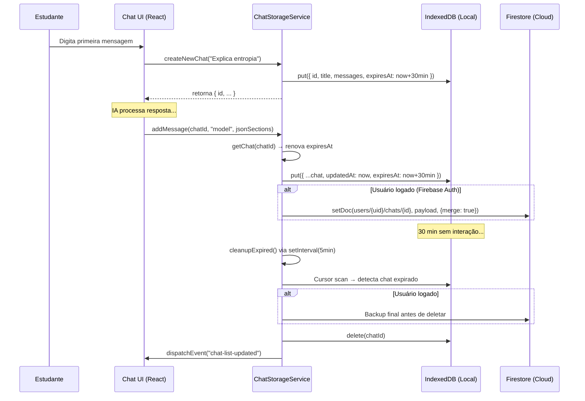

# Chat Storage — Persistência Híbrida de Conversas

> 🤖 **Disclaimer**: Documentação gerada por IA e pode conter imprecisões. [📋 Reportar erro](https://github.com/TouchRefletz/maia.api/issues/new?title=Erro+na+doc:+chat-storage&labels=docs)

## Visão Geral

O `ChatStorageService` (`js/services/chat-storage.js`) é o guardião absoluto de toda conversa que o estudante mantém com a inteligência artificial do maia.edu. Diferente de serviços triviais que simplesmente jogam dados no `localStorage` e rezam para não perder nada, este módulo implementa uma **Arquitetura de Persistência Híbrida com TTL (Time-To-Live)** que combina armazenamento local de alta velocidade (IndexedDB) com sincronização assíncrona na nuvem (Firebase Firestore).

A filosofia central é: **o browser do aluno é cache efêmero, a nuvem é o cofre permanente**. Toda mensagem vive localmente por 30 minutos de inatividade. Se o aluno parar de interagir, o sistema faz backup automático para o Firestore e evapora os dados locais, liberando a RAM e o disco do dispositivo — algo crítico para celulares de estudantes de escola pública com 2GB de armazenamento livre.

## Constantes Fundamentais de Configuração

```javascript
const DB_NAME     = "MaiaChatsDB";     // Nome do banco IndexedDB
const DB_VERSION  = 2;                  // Versão com suporte a expiresAt
const STORE_NAME  = "chats";            // Object Store principal
const LOCAL_EXPIRATION_TIME = 30 * 60 * 1000; // 30 minutos em ms
```

A `DB_VERSION = 2` foi necessária para introduzir o índice `expiresAt` no ObjectStore. Quando o browser detecta uma versão mais nova, o evento `onupgradeneeded` cria o índice novo sem destruir dados existentes — uma migração in-place segura.

## Topologia de Dados e Modelo de Objeto

Cada chat armazenado segue uma estrutura flat que maximiza a performance de serialização:

```json
{
  "id": "uuid-v4-gerado-por-crypto",
  "title": "Dúvida sobre Termodinâmica...",
  "messages": [
    {
      "role": "user",
      "content": "Me explica entropia",
      "attachments": [],
      "timestamp": 1712862400000
    },
    {
      "role": "model",
      "content": { "sections": [{ "layout": { "id": "linear" }, "conteudo": [...] }] },
      "attachments": [],
      "timestamp": 1712862405000
    },
    {
      "role": "system",
      "content": { "type": "memory_found", "message": "Memórias recuperadas..." },
      "timestamp": 1712862403000
    }
  ],
  "scaffoldingSteps": [],
  "createdAt": 1712862400000,
  "updatedAt": 1712862405000,
  "expiresAt": 1712864200000
}
```

### Roles de Mensagem

| Role | Tipo do Content | Propósito |
|------|----------------|-----------|
| `user` | `string` | Texto cru digitado pelo estudante no input |
| `model` | `object` (JSON sections) | Resposta estruturada com layouts e blocos tipados |
| `system` | `object` (evento) | Eventos internos invisíveis: `mode_selected`, `memory_found`, `extraction_triggered` |

As mensagens de role `system` nunca aparecem como bolhas no chat visual do estudante. Elas são metadados fantasma que permitem que o frontend reconstrua estados visuais (como o badge de "Memórias Recuperadas") ao recarregar a página.

## O Ciclo de Vida Completo de um Chat



## API Completa do Serviço

### `createNewChat(firstMessage, attachments)`
Gera um UUID via `crypto.randomUUID()`, cria o objeto chat com a primeira mensagem, salva local + cloud (se logado), e dispara o evento `chat-list-updated` para o sidebar se atualizar.

### `getChat(id)`
Opera em cascata de fallback:
1. **Busca no IndexedDB** → se existe e `expiresAt > now`, retorna imediatamente.
2. **Se expirou ou não existe** e o usuário está logado → busca no Firestore.
3. **Se encontrou na nuvem** → re-hidrata localmente com novo TTL de 30min.
4. **Se não encontrou em lugar nenhum** → retorna `null`.
5. **Se encontrou mas expirou** e não está logado → deleta silenciosamente e retorna `null` (dado perdido — punição por não logar).

### `getChats()`
Lista todos os chats do IndexedDB ordenados por `updatedAt` decrescente. Não filtra expirados aqui (a limpeza roda em background separada) para evitar race conditions e loops infinitos que foram corrigidos em versões anteriores do código.

### `saveChat(chat)`
Operação dupla:
1. **Local**: Chama `saveLocal(chat)` que renova o `expiresAt`.
2. **Cloud**: Se `auth.currentUser` existe e não é anônimo, serializa o payload (removendo `expiresAt` que é conceito local), e faz `setDoc` com `merge: true`.

### `addMessage(chatId, role, content, attachments)`
Recupera o chat via `getChat()`, faz push no array `messages`, atualiza `updatedAt`, e chama `saveChat()`. Se o chat já expirou e não tem backup cloud, emite warning no console — dado perdido.

### `deleteChat(chatId)`
Deleta do IndexedDB e, se logado, deleta do Firestore também. Dispara evento de atualização de lista.

### `updateTitle(chatId, newTitle)`
Usado pelo gerador assíncrono de títulos (`generateChatTitleData`). Recupera o chat, muda o campo `title`, e salva novamente. Isso faz com que o sidebar do chat atualize o texto da aba de "Novo Chat" para "Dúvida sobre Entropia" sem intervenção do aluno.

### `syncFromCloud(uid)`
Baixa TODOS os chats do Firestore para o IndexedDB local, cada um com TTL fresco de 30min. Chamada no login do usuário para reconstruir o estado completo do sidebar.

### `syncPendingToCloud()`
Operação inversa: varre todos os chats locais e faz upload para o Firestore com `merge: true`. Protege contra perda de dados em cenários onde o aluno conversou offline e depois conectou.

### `cleanupExpired()`
O motor de Garbage Collection do serviço. Funciona em 3 passes:

```
Pass 1: Cursor Scan — Itera todos os registros do ObjectStore,
        marcando como expirados aqueles cujo (updatedAt + 30min) < now.

Pass 2: Cloud Backup — Se logado, faz setDoc de TODOS os expirados
        para o Firestore antes de deletar. Se o backup falhar,
        ABORTA A DELEÇÃO (safety-first: nunca perder dado).

Pass 3: Local Delete — Nova transaction readwrite, deleta cada
        registro expirado individualmente.
```

### `addScaffoldingStep(chatId, stepIndex, stepData)` / `getScaffoldingSteps(chatId)`
Métodos especializados para o pipeline de Scaffolding. Cada step de quiz Verdadeiro/Falso é salvo como entrada separada no array `scaffoldingSteps` do chat, permitindo que o frontend reconstrua o estado exato do quiz interativo após F5.

## Tratamento de Erros e Resiliência

O serviço implementa uma filosofia de **degradação graciosa em cascata**:

- Se o IndexedDB falhar (modo privado do Safari, por exemplo), o serviço captura a exceção, loga warning, e retorna array vazio ou `null` — nunca crasheia a UI.
- Se o Firestore falhar (offline, quota excedida), a operação cloud é ignorada silenciosamente via `.catch()`, mas o dado local permanece intacto.
- Limpeza automática roda a cada 5 minutos via `setInterval`, mas jamais durante operações de leitura (evita race conditions).

```javascript
// Auto-start cleanup periodically
setInterval(() => {
  ChatStorageService.cleanupExpired()
    .catch((e) => console.error("Auto-cleanup error", e));
}, 5 * 60 * 1000); // 5 mins
```

## O Dilema dos Usuários Anônimos

Usuários que não fizeram login operam em modo kamikaze: seus chats existem exclusivamente no IndexedDB com TTL de 30 minutos. Se fecharem o navegador e não voltarem a tempo, **tudo é perdido irrevogavelmente**. Isso é intencional — serve como incentivo para criar conta. A UI exibe periodicamente um toast sutil: *"Faça login para salvar suas conversas na nuvem"*.

## Otimizações de Performance

1. **Serialização limpa via `JSON.parse(JSON.stringify())`**: Remove `undefined`, funções, e referências circulares antes de enviar ao Firestore.
2. **Merge ao invés de overwrite**: `setDoc` com `{ merge: true }` evita sobrescrever campos que o Firestore pode ter e o local não (metadados de analytics, por exemplo).
3. **Eventos CustomEvent**: A comunicação `ChatStorage → UI` usa `window.dispatchEvent(new CustomEvent("chat-list-updated"))` em vez de callbacks diretos, desacoplando completamente o storage da camada visual.
4. **Índice `updatedAt`**: Criado no `onupgradeneeded` para permitir listagem ordenada sem sort em memória.

## Referências Cruzadas

- [Pipelines — Onde o storage é invocado pós-geração](/chat/pipelines-overview)
- [Memory Service — Sistema de extração factual paralelo](/memoria/visao-geral)
- [Firebase Auth — Base para sincronização cloud](/firebase/init)
- [Gap Detector — Persiste notificações de extração via addMessage](/chat/gap-detector)
