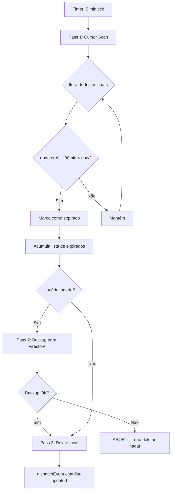

# Cleanup — Garbage Collection da Memória

> 🤖 **Disclaimer**: Documentação gerada por IA e pode conter imprecisões. [📋 Reportar erro](https://github.com/TouchRefletz/maia.api/issues/new?title=Erro+na+doc:+cleanup&labels=docs)

## Visão Geral

O módulo de **Cleanup** engloba as rotinas de coleta de lixo (Garbage Collection) que mantêm os bancos de dados locais do maia.edu saudáveis e enxutos. Existem dois sistemas de cleanup independentes que operam em paralelo: um para mensagens de chat (`ChatStorageService.cleanupExpired`) e outro para fatos atômicos da memória semântica (`cleanupExpired` do MemoryService).

Ambos seguem a mesma filosofia fundamental: **Sync-Before-Delete** — nunca deletar dados locais sem antes garantir que existe um backup na nuvem (Firestore ou Pinecone).

## Por Que Cleanup É Necessário

O maia.edu roda inteiramente no browser do estudante. IndexedDB, embora poderoso, compartilha a quota de storage com todo o resto do navegador. Um aluno que conversa ativamente por semanas acumularia:
- 200+ mensagens de chat com JSONs pesados (layouts, blocos, attachments Base64)
- 100+ fatos atômicos com vetores de 768 dimensões cada

Em dispositivos com 2-4GB de storage total (celulares de entrada), isso causaria `QuotaExceededError` — o browser simplesmente pararia de salvar qualquer coisa, inclusive para outros sites.

## Arquitetura de TTL (Time-To-Live)

Todo dado local possui um campo `expiresAt` calculado como `Date.now() + LOCAL_EXPIRATION_TIME`:

```javascript
const LOCAL_EXPIRATION_TIME = 30 * 60 * 1000; // 30 minutos
```

Cada vez que o dado é acessado ou atualizado (leitura de chat, salvamento de nova mensagem), o `expiresAt` é renovado. Dados que ficam 30 minutos sem serem tocados são candidatos à evaporação.

### A Metáfora do Gelo

Imagine cada registro local como um cubo de gelo. Cada interação do aluno "re-congela" o cubo. Se o aluno para de interagir, o gelo derrete em 30 minutos. Antes de derreter completamente, o sistema faz uma cópia digital do cubo na nuvem (Firestore/Pinecone). Quando o aluno voltar e precisar do dado, ele é recriado a partir da cópia cloud.

## Cleanup de Chats (`ChatStorageService.cleanupExpired`)

### Trigger

Roda automaticamente via `setInterval` a cada 5 minutos:

```javascript
setInterval(() => {
  ChatStorageService.cleanupExpired()
    .catch((e) => console.error("Auto-cleanup error", e));
}, 5 * 60 * 1000);
```

### Algoritmo em 3 Passes



### Detalhes do Pass 1 (Cursor Scan)

O cleanup não usa o índice `expiresAt` diretamente. Isso porque o `expiresAt` é renovado em cada `saveLocal()`, criando um cenário onde chats antigos nunca expiram porque o sync os re-hidrata. Em vez disso, a regra usa `updatedAt`:

```javascript
if (chat.updatedAt) {
  if (chat.updatedAt + LOCAL_EXPIRATION_TIME <= now) isExpired = true;
} else if (chat.createdAt) {
  if (chat.createdAt + LOCAL_EXPIRATION_TIME <= now) isExpired = true;
} else if (chat.expiresAt) {
  if (chat.expiresAt <= now) isExpired = true; // Last resort
}
```

A prioridade é `updatedAt` > `createdAt` > `expiresAt`. Isso garante que a métrica de expiração seja baseada na última interação REAL do aluno, não na última vez que o sistema re-salvou o registro internamente.

### Detalhes do Pass 2 (Cloud Backup)

Para cada chat expirado, um `setDoc` com `merge: true` é disparado para o Firestore. O campo `expiresAt` é removido do payload (conceito local, irrelevante na nuvem):

```javascript
const syncPromises = expiredChats.map((chat) => {
  const cloudPayload = { ...chat };
  delete cloudPayload.expiresAt;
  const cleanPayload = JSON.parse(JSON.stringify(cloudPayload));
  const docRef = doc(firestore, "users", user.uid, "chats", chat.id);
  return setDoc(docRef, cleanPayload, { merge: true });
});
await Promise.all(syncPromises);
```

**CRÍTICO**: Se `Promise.all` rejeitar (rede caiu no meio), a função faz `return` imediato — o Pass 3 NÃO executa. Preferimos manter lixo local a perder dados irrecuperáveis.

### Detalhes do Pass 3 (Delete Local)

Uma NOVA transaction `readwrite` é aberta (a do Pass 1 já expirou durante o await do Pass 2). Cada chat é deletado individualmente:

```javascript
const txDelete = db.transaction(STORE_NAME, "readwrite");
const storeDelete = txDelete.objectStore(STORE_NAME);
const deletePromises = expiredChats.map((chat) => {
  return new Promise((resolve) => {
    const req = storeDelete.delete(chat.id);
    req.onsuccess = () => { deletedCount++; resolve(); };
    req.onerror = () => resolve(); // Ignora erros individuais
  });
});
await Promise.all(deletePromises);
```

Após as deleções, um `CustomEvent("chat-list-updated")` é disparado para que o sidebar do chat atualize a lista visual.

## Cleanup de Fatos Atômicos (`cleanupExpired` do MemoryService)

### Diferenças em Relação ao Chat Cleanup

| Aspecto | Chat Cleanup | Memory Cleanup |
|---------|-------------|----------------|
| Target DB | MaiaChatsDB (IndexedDB) | EntityDB (IndexedDB) |
| Cloud backup | Firestore | Pinecone |
| Critério | `updatedAt + 30min` | `expiresAt` ou `timestamp + 30min` |
| ObjectStore | "chats" (nome fixo) | "vector" ou "vectors" (detecção dinâmica) |
| Intervalo | 5 minutos | 5 minutos |

### O Problema do ObjectStore Name

A biblioteca `@babycommando/entity-db` não garante consistência no nome do ObjectStore entre versões. O cleanup implementa detecção automática:

```javascript
let storeName = "vectors";
if (rawDb.objectStoreNames.contains("vector")) storeName = "vector";
else if (rawDb.objectStoreNames.contains("vectors")) storeName = "vectors";
else if (rawDb.objectStoreNames.length > 0) storeName = rawDb.objectStoreNames[0];
```

### Cloud Sync para Pinecone

Fatos expirados são convertidos para formato Pinecone e upserteados antes da deleção:

```javascript
const vectorsToUpsert = expiredItems.map((wrapper) => ({
  id: typeof wrapper.key === "string" ? wrapper.key : crypto.randomUUID(),
  values: p.vector || p.values,
  metadata: {
    ...(p.metadata || {}),
    text: p.text || p.metadata?.text,
    origem_cleanup: true,  // Flag para auditoria: "veio do cleanup"
  },
}));
await upsertPineconeWorker(vectorsToUpsert, user.uid, "maia-memory");
```

O campo `origem_cleanup: true` nos metadados do Pinecone permite auditar quais fatos vieram de sync proativo vs. salvamento normal.

## Edge Cases e Proteções

1. **Usuário anônimo**: Não tem backup cloud. Ao expirar, dados são deletados permanentemente. É o incentivo para criar conta.
2. **Múltiplas tabs**: Cada tab roda seu próprio setInterval. Como as operações são idempotentes (deletar algo já deletado é no-op), não há conflito.
3. **Browser crash durante Pass 2**: Os dados locais ainda existem (Pass 3 não rodou). No próximo boot, o cleanup detectará novamente e tentará sync.
4. **Quota do Pinecone excedida**: O upsert falha, o cleanup aborta — dados locais preservados.

## Referências Cruzadas

- [Chat Storage — O serviço que possui o cleanup de chats](/memoria/chat-storage)
- [EntityDB — O banco que possui o cleanup de fatos](/memoria/entitydb)
- [Pinecone Sync — Detalhes da comunicação cloud](/memoria/pinecone-sync)
- [Visão Geral da Memória — Contexto global](/memoria/visao-geral)
