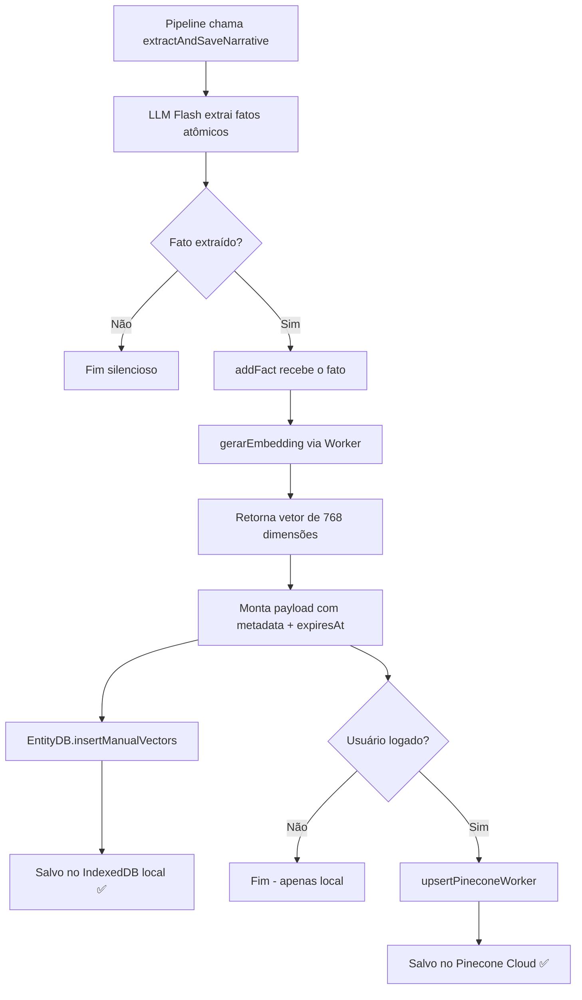

# EntityDB — O Banco Vetorial Embarcado

> 🤖 **Disclaimer**: Documentação gerada por IA e pode conter imprecisões. [📋 Reportar erro](https://github.com/TouchRefletz/maia.api/issues/new?title=Erro+na+doc:+entitydb&labels=docs)

## Visão Geral

O `EntityDB` é a espinha dorsal da memória semântica de longo prazo do maia.edu. Enquanto o [ChatStorageService](/memoria/chat-storage) guarda as bolhas brutas de cada conversa, o EntityDB opera numa dimensão completamente diferente: ele armazena **representações vetoriais de fatos atômicos** sobre o estudante — suas habilidades, lacunas, preferências e estados cognitivos — num banco de dados local que suporta busca por similaridade cosseno nativa.

A biblioteca utilizada é o `@babycommando/entity-db`, um wrapper open-source leve sobre IndexedDB que adiciona capacidades vetoriais (K-Nearest Neighbors) diretamente no browser do aluno, sem necessidade de servidor. Isso torna a Maia capaz de "lembrar" do estudante mesmo offline.

## Motivação Técnica

Bancos vetoriais na nuvem (como o Pinecone usado em paralelo) são poderosos mas introduzem latência de rede. Para que a IA possa consultar fatos sobre o aluno em tempo real — literalmente antes de começar a gerar uma resposta —, precisamos de uma cópia local ultra-rápida que responda em menos de 5ms.

O EntityDB resolve isso armazenando embeddings de 768 dimensões (gerados pelo Gemini Embedding Model) diretamente no IndexedDB do browser, com um índice de busca K-NN baseado em similaridade cosseno. A busca é O(n) bruta (varredura completa), mas como raramente temos mais de 200-500 fatos atômicos por aluno, isso é irrelevante em termos de performance.

## Inicialização e Singleton

```javascript
import { EntityDB } from "@babycommando/entity-db";

const DB_NAME = "maia_memory";
let dbInstance = null;

async function getDb() {
  if (dbInstance) return dbInstance;
  dbInstance = new EntityDB({
    vectorPath: "vector",  // Campo onde os vetores residem nos documentos
  });
  return dbInstance;
}
```

O pattern Singleton garante que apenas uma conexão ao IndexedDB exista por tab do browser. A propriedade `vectorPath: "vector"` indica ao EntityDB que, ao inserir documentos, ele deve indexar o campo `vector` para buscas por similaridade.

## Modelo de Dados dos Fatos Armazenados

Cada fato atômico armazenado no EntityDB possui a seguinte estrutura:

```json
{
  "text": "Usuário demonstrou dificuldade severa em derivadas parciais",
  "vector": [0.0234, -0.1456, 0.8921, ...],
  "metadata": {
    "dominio": "LACUNA",
    "categoria": "LACUNA",
    "confianca": 0.85,
    "evidencia": "Errou 3 vezes seguidas a aplicação da regra da cadeia",
    "timestamp": 1712862400000,
    "expiresAt": 1712864200000,
    "text": "Usuário demonstrou dificuldade severa em derivadas parciais",
    "fatos_atomicos": "Usuário demonstrou dificuldade severa em derivadas parciais",
    "validade": "PERMANENTE"
  }
}
```

### Taxonomia de Categorias

A classificação vem do [Agente Narrador](/chat/memory-prompts) e segue uma taxonomia fechada:

| Categoria | Descrição | Exemplo | Validade Típica |
|-----------|-----------|---------|-----------------|
| `PERFIL` | Dados demográficos e objetivos | "Está no 3º ano do EM, fazendo cursinho" | PERMANENTE |
| `HABILIDADE` | Competências demonstradas | "Domina equações de 2º grau por Bhaskara" | PERMANENTE |
| `LACUNA` | Dificuldades e erros conceituais | "Confunde meiose com mitose consistentemente" | PERMANENTE |
| `PREFERENCIA` | Estilo de aprendizado | "Prefere explicações visuais com diagramas" | PERMANENTE |
| `ESTADO_COGNITIVO` | Nível emocional/atencional | "Demonstra frustração com química orgânica" | TEMPORARIO |
| `EVENTO` | Ações específicas | "Completou o módulo de Óptica" | TEMPORARIO |

## Ciclo Completo de Escrita (`addFact`)

A função `addFact` orquestra a inserção dual (local + cloud):



### Detalhes Críticos da Escrita

1. **Geração de Embedding**: O texto do fato é enviado ao Cloudflare Worker que chama a Gemini Embedding API. O vetor retornado tem 768 dimensões e é normalizado para similaridade cosseno.

2. **TTL Local**: Mesmo fatos "PERMANENTE" na taxonomia possuem `expiresAt` local de 30 minutos. Isso não significa que o fato é efêmero — significa que a cópia local evapora, mas a cópia no Pinecone (para usuários logados) persiste para sempre.

3. **Namespace no Pinecone**: Os vetores são armazenados no namespace `user.uid`, garantindo isolamento total entre estudantes. O índice target é `"maia-memory"`.

## Ciclo de Leitura (`queryContext`)

A busca por contexto é **híbrida e paralela**: EntityDB local e Pinecone cloud são consultados simultaneamente.

```javascript
const [localResults, cloudResults] = await Promise.all([
  localPromise,    // EntityDB: cosine similarity, MIN_SCORE = 0.6
  cloudPromise,    // Pinecone: cosine similarity, MIN_SCORE = 0.7
]);
```

### Scores de Corte

| Fonte | Score Mínimo | Justificativa |
|-------|-------------|---------------|
| Local (EntityDB) | 0.60 | Mais permissivo pois dados são frescos e confiáveis |
| Cloud (Pinecone) | 0.70 | Mais rigoroso pois pode conter fatos de meses atrás já desatualizados |

### Deduplicação

Os resultados são mergeados com prioridade para o Cloud (dados mais ricos em metadados). Fatos com texto idêntico são deduplicados via `Map` keyed por `conteudo`:

```javascript
const allResults = [...cloudResults, ...localResults];
const uniqueMap = new Map();
allResults.forEach((item) => {
  const key = item.conteudo || "";
  if (key && !uniqueMap.has(key)) {
    uniqueMap.set(key, item);
  }
});
return Array.from(uniqueMap.values()).slice(0, limit);
```

## Garbage Collection (`cleanupExpired`)

A limpeza de fatos expirados é a operação mais complexa e delicada do módulo. Ela implementa uma estratégia de **Sync-Before-Delete** em 3 passes:

### Pass 1: Cursor Scan
Abre uma transaction `readonly` no IndexedDB e itera TODOS os registros via cursor. Classifica cada um como expirado ou válido baseado em `expiresAt` ou fallback para `timestamp + LOCAL_EXPIRATION_TIME`.

### Pass 2: Cloud Sync (Safety Net)
Se o usuário estiver logado, faz `upsertPineconeWorker` de TODOS os fatos expirados antes de deletá-los. Se o upsert falhar (rede caiu, quota excedida), a deleção é **ABORTADA** — preferimos manter lixo local a perder dados irrecuperáveis.

### Pass 3: Local Delete
Nova transaction `readwrite` (a anterior pode ter expirado durante o sync assíncrono), deleta cada registro expirado individualmente via `store.delete(key)`.

```javascript
// Auto-cleanup interval (every 5 mins)
setInterval(() => {
  cleanupExpired().catch(console.error);
}, 5 * 60 * 1000);
```

### O Problema do Object Store Name

Um desafio técnico peculiar: a biblioteca EntityDB internamente pode nomear o ObjectStore como `"vector"` ou `"vectors"` dependendo da versão. O cleanup implementa detecção dinâmica:

```javascript
let storeName = "vectors";
if (rawDb.objectStoreNames.contains("vector")) {
  storeName = "vector";
} else if (rawDb.objectStoreNames.contains("vectors")) {
  storeName = "vectors";
} else if (rawDb.objectStoreNames.length > 0) {
  storeName = rawDb.objectStoreNames[0]; // Fallback
}
```

## Sincronização Proativa (`syncPendingToCloud`)

Chamada no boot da aplicação e no evento de login. Varre todos os fatos locais válidos e faz upload em batch para o Pinecone, garantindo que nada se perca mesmo se o aluno conversou offline e depois conectou à internet.

## Limitações Conhecidas

1. **Busca O(n)**: O EntityDB faz varredura completa para cada query. Com > 1000 fatos, isso pode começar a impactar. Mitigação: cleanup agressivo mantém o banco local enxuto.
2. **Dimensionalidade fixa**: Os vetores são de 768 dimensões (Gemini Embedding). Mudar de modelo de embedding requer re-indexação completa.
3. **Sem versionamento**: Se um fato sobre o aluno mudar (ex: "não sabe Bhaskara" → "agora sabe"), ambas as versões coexistem. O [Sintetizador de Contexto](/memoria/sintetizador) resolve isso na hora da leitura via resolução temporal.

## Referências Cruzadas

- [Visão Geral da Memória](/memoria/visao-geral)
- [Sintetizador de Contexto — Resolve conflitos temporais](/memoria/sintetizador)
- [Memory Prompts — Agente Narrador que gera os fatos](/chat/memory-prompts)
- [Pinecone Sync — Detalhes da sincronização cloud](/memoria/pinecone-sync)
- [Query Context — Como fatos são recuperados](/memoria/query)
