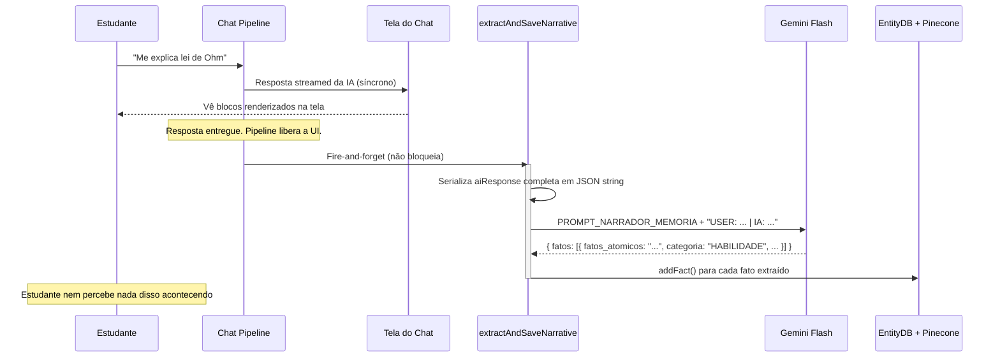

# Extração de Fatos Atômicos (O Agente Narrador)

> 🤖 **Disclaimer**: Documentação gerada por IA e pode conter imprecisões. [📋 Reportar erro](https://github.com/TouchRefletz/maia.api/issues/new?title=Erro+na+doc:+extracao&labels=docs)

## Visão Geral

A função `extractAndSaveNarrative()` em `js/services/memory-service.js` é o motor silencioso que transforma toda conversa entre o estudante e a IA Maia em fatos atômicos persistentes. Ela opera em **background pós-geração**: depois que a resposta da IA já foi entregue ao aluno na tela, este processo roda em segundo plano sem nenhum impacto visual ou de latência.

O nome "Narrador" vem da sua postura: ele observa a interação como um terceiro observador imparcial e narra em terceira pessoa o que aprendeu sobre o estudante. Nunca fala com o aluno, nunca aparece na UI, nunca bloqueia nada. Sua única missão é fofocar ao banco de dados.

## Motivação Pedagógica

Na educação presencial, um bom professor acumula mentalmente observações sobre cada aluno: "João sempre erra sinais em equações", "Maria entende conceitos visuais melhor que textuais", "Pedro está desmotivado ultimamente". Essas observações informam como o professor ajusta sua abordagem.

O Narrador replica essa capacidade em escala digital. Cada rodada de conversa é analisada por um LLM leve (Flash) que extrai observações estruturadas, classificadas, com grau de confiança, e as persiste para uso futuro pelo [Sintetizador de Contexto](/memoria/sintetizador).

## Fluxo Temporal na Pipeline

A extração é disparada como tarefa assíncrona **fire-and-forget** dentro da pipeline principal:



## O Prompt do Agente Narrador

O `PROMPT_NARRADOR_MEMORIA` (definido em `js/chat/prompts/memory-prompts.js`) instrui o Flash a se comportar como um psicólogo educacional que analisa transcripts:

```text
Você é o Agente de Memória do Sistema Maia.
Seu objetivo é extrair FATOS ATÔMICOS e MENSURÁVEIS sobre o USUÁRIO
a partir da interação recente.
Ignore informações irrelevantes ou ruído conversacional ("Olá", "Tudo bem").
```

### Regras de Extração

1. **Atomicidade**: Cada fato deve conter UMA única informação. "Sabe programar e gosta de jogos" são DOIS fatos separados.
2. **Terceira pessoa**: Sempre "O usuário..." ou "O estudante...", nunca "Você...".
3. **Evidência separada**: O fato é a conclusão, a evidência é o trecho que prova. Não fundir.
4. **Confidence Score**:
   - `1.0`: Afirmação explícita → "Eu não sei SQL"
   - `0.8`: Inferência forte → Errou 3x a mesma sintaxe
   - `0.5`: Inferência fraca → "Parece cansado"
5. **Validade temporal**:
   - `PERMANENTE`: Fato estrutural → "Está no 3º ano"
   - `TEMPORARIO`: Estado efêmero → "Está frustrado agora"

## Schema de Extração

O Flash é forçado via JSON Mode a retornar um array rigorosamente tipado:

```javascript
const extractionSchema = {
  type: "object",
  properties: {
    fatos: {
      type: "array",
      items: {
        type: "object",
        properties: {
          fatos_atomicos: { type: "string" },
          categoria: {
            type: "string",
            enum: ["PERFIL", "HABILIDADE", "LACUNA", "PREFERENCIA", "ESTADO_COGNITIVO", "EVENTO"]
          },
          confianca: { type: "number" },
          evidencia: { type: "string" },
          validade: { type: "string", enum: ["PERMANENTE", "TEMPORARIO"] }
        },
        required: ["fatos_atomicos", "categoria", "confianca", "validade"]
      }
    }
  },
  required: ["fatos"]
};
```

### Exemplo de Saída Real

Para a interação:
- **Aluno**: "Não consigo entender integral definida, já tentei 5 vezes"
- **IA**: [explicação detalhada com diagrama visual]

O Narrador extrairia:

```json
{
  "fatos": [
    {
      "fatos_atomicos": "Usuário possui dificuldade persistente com integrais definidas após múltiplas tentativas",
      "categoria": "LACUNA",
      "confianca": 1.0,
      "evidencia": "Afirmação direta: 'Não consigo entender integral definida, já tentei 5 vezes'",
      "validade": "PERMANENTE"
    },
    {
      "fatos_atomicos": "Usuário demonstra frustração com o tópico de cálculo integral",
      "categoria": "ESTADO_COGNITIVO",
      "confianca": 0.8,
      "evidencia": "Tom de desânimo implícito em 'já tentei 5 vezes'",
      "validade": "TEMPORARIO"
    }
  ]
}
```

## Processamento de Anexos Visuais

Se o aluno enviou imagens junto com a mensagem (foto do caderno, captura de tela de exercício), elas são convertidas em Base64 e enviadas ao Flash como multimodal input:

```javascript
if (attachments && attachments.length > 0) {
  processedFiles = await Promise.all(
    attachments.map(async (file) => {
      const base64 = await fileToBase64(file);
      return { data: base64, mimeType: file.type || "application/octet-stream" };
    }),
  );
}
```

Isso permite extrações visuais ricas. Se o aluno tirou foto de um caderno com anotações, o Flash pode detectar: "Usuário demonstra organização visual com cores diferentes para cada tópico — categoria PREFERENCIA".

## Persistência Pós-Extração

Cada fato extraído é individualmente passado para `addFact()`, que:
1. Gera embedding via Worker
2. Salva no EntityDB local (com TTL de 30min)
3. Se logado, salva no Pinecone (namespace = uid, index = "maia-memory")

```javascript
if (result.fatos && Array.isArray(result.fatos)) {
  for (const fato of result.fatos) {
    await addFact(fato);
  }
}
```

O loop serial (`for...of` com `await`) garante que embeddings não sejam gerados em corrida, evitando rate limiting na Embedding API.

## Tratamento de Falhas

A extração NUNCA pode crashar a pipeline principal. Toda a função é envolvida em try/catch e falhas são logadas silenciosamente:

```javascript
} catch (error) {
  console.error("[MemoryService] Falha na extração de narrativa:", error);
}
```

Cenários de falha comuns:
- **API Key ausente**: O aluno não configurou a chave → extração pulada silenciosamente.
- **LLM retorna JSON inválido**: O parse falha → nenhum fato é salvo, mas nada quebra.
- **Rede offline**: Embedding generation falha → fato não é salvo.

Em todos os casos, a experiência do aluno permanece intacta. A extração é um luxo, não uma necessidade — o chat funciona perfeitamente sem ela.

## Frequência de Invocação

A extração roda UMA vez por turno de conversa (após cada resposta da IA). Não é cumulativa — cada invocação analisa apenas a interação mais recente (mensagem do aluno + resposta da IA), não o histórico completo. Isso mantém o custo em tokens baixo (~200-400 tokens por extração) e a latência imperceptível.

## Referências Cruzadas

- [Memory Prompts — O prompt completo do Narrador](/chat/memory-prompts)
- [EntityDB — Onde os fatos são armazenados](/memoria/entitydb)
- [Sintetizador — Como os fatos são usados depois](/memoria/sintetizador)
- [Pipeline Rápida — Onde a extração é disparada](/chat/pipeline-rapido)
