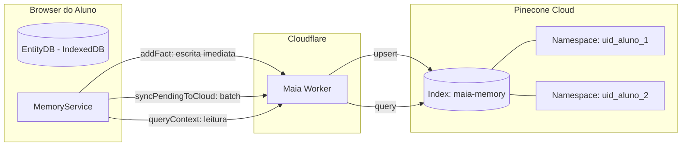

# Pinecone Sync — Sincronização de Memória na Nuvem

> 🤖 **Disclaimer**: Documentação gerada por IA e pode conter imprecisões. [📋 Reportar erro](https://github.com/TouchRefletz/maia.api/issues/new?title=Erro+na+doc:+pinecone-sync&labels=docs)

## Visão Geral

O módulo de **Pinecone Sync** (`syncPendingToCloud` em `js/services/memory-service.js`) é o mecanismo que transporta fatos atômicos do banco local (EntityDB/IndexedDB) para a nuvem vetorial permanente (Pinecone). Ele garante que, mesmo se o aluno trocar de dispositivo (do celular para o notebook), suas memórias acadêmicas o acompanhem.

Pinecone é um banco de dados vetorial gerenciado em cloud que oferece busca por similaridade em escala. No maia.edu, ele serve como **cofre permanente** da memória do estudante, complementando o EntityDB local que é efêmero (TTL de 30 minutos).

## Arquitetura de Sincronização



### Isolamento por Namespace

Cada estudante possui um **namespace isolado** no Pinecone, correspondente ao seu `uid` do Firebase Auth. Isso garante:
- **Privacidade**: Aluno A jamais acessa fatos do Aluno B.
- **Performance**: Queries varrem apenas os vetores do namespace do aluno logado, não do índice inteiro.
- **Deleção limpa**: Se o aluno quiser "resetar" sua memória, basta limpar seu namespace.

## Fluxos de Sincronização

### 1. Escrita Imediata (`addFact`)

Toda vez que um fato é extraído pelo [Agente Narrador](/memoria/extracao), ele é salvo simultaneamente no EntityDB local E no Pinecone (se o aluno estiver logado).

```javascript
// Dentro de addFact()
const user = auth.currentUser;
if (user && !user.isAnonymous) {
  const pineconeVector = {
    id: crypto.randomUUID(),
    values: vector,             // 768 dimensões do Gemini Embedding
    metadata: {
      ...metadata,
      text: textoParaEmbedding, // Texto original para recuperação
    },
  };

  await upsertPineconeWorker(
    [pineconeVector],
    user.uid,       // Namespace = UID
    "maia-memory",  // Index name
  );
}
```

### 2. Sync Proativo no Boot (`syncPendingToCloud`)

Chamado quando o aluno abre a aplicação ou faz login. Varre TODOS os fatos locais válidos e faz upload em batch:

```javascript
export async function syncPendingToCloud() {
  const user = auth.currentUser;
  if (!user || user.isAnonymous) return;

  const validItems = await cleanupExpired(); // Reutiliza o scan do cleanup

  if (validItems.length === 0) return;

  const vectorsToUpsert = validItems.map((item) => ({
    id: crypto.randomUUID(),
    values: item.vector || item.embedding,
    metadata: {
      ...item.metadata,
      text: item.text || item.metadata?.text,
    },
  }));

  await upsertPineconeWorker(vectorsToUpsert, user.uid, "maia-memory");
}
```

Este sync garante que fatos gerados enquanto o aluno estava offline (ou antes de logar) sejam promovidos para a nuvem na primeira oportunidade.

### 3. Sync de Evacuação (Cleanup)

Quando fatos locais expiram, o [Cleanup](/memoria/cleanup) faz upload para Pinecone antes de deletá-los do EntityDB. Esse é o último recurso de preservação de dados.

## Formato do Vetor no Pinecone

Cada vetor armazenado no Pinecone possui:

```json
{
  "id": "uuid-v4",
  "values": [0.0234, -0.1456, 0.8921, ...],
  "metadata": {
    "text": "Usuário possui dificuldade em derivadas parciais",
    "dominio": "LACUNA",
    "categoria": "LACUNA",
    "confianca": 0.85,
    "evidencia": "Errou 3 vezes a aplicação da regra da cadeia",
    "timestamp": 1712862400000,
    "fatos_atomicos": "Usuário possui dificuldade em derivadas parciais",
    "validade": "PERMANENTE"
  }
}
```

### Metadados Relevantes

| Campo | Tipo | Propósito |
|-------|------|-----------|
| `text` | string | Texto original do fato (obrigatório para queries textuais) |
| `categoria` | string | Taxonomia: PERFIL, HABILIDADE, LACUNA, etc. |
| `confianca` | number | Score de certeza do Narrador (0.0-1.0) |
| `evidencia` | string | Trecho da conversa que justifica o fato |
| `timestamp` | number | Quando o fato foi criado (ms desde epoch) |
| `validade` | string | PERMANENTE ou TEMPORARIO |
| `origem_cleanup` | boolean | Flag que indica se veio de sync de evacuação |

## Leitura Híbrida (`queryContext`)

A busca por contexto é sempre híbrida — Local + Cloud em paralelo:

```javascript
const [localResults, cloudResults] = await Promise.all([
  localPromise,   // EntityDB cosine similarity, threshold 0.6
  cloudPromise,   // Pinecone cosine similarity, threshold 0.7
]);
```

O threshold do Pinecone (0.7) é mais rigoroso que o local (0.6) porque fatos cloud podem ser antigos e menos relevantes. Resultados são mergeados e deduplicados por conteúdo textual.

### Via Worker

Toda comunicação com Pinecone passa pelo Cloudflare Worker (`WORKER_URL`). O browser nunca fala diretamente com o Pinecone — as API Keys ficam seguras no worker:

```javascript
// Em js/api/worker.js
export async function queryPineconeWorker(queryVector, limit, filters, indexName, namespace) {
  const response = await fetch(`${WORKER_URL}/pinecone-query`, {
    method: "POST",
    headers: { "Content-Type": "application/json" },
    body: JSON.stringify({ vector: queryVector, topK: limit, filter: filters, indexName, namespace }),
  });
  return response.json();
}
```

## Tratamento de Edge Cases

### Aluno Offline
Se a rede cair durante `upsertPineconeWorker`, a exceção é capturada silenciosamente. O fato permanece salvo localmente e será sincronizado no próximo boot via `syncPendingToCloud`.

### Aluno Anônimo
Sem `uid`, não há namespace no Pinecone. Fatos ficam APENAS no EntityDB local com TTL de 30 minutos. Ao logar, `syncPendingToCloud` promove tudo para a nuvem.

### Duplicatas
O Pinecone usa IDs UUID. Cada fato gera um novo UUID, então não há deduplicação server-side. A deduplicação acontece na leitura, via `Map` keyed por `conteudo` no `queryContext`.

### Rate Limiting
O `addFact` é chamado sequencialmente (`for...of` com `await` no loop de fatos extraídos). Isso evita explosões de requests simultâneos que poderiam triggar rate limiting na API do Pinecone.

## Custos e Limites

O plano do Pinecone utilizado pelo maia.edu suporta:
- **Index**: `maia-memory` (768 dimensões, métrica cosseno)
- **Namespaces**: Ilimitados (um por aluno)
- **Vetores por namespace**: Tipicamente < 500 por aluno ativo

O custo por operação é mínimo: upserts e queries de poucos vetores por sessão de estudo. O maior custo está na geração de embeddings (Gemini API), não no armazenamento em si.

## Referências Cruzadas

- [EntityDB — O banco local que alimenta o sync](/memoria/entitydb)
- [Cleanup — O mecanismo de evacuação que triggera sync](/memoria/cleanup)
- [Query Context — Como os resultados do Pinecone são usados](/memoria/query)
- [Worker Pinecone API — O endpoint no Cloudflare que proxeia as chamadas](/api-worker/pinecone)
