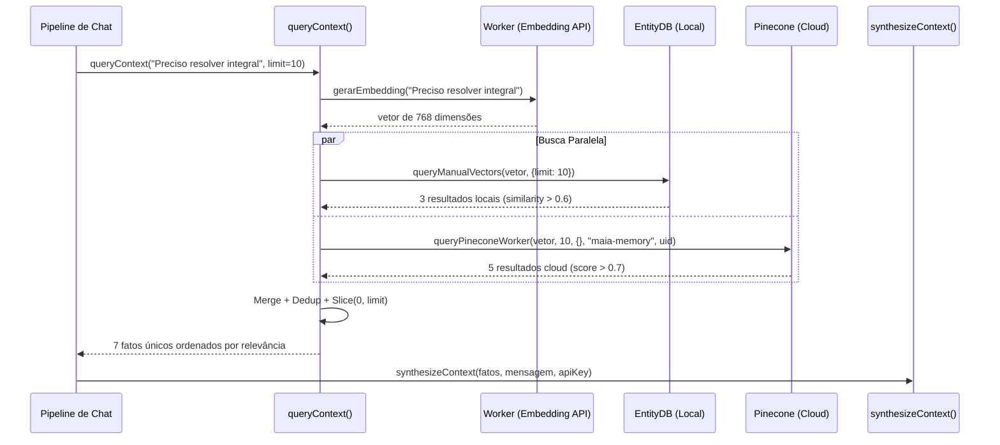

# Query Context — Busca Semântica de Fatos

> 🤖 **Disclaimer**: Documentação gerada por IA e pode conter imprecisões. [📋 Reportar erro](https://github.com/TouchRefletz/maia.api/issues/new?title=Erro+na+doc:+query&labels=docs)

## Visão Geral

A função `queryContext()` em `js/services/memory-service.js` é o ponto de entrada principal para recuperação de memórias do estudante. Sempre que o aluno envia uma mensagem ao chat, esta função é chamada para buscar fatos relevantes que serão passados ao [Sintetizador de Contexto](/memoria/sintetizador) e, por fim, injetados no prompt da IA como diretivas comportamentais.

A busca é **híbrida e paralela**: consulta simultaneamente o banco local (EntityDB) e o banco cloud (Pinecone), mergea os resultados, deduplicada, e retorna os fatos mais relevantes ordenados por similaridade.

## Fluxo de Execução



## Anatomia da Função

### 1. Geração do Query Embedding

A mensagem do aluno é transformada em um vetor de 768 dimensões via Gemini Embedding API:

```javascript
const vectorData = await gerarEmbedding(query);
const queryVector = Array.isArray(vectorData)
  ? vectorData
  : vectorData.embedding || vectorData.values;
```

O handler aceita múltiplos formatos de retorno porque a API pode retornar o vetor diretamente como array ou encapsulado em objetos com chaves `embedding` ou `values`.

### 2. Busca Local (EntityDB)

Usa a busca por similaridade cosseno nativa da biblioteca EntityDB:

```javascript
const localPromise = db
  .queryManualVectors(queryVector, { limit: limit })
  .then((results) => {
    return results
      .filter((r) =>
        r.similarity >= MIN_SCORE &&
        (r.metadata?.expiresAt ? r.metadata.expiresAt > now : false)
      )
      .map((r) => ({
        conteudo: r.text || r.metadata?.conteudo,
        ...r.metadata,
        score: r.similarity,
        source: "local",
      }));
  })
  .catch((e) => {
    console.warn("[Memory] Local query failed:", e);
    return [];
  });
```

**Filtros aplicados:**
- `similarity >= 0.6` (MIN_SCORE): Corta resultados com baixa relevância semântica.
- `expiresAt > now`: Ignora fatos expirados que o cleanup ainda não removeu.

**Fallback**: Se o EntityDB falhar (banco corrompido, API quebrada), retorna array vazio silenciosamente. A busca cloud continua independente.

### 3. Busca Cloud (Pinecone)

Só executa se o aluno estiver logado (Firebase Auth):

```javascript
let cloudPromise = Promise.resolve([]);
if (user && !user.isAnonymous) {
  cloudPromise = queryPineconeWorker(
    queryVector,
    limit,
    {},              // Sem filtros de metadata por enquanto
    "maia-memory",   // Index name
    user.uid,        // Namespace
  )
  .then((result) => {
    if (!result || !result.matches) return [];
    return result.matches
      .filter((match) => match.score >= MIN_SCORE_CLOUD)
      .map((match) => ({
        conteudo: match.metadata?.text || match.metadata?.conteudo,
        ...match.metadata,
        score: match.score,
        source: "cloud",
      }));
  })
  .catch((e) => {
    console.warn("[Memory] Cloud query failed:", e);
    return [];
  });
}
```

**Score mínimo cloud: 0.7** (mais rigoroso que o local 0.6). Justificativa: fatos no Pinecone podem ter meses de idade e representar estados desatualizados do aluno. Um threshold mais alto reduz falsos positivos.

### 4. Merge e Deduplicação

Os resultados de ambas as fontes são combinados, com prioridade para Cloud (listados primeiro):

```javascript
const allResults = [...cloudResults, ...localResults];
const uniqueMap = new Map();

allResults.forEach((item) => {
  const key = item.conteudo || "";
  if (key && !uniqueMap.has(key)) {
    uniqueMap.set(key, item);
  }
});

return Array.from(uniqueMap.values()).slice(0, limit);
```

**Estratégia de dedup**: Usa o campo `conteudo` como chave. Se um fato idêntico existe local E cloud, preserva o cloud (que aparece primeiro no array). O `.slice(0, limit)` garante que no máximo `limit` fatos sejam retornados (default: 10).

## Scores de Corte: A Ciência por Trás dos Números

| Fonte | MIN_SCORE | Justificativa |
|-------|-----------|---------------|
| EntityDB (local) | 0.60 | Dados frescos (< 30 min), alta confiança. Score mais permissivo permite capturar fatos tangencialmente relevantes. |
| Pinecone (cloud) | 0.70 | Dados potencialmente antigos. Threshold mais alto evita trazer fatos de meses atrás que podem estar desatualizados. |

Exemplo prático:
- Aluno pergunta sobre "Logaritmo"
- Fato local: "Sabe resolver equações exponenciais" (similarity 0.62) → **INCLUSO** (> 0.6)
- Fato cloud: "Sabe resolver equações exponenciais" (score 0.65) → **EXCLUÍDO** (< 0.7)

O fato cloud com o mesmo conteúdo seria cortado por ser antigo e potencialmente desatualizado. O fato local fresco é mais confiável.

## Performance e Latência

A busca roda em paralelo via `Promise.all`:
- **EntityDB local**: ~2-5ms (varredura O(n) de ~100-500 vetores)
- **Pinecone cloud**: ~50-200ms (depende da rede, região, e tamanho do namespace)

O gargalo é o Pinecone, mas como a busca é disparada no início da pipeline (antes da geração), ela completa antes que o modelo comece a produzir tokens. O aluno não percebe nenhuma latência adicional.

## Cenários de Falha

| Cenário | Comportamento |
|---------|--------------|
| Embedding API falha | `queryVector` é `null` → retorna `[]` imediatamente |
| EntityDB corrompido | `localPromise.catch` → retorna `[]` |
| Pinecone offline | `cloudPromise.catch` → retorna `[]` |
| Ambos falham | Retorna `[]` → IA opera sem memória (genérica) |
| Aluno anônimo | `cloudPromise = Promise.resolve([])` → só local |

Em NENHUM cenário a falha da query propaga para a pipeline principal. A IA simplesmente opera sem contexto personalizado — uma degradação graciosa.

## Evolução Futura: Filtros por Metadata

Atualmente o objeto `filters` passado ao Pinecone está vazio (`{}`). Futuramente, podemos implementar filtros contextual:

```javascript
// Futuro: filtrar por categoria relevante ao domínio
const filters = {
  categoria: { $in: ["HABILIDADE", "LACUNA", "PREFERENCIA"] },
  // Excluir eventos pontuais para queries genéricas
};
```

Isso reduziria o volume de resultados e melhoraria a qualidade das diretivas do Sintetizador.

## Referências Cruzadas

- [EntityDB — Banco local consultado](/memoria/entitydb)
- [Pinecone Sync — Comunicação com a cloud](/memoria/pinecone-sync)
- [Sintetizador — Consome os resultados da query](/memoria/sintetizador)
- [Extração — Produz os fatos que serão queridos](/memoria/extracao)
