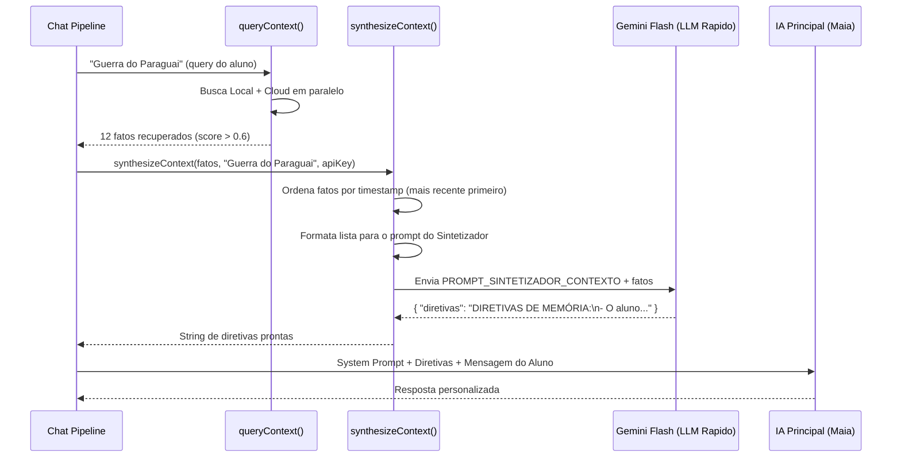

# Sintetizador de Contexto — O Tradutor de Fatos para Ação

> 🤖 **Disclaimer**: Documentação gerada por IA e pode conter imprecisões. [📋 Reportar erro](https://github.com/TouchRefletz/maia.api/issues/new?title=Erro+na+doc:+sintetizador&labels=docs)

## Visão Geral

O **Sintetizador de Contexto** é a função `synthesizeContext()` exportada por `js/services/memory-service.js`. Seu papel é converter uma lista crua de fatos atômicos recuperados do [EntityDB](/memoria/entitydb) em **diretivas comportamentais imperativas** que a IA principal vai obedecer na próxima resposta.

É a diferença entre mandar ao modelo uma lista seca de dados:
```
- [20/03] LACUNA: Não sabe equações do 2º grau
- [15/04] HABILIDADE: Resolveu equações do 2º grau corretamente
- [15/04] PREFERENCIA: Gosta de diagramas visuais
```

...e mandar uma instrução pragmática mastigada:
```
DIRETIVAS DE MEMÓRIA:
- Tratar equações do 2º grau como habilidade ADQUIRIDA — oferecer desafios avançados.
- Utilizar diagramas visuais sempre que possível nas explicações.
```

Sem o Sintetizador, a IA principal receberia fatos contraditórios (o aluno "não sabe" e "sabe" a mesma coisa) e ficaria paralisada. O Sintetizador resolve paradoxos temporais e filtra ruído irrelevante.

## Motivação Arquitetural

Considere o cenário: o estudante acumulou 47 fatos no EntityDB ao longo de 3 meses. Ele agora pergunta sobre a Guerra do Paraguai (História). Dos 47 fatos, 30 são sobre Matemática, 10 sobre Biologia, 3 sobre preferências gerais, e 4 sobre estados cognitivos antigos.

Se jogarmos todos os 47 fatos no prompt da IA:
1. **Poluição cognitiva**: O modelo perde foco tentando incorporar fatos irrelevantes.
2. **Desperdício de tokens**: Cada fato consome ~30 tokens. 47 × 30 = 1.410 tokens desperdiçados.
3. **Paradoxos não resolvidos**: Fatos antigos contradizem fatos novos.

O Sintetizador recebe os fatos brutos e a mensagem atual do aluno, e produz um bloco enxuto de 3-5 diretivas cirúrgicas que consomem ~100 tokens.

## Fluxo de Execução



## O Prompt do Sintetizador (`PROMPT_SINTETIZADOR_CONTEXTO`)

O modelo Flash que executa a síntese recebe instruções rigorosas divididas em 3 regras mestras:

### Regra 1: Resolução Temporal

A regra mais crítica. O Sintetizador deve comparar datas dos fatos e resolver contradições:

```
Se "Falhava em X" (mês passado) e "Acertou X" (hoje), a diretiva CORRETA é:
"Tratar X como habilidade adquirida, oferecer desafios maiores."

A diretiva ERRADA seria:
"O aluno tem dificuldade em X." ← Isso sabotaria o progresso dele.
```

Este mecanismo impede que a IA trate um estudante que evoluiu como se ele ainda estivesse preso no ponto zero. A memória do Maia **cresce** com o aluno.

### Regra 2: Filtro de Escopo

O Sintetizador deve ignorar fatos irrelevantes para o contexto atual:

```
Se o usuário pergunta sobre HISTÓRIA:
✅ MANTER: "Gosta de respostas curtas" (preferência geral, transversal)
✅ MANTER: "Está frustrado hoje" (estado cognitivo, transversal)
❌ IGNORAR: "Sabe usar loops em Python" (habilidade de Programação, irrelevante)
❌ IGNORAR: "Erra conversão de Celsius para Kelvin" (lacuna de Física, irrelevante)
```

### Regra 3: Detecção de Estado Emocional

Se fatos recentes indicam frustração, cansaço ou ansiedade, o Sintetizador gera diretivas de tom:

```
DIRETIVAS DE MEMÓRIA:
- Adotar tom encorajador e paciente.
- Evitar parágrafos longos — usar listas curtas.
- Não mencionar erros anteriores para não desmotivar.
```

## Implementação Técnica

A função `synthesizeContext` monta o prompt combinando o `PROMPT_SINTETIZADOR_CONTEXTO` com a lista formatada de fatos:

```javascript
const fullPrompt = `${PROMPT_SINTETIZADOR_CONTEXTO}

---
MENSAGEM ATUAL DO USUÁRIO: "${currentMessage}"

LISTA DE FATOS RECUPERADOS:
${factsList}`;
```

A lista de fatos é formatada com data, categoria, confiança e evidência:

```javascript
const factsList = sortedFacts.map((f) => {
  const date = new Date(f.timestamp).toLocaleDateString();
  return `- [${date}] [${f.categoria}] (Conf: ${f.confianca}): ${f.conteudo} (Evidência: "${f.evidencia}")`;
}).join("\n");
```

### O Schema de Saída

Para garantir parsing confiável, a síntese usa JSON Mode com um schema minimalista:

```json
{
  "type": "object",
  "properties": {
    "diretivas": {
      "type": "string",
      "description": "O texto completo das diretivas formatado com hífens."
    }
  },
  "required": ["diretivas"]
}
```

### Modelo Utilizado

O Sintetizador usa `gemini-3-flash-preview` — o modelo mais rápido disponível. Como a síntese é invocada antes de cada resposta principal, ela precisa completar em menos de 1 segundo para não impactar o TTFT percebido pelo aluno.

## Fallback para Formatação Simples

Se o LLM Flash falhar (rede caiu, quota excedida, timeout), o sistema cai para uma formatação puramente mecânica via `formatFactsForSynthesis`:

```javascript
export function formatFactsForSynthesis(facts) {
  if (!facts || facts.length === 0) return "";
  const sortedFacts = [...facts].sort((a, b) => b.timestamp - a.timestamp);
  return sortedFacts
    .map((f) => {
      const txt = f.conteudo || f.fatos_atomicos;
      return `- ${txt}`;
    })
    .join("\n");
}
```

Isso é inferior (sem resolução temporal, sem filtro de escopo), mas garante que algum contexto chegue à IA principal mesmo em cenário de falha.

## Tratamento de Anexos

O Sintetizador também suporta anexos visuais. Se o aluno enviou uma foto junto com a mensagem, os arquivos são convertidos para Base64 e enviados ao Flash junto com o prompt textual. Isso permite que o modelo visual identifique contextos que puro texto não capturaria (ex: foto de caderno com anotações manuscritas sobre o tema).

```javascript
if (attachments && attachments.length > 0) {
  processedFiles = await Promise.all(
    attachments.map(async (file) => {
      const base64 = await fileToBase64(file);
      return {
        data: base64,
        mimeType: file.type || "application/octet-stream",
      };
    }),
  );
}
```

## Impacto na Qualidade da Resposta

A diferença qualitativa entre uma resposta com e sem Sintetizador é brutal:

| Cenário | Sem Sintetizador | Com Sintetizador |
|---------|-----------------|------------------|
| Aluno frustrado | *"Entropia é a medida de desordem..."* (genérico, frio) | *"Calma, vamos devagar! Entropia nada mais é que..."* (empático, ajustado) |
| Aluno que superou lacuna | *"Lembre-se de revisar frações básicas antes"* (insulto velado) | *"Como você já domina frações, vamos direto para..."* (respeita evolução) |
| Pergunta fora do domínio conhecido | *Joga 30 fatos de Matemática no prompt* | *Filtra, mantém só preferências gerais* |

## Referências Cruzadas

- [Memory Prompts — Os prompts brutos do Narrador e Sintetizador](/chat/memory-prompts)
- [EntityDB — Onde os fatos ficam armazenados](/memoria/entitydb)
- [Query Context — Como os fatos são recuperados antes da síntese](/memoria/query)
- [Visão Geral da Memória — Panorama completo do módulo](/memoria/visao-geral)
