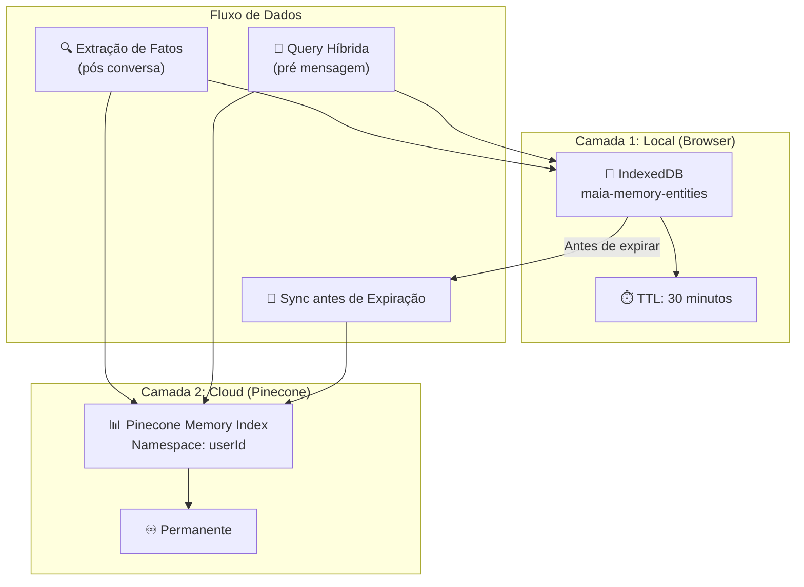
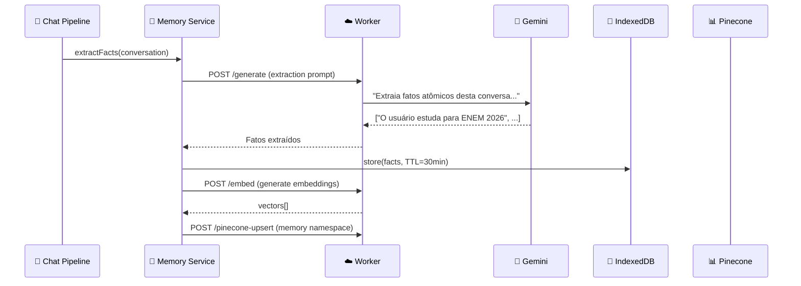
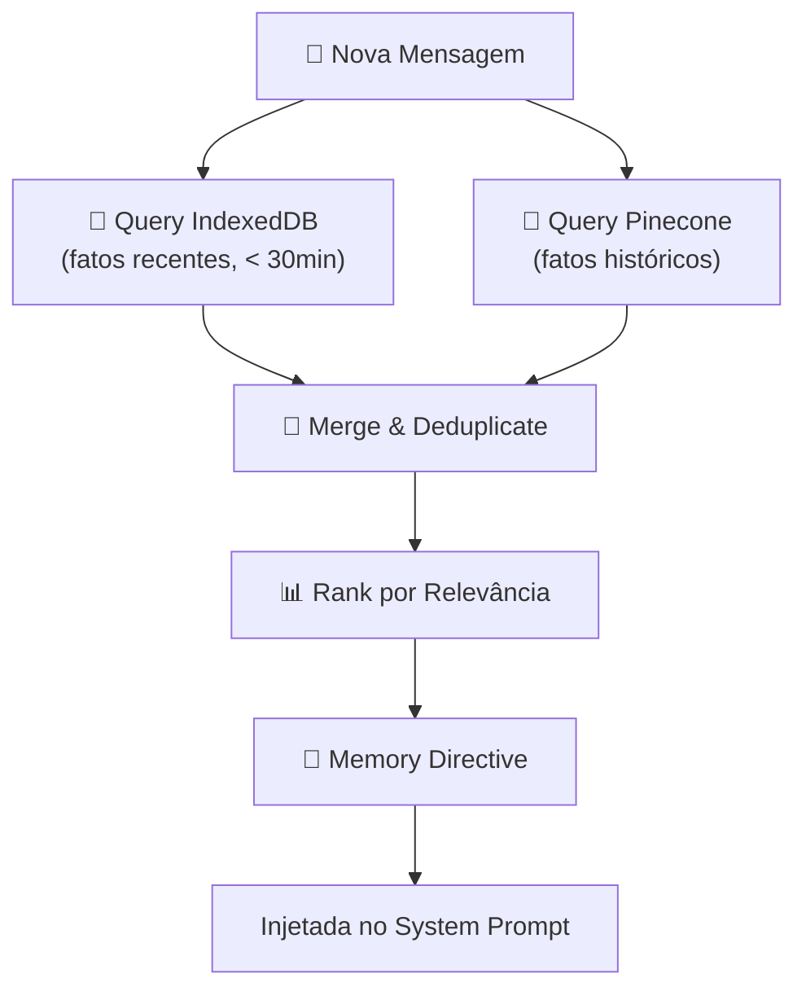
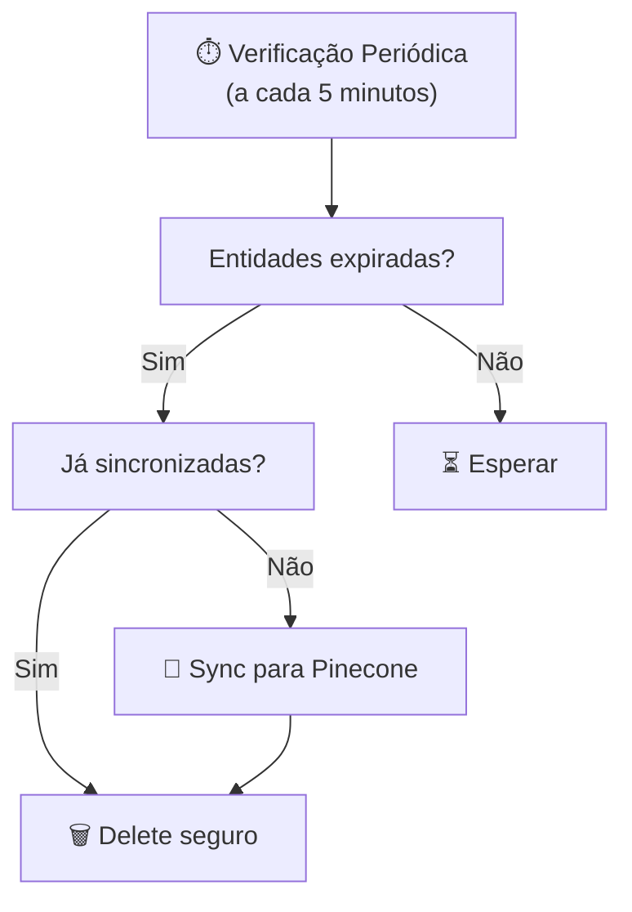
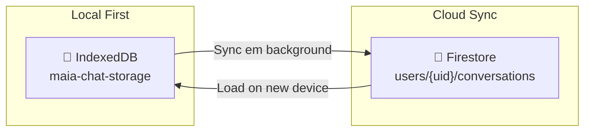

# Visão Geral da Memória — Sistema Cognitivo

## Propósito

O sistema de memória do maia.edu implementa uma **cognição artificial persistente** que permite ao chatbot lembrar do estudante entre sessões. Ele extrai "fatos atômicos" das conversas, os armazena em uma arquitetura **híbrida local+cloud**, e os injeta automaticamente nos prompts futuros para personalização.

---

## Arquitetura Hybrid Storage



---

## Pipeline de Memória

### 1. Extração de Fatos Atômicos

Após cada conversa significativa, o sistema extrai "fatos" sobre o estudante:



### Exemplo de Fatos Extraídos

De uma conversa sobre termodinâmica, o sistema extrai:

```json
[
  "O estudante tem dificuldade com a segunda lei da termodinâmica",
  "O estudante confunde entalpia com entropia",
  "O estudante está no terceiro ano do ensino médio",
  "O estudante prefere explicações com analogias do dia-a-dia",
  "O estudante acertou questões sobre calorimetria"
]
```

### 2. Query Híbrida (Antes de Cada Mensagem)



### 3. Memory Directive (Injeção no Prompt)

O resultado da query é convertido em uma **directive string** que é adicionada ao system prompt:

```markdown
## Contexto do Estudante (Memória)

As seguintes informações foram coletadas em interações anteriores:

- O estudante se prepara para o ENEM 2026
- Tem dificuldade com termodinâmica (entalpia vs entropia)
- Prefere explicações com analogias
- Acertou questões de calorimetria
- Está no 3º ano do ensino médio

Use estas informações para personalizar sua resposta.
```

---

## EntityDB — Armazenamento Local

### Schema do IndexedDB

```javascript
// Database: maia-memory-entities
// Object Store: entities

const entity = {
  id: 'entity_abc123',         // UUID gerado
  userId: 'user_xyz',          // ID do usuário
  text: 'O estudante tem dificuldade com logaritmos',
  embedding: [0.123, -0.456, ...],  // 768 dimensões
  createdAt: 1712345678000,    // Timestamp de criação
  expiresAt: 1712347478000,    // TTL: criação + 30min
  synced: false,               // Se já foi sincronizado para cloud
};
```

### Operações CRUD

| Método                     | Descrição                         |
| -------------------------- | --------------------------------- |
| `put(entity)`              | Adiciona ou atualiza uma entidade |
| `get(id)`                  | Retorna uma entidade por ID       |
| `getAll(userId)`           | Todas as entidades de um usuário  |
| `getRecent(userId, limit)` | N entidades mais recentes         |
| `delete(id)`               | Remove uma entidade               |
| `deleteExpired()`          | Remove entidades com TTL expirado |
| `markSynced(id)`           | Marca como sincronizada com cloud |

### Expiração e Sync



---

## Pinecone Memory Index

### Namespace: Um por Usuário

Cada usuário tem seu próprio **namespace** no Pinecone Memory Index:

```
Pinecone Index: maia-memory
├── Namespace: user_abc123/
│   ├── vec_001: "Estudante prepara para ENEM"
│   ├── vec_002: "Dificuldade com logaritmos"
│   └── vec_003: "Prefere analogias"
├── Namespace: user_def456/
│   └── vec_001: "Estudante de medicina"
└── ...
```

### Formato do Vetor

```javascript
const vector = {
  id: 'entity_abc123',
  values: [0.123, -0.456, ...],  // 768 dimensões
  metadata: {
    text: 'O estudante tem dificuldade com logaritmos',
    userId: 'user_xyz',
    createdAt: '2026-04-11T14:00:00Z',
    source: 'chat_conversation',
  },
};
```

---

## Chat Storage — Persistência de Conversas

### Dual Persistence

Conversas do chat são armazenadas em **duas camadas**:



### Schema de Conversa (IndexedDB)

```javascript
const conversation = {
  id: "conv_abc123",
  userId: "user_xyz",
  title: "Termodinâmica - Leis da Termodinâmica",
  createdAt: 1712345678000,
  updatedAt: 1712347478000,
  messages: [
    {
      id: "msg_001",
      role: "user",
      content: "Me explica a segunda lei da termodinâmica",
      timestamp: 1712345678000,
    },
    {
      id: "msg_002",
      role: "model",
      content: '{"layout":"standard","blocks":[...]}',
      timestamp: 1712345680000,
      metadata: {
        mode: "raciocinio",
        methodology: "analogias",
        thinkingTime: 2500,
      },
    },
  ],
};
```

---

## Decisões de Design

### Por que TTL de 30 minutos?

- **Muito curto (< 10min)**: Fatos se perdem antes de serem úteis
- **30 minutos**: Cobre uma sessão típica de estudo
- **Muito longo (> 2h)**: IndexedDB cresce sem controle
- **Além de 30min**: Dados já estão no Pinecone (permanente)

### Por que não usar apenas Pinecone?

- **Latência**: IndexedDB é acessível em ~1ms; Pinecone em ~100-500ms
- **Offline**: IndexedDB funciona sem internet
- **Custo**: Menos queries ao Pinecone = menor custo

### Por que namespace por usuário no Pinecone?

- **Isolamento**: Dados de um usuário nunca vazam para outro
- **Performance**: Queries filtradas por namespace são mais rápidas
- **Compliance**: Permite deletar todos os dados de um usuário facilmente

---

## Referências Cruzadas

| Tópico                          | Link                                                       |
| ------------------------------- | ---------------------------------------------------------- |
| EntityDB detalhado              | [EntityDB — Local](/memoria/entitydb)                      |
| Pinecone Sync                   | [Pinecone Cloud Sync](/memoria/pinecone-sync)              |
| Extração de Narrativa           | [Extração de Narrativa](/memoria/extracao)                 |
| Memory Prompts                  | [Memory Prompts](/chat/memory-prompts)                     |
| Chat Pipeline (consume memória) | [Pipelines](/chat/pipelines-overview)                      |
| Pinecone API                    | [/pinecone-upsert e /pinecone-query](/api-worker/pinecone) |
