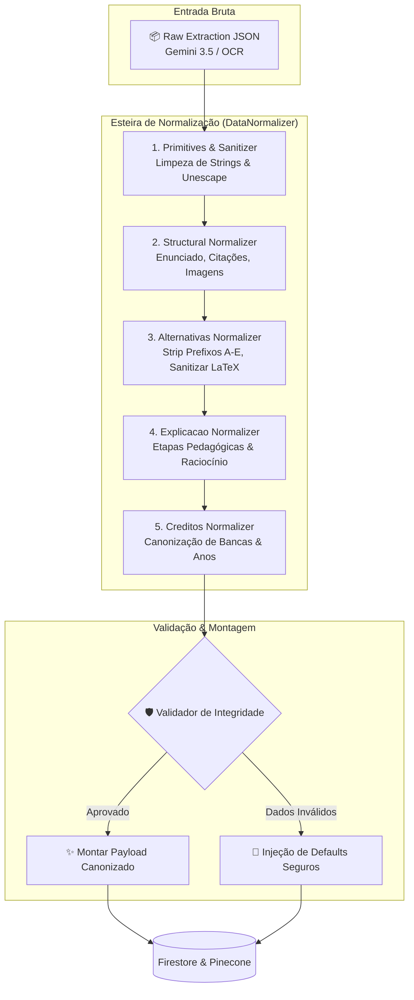

# Data Normalizer Pipeline (`js/normalize/data-normalizer.js`)

## Arquivo-Fonte

| Propriedade | Valor |
|---|---|
| **Arquivo** | `js/normalize/data-normalizer.js` |
| **Escopo** | Pipeline central de sanitização, enriquecimento e compilação de dados brutos do OCR/LLM |
| **Exports** | `DataNormalizer`, `processAndNormalizeQuestion()`, `validateSchemaIntegrity()` |
| **Dependências** | `./alternativas.js`, `./creditos.js`, `./explicacao.js`, `./payload.js`, `./primitives.js` |

---

## 🎯 Visão Geral e Arquitetura

O `DataNormalizer` é a espinha dorsal de validação e sanitização do ecossistema **Maia.edu**. Quando os dados são extraídos de arquivos PDF por meio do Gemini 3.5 Flash ou Tesseract OCR, eles contêm inconsistências inerentes à visão computacional: quebras de linha espúrias, tipos de blocos mal categorizados, fórmulas TeX com sintaxe inválida e ausência de campos obrigatórios do esquema do banco de dados.

O `DataNormalizer` executa uma esteira de transformações puras, determinísticas e sequenciais sobre os dados brutos, garantindo que **nenhum objeto corrompido ou incompleto atinja a camada de persistência** (Firebase Firestore / Pinecone).

---

## 🔄 Fluxo de Processamento da Pipeline



---

## 🛠️ Implementação do Código

```javascript
import { cleanText, sanitizeLaTeX } from './primitives.js';
import { normalizarAlternativas } from './alternativas.js';
import { normalizarCreditos } from './creditos.js';
import { normalizarExplicacao } from './explicacao.js';
import { montarPayloadFinal } from './payload.js';

export class DataNormalizer {
  /**
   * Processa e normaliza uma questão completa.
   * @param {Object} rawData - Dados brutos extraídos pelo OCR ou IA.
   * @returns {Object} Objeto de questão estruturado e validado.
   */
  static processQuestion(rawData) {
    if (!rawData || typeof rawData !== 'object') {
      throw new Error('DataNormalizer: Dados de entrada devem ser um objeto válido.');
    }

    const q = rawData.dados_questao || rawData.questao || {};
    const g = rawData.dados_gabarito || rawData.gabarito || {};

    // 1. Normalização do Enunciado e Estrutura
    const estruturaNormalizada = this.normalizeStructure(q.estrutura || q.enunciado || []);

    // 2. Normalização de Alternativas (se for questão objetiva)
    const alternativasNormalizadas = normalizarAlternativas(q.alternativas || []);

    // 3. Normalização de Créditos e Metadados
    const creditosNormalizados = normalizarCreditos(g.creditos || q.creditos || {});

    // 4. Normalização da Resolução Comentada
    const explicacaoNormalizada = normalizarExplicacao(g.explicacao || g.passos || []);

    // 5. Compilação do Payload Final
    return montarPayloadFinal({
      rawData: {
        ...rawData,
        dados_questao: { ...q, estrutura: estruturaNormalizada },
        dados_gabarito: { ...g, explicacao: explicacaoNormalizada }
      },
      alternativas: alternativasNormalizadas,
      creditos: creditosNormalizados,
      explicacao: explicacaoNormalizada
    });
  }

  /**
   * Normaliza os blocos da estrutura do enunciado.
   * @param {Array|string} estruturaRaw - Blocos de conteúdo brutos.
   * @returns {Array<Object>} Lista de blocos tipados.
   */
  static normalizeStructure(estruturaRaw) {
    if (typeof estruturaRaw === 'string') {
      return [{ tipo: 'texto', conteudo: sanitizeLaTeX(cleanText(estruturaRaw)) }];
    }

    if (!Array.isArray(estruturaRaw)) return [];

    return estruturaRaw.map(bloco => {
      if (typeof bloco === 'string') {
        return { tipo: 'texto', conteudo: sanitizeLaTeX(cleanText(bloco)) };
      }

      const tipo = ['texto', 'citacao', 'fonte', 'imagem', 'tabela', 'codigo'].includes(bloco.tipo)
        ? bloco.tipo
        : 'texto';

      return {
        tipo: tipo,
        conteudo: sanitizeLaTeX(cleanText(bloco.conteudo || bloco.texto || ''))
      };
    });
  }
}
```

---

## 🛡️ Validação de Integridade e Invariantes do Schema

A pipeline impõe **invariantes de segurança de dados** que impedem falhas na UI do cliente:

1. **Nunca `null` ou `undefined` em coleções de texto**: Qualquer campo ausente assume `""` ou `[]`.
2. **Garantia de tipo em `estrutura`**: Todo bloco deve ter uma propriedade `tipo` explícita pertencente ao conjunto `{'texto', 'citacao', 'fonte', 'imagem', 'tabela', 'codigo'}`.
3. **Preservação de Imagens Originais**: Garante que o array `fotos_originais` seja sempre mantido na raiz de `dados_questao` e `dados_gabarito` para permitir auditoria visual humana.

---

## 🔗 Referências Cruzadas
- [Alternativas](/normalizacao/alternativas)
- [Creditos](/normalizacao/creditos)
- [Explicacao](/normalizacao/explicacao)
- [Payload](/normalizacao/payload)
- [Primitives](/normalizacao/primitives)
