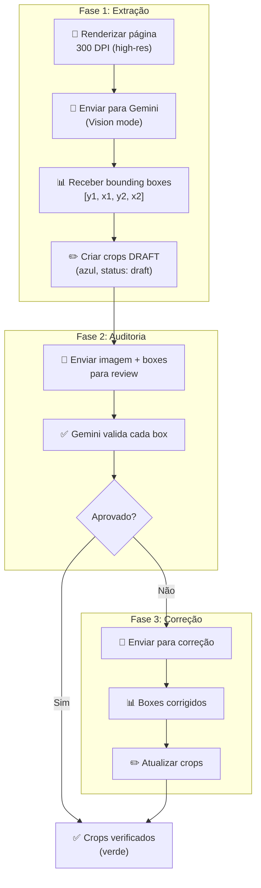
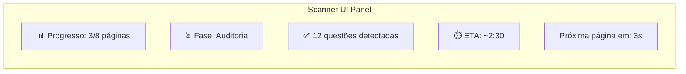
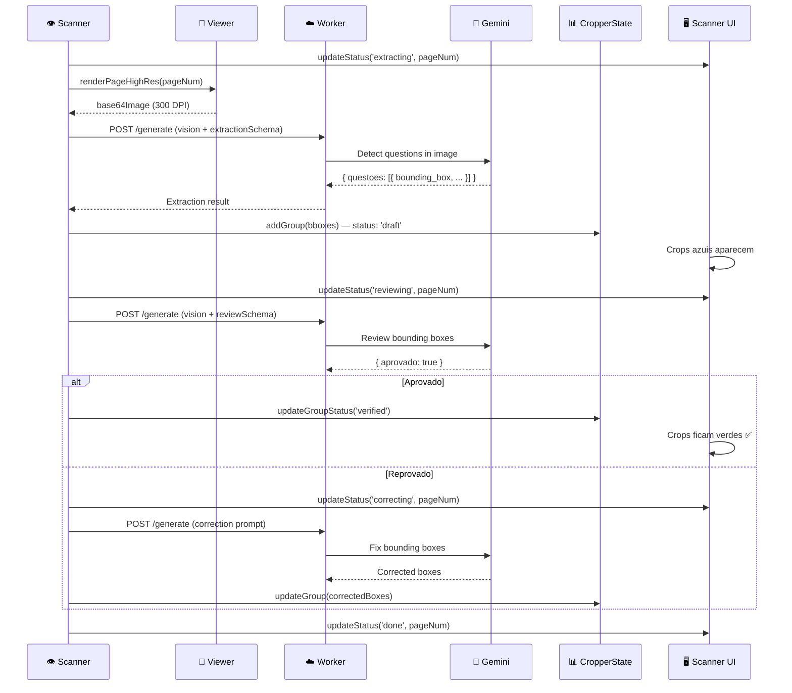

# AI Scanner — Pipeline de Extração

## Arquivo-Fonte

| Propriedade | Valor |
|------------|-------|
| **Arquivo** | [`js/services/ai-scanner.js`](file:///c:/Users/jcamp/Downloads/maia.api/js/services/ai-scanner.js) |
| **Tamanho** | ~30 KB |
| **Classe** | `AiScanner` |
| **Dependências** | `worker.js`, `cropper-state.js`, `selection-overlay.js`, `scanner-ui.js` |

---

## Propósito

O AI Scanner é o **sistema de visão computacional** que processa páginas de PDF para detectar questões automaticamente. Ele opera em um loop de 3 fases por página: **Extração → Auditoria → Correção**.

---

## Pipeline de 3 Fases



---

## Fase 1: Extração — GREEDY BOX Principle

O prompt de extração instrui o Gemini a usar o princípio **GREEDY BOX**:

> "A bounding box de uma questão deve incluir TUDO que pertence a ela: enunciado completo, todas as alternativas, imagens associadas, tabelas, gráficos, fontes e referências. É melhor incluir um pouco de margem extra do que cortar qualquer conteúdo."

### responseSchema (Fase 1)

```javascript
const extractionSchema = {
  type: 'object',
  properties: {
    questoes: {
      type: 'array',
      items: {
        type: 'object',
        properties: {
          numero: { type: 'integer', description: 'Número da questão' },
          bounding_box: {
            type: 'array',
            items: { type: 'number' },
            description: '[y1, x1, y2, x2] normalizado 0-1000',
          },
          tipo: {
            type: 'string',
            enum: ['objetiva', 'dissertativa', 'mista'],
          },
          confianca: {
            type: 'number',
            description: 'Confiança da detecção 0-1',
          },
        },
      },
    },
    total_questoes: { type: 'integer' },
    observacoes: { type: 'string' },
  },
};
```

### Conversão de Coordenadas

As bounding boxes do Gemini usam escala 0-1000. A conversão para coordenadas de página:

```javascript
function convertBBoxToPageCoords(bbox, pageWidth, pageHeight) {
  const [y1, x1, y2, x2] = bbox;
  return {
    relativeLeft: x1 / 1000,
    relativeTop: y1 / 1000,
    relativeWidth: (x2 - x1) / 1000,
    relativeHeight: (y2 - y1) / 1000,
  };
}
```

---

## Fase 2: Auditoria

O Gemini recebe a imagem da página com as bounding boxes sobrepostas e verifica:

1. Cada box realmente contém uma questão?
2. O box cobre a questão inteira?
3. Não há sobreposição entre boxes?
4. A contagem total está correta?

### reviewSchema

```javascript
const reviewSchema = {
  type: 'object',
  properties: {
    aprovado: { type: 'boolean' },
    problemas: {
      type: 'array',
      items: {
        type: 'object',
        properties: {
          questao_numero: { type: 'integer' },
          problema: { type: 'string' },
          sugestao: { type: 'string' },
        },
      },
    },
  },
};
```

---

## Fase 3: Correção

Se a auditoria reprova, o Gemini recebe os problemas identificados e gera boxes corrigidos:

```javascript
const correctionPrompt = `
Os seguintes problemas foram identificados nas bounding boxes:
${problemas.map(p => `- Questão ${p.questao_numero}: ${p.problema}`).join('\n')}

Gere bounding boxes corrigidas para TODAS as questões da página.
`;
```

---

## Scanner UI Integration

O Scanner UI exibe um **painel flutuante** com status em tempo real:



### Status por Página

| Status | Ícone | Descrição |
|--------|-------|-----------|
| `pending` | ⬜ | Aguardando processamento |
| `extracting` | 🔄 | Fase 1: Extraindo |
| `reviewing` | 🔍 | Fase 2: Auditando |
| `correcting` | 🔧 | Fase 3: Corrigindo |
| `done` | ✅ | Processamento completo |
| `error` | ❌ | Erro irrecuperável |

---

## Processamento por Página



---

## Edge Cases

### Página sem questões
Se o Gemini retorna `{ questoes: [], total_questoes: 0 }`, a página é marcada como `done` sem criar crops.

### Muitas questões por página
O sistema limita a **25 questões por página** como safeguard contra alucinações do modelo.

### Sobreposição de boxes
Na fase de auditoria, boxes sobrepostos mais de 30% são automaticamente flagados para correção.

### Timeout
Cada fase tem timeout de 30 segundos. Se excedido, a página é marcada como `error` e o scanner avança para a próxima.

---

## Referências Cruzadas

| Tópico | Link |
|--------|------|
| AI Scanner Prompts | [Scanner Prompts](/ocr/scanner-prompts) |
| AI Image Extractor | [Image Extractor](/ocr/image-extractor) |
| OCR Queue (Tesseract) | [OCR Queue](/ocr/queue-service) |
| Cropper State | [Cropper State](/cropper/state) |
| Selection Overlay | [Selection Overlay](/cropper/overlay) |
| Batch Processor (next step) | [Batch Processor](/upload/batch-arquitetura) |
